# 雀友麻将 · 系统架构设计文档（ARCHITECTURE.md）

> 版本 v0.1 · 2026-06-15
> 基于 PRD v0.2（襄阳红中癞子 / 仅好友局段位 / TRTC 自动开麦三态 / 全程横屏）
> 配套 Stack：Taro + React + TS / NestJS + Socket.IO + Redis + MySQL + Prisma / 腾讯云 TRTC
>
> **架构定位**：MVP 单体集群，优先**简单可靠**而非"未来能扩多大"。
> 单服承载目标：1–2 万房间 / 4–8 万在线（满足 50 万 WAU 起步规模）。

---

## 0. 架构核心原则

| # | 原则 | 说明 |
|---|------|------|
| 1 | **服务器权威**（Server-Authoritative） | 所有牌池、洗牌、摸打、番型、胜负判定**全部在后端**。客户端只是输入输出和渲染 |
| 2 | **全量状态广播 + 增量事件并存** | 进房/重连用全量快照，运行时用带 seq 的增量事件，两者通过 seq 对齐 |
| 3 | **幂等优先 + ACK 确认** | 客户端动作携带 `clientSeq`，服务端通过 `(roomId, userId, clientSeq)` 去重；服务端事件携带 `serverSeq`，客户端 ACK 确认 |
| 4 | **状态可重建** | 房间状态 = 初始牌池 + Operation Log，客户端崩溃/掉线后可从快照恢复 |
| 5 | **语音降级独立** | TRTC 链路失败不影响麻将逻辑；两条 WS 隔离（业务 WS 走 Socket.IO，TRTC 信令直连腾讯云） |
| 6 | **房间为粒度的状态隔离** | 单房间 = 单状态机。不同房间互不干涉，可水平扩展 |
| 7 | **避免数据库写热点** | 对局过程**不写库**，仅在结算时持久化。运行时全部走 Redis |

---

## 1. 系统总体架构

### 1.1 上下文（C4 - Context）

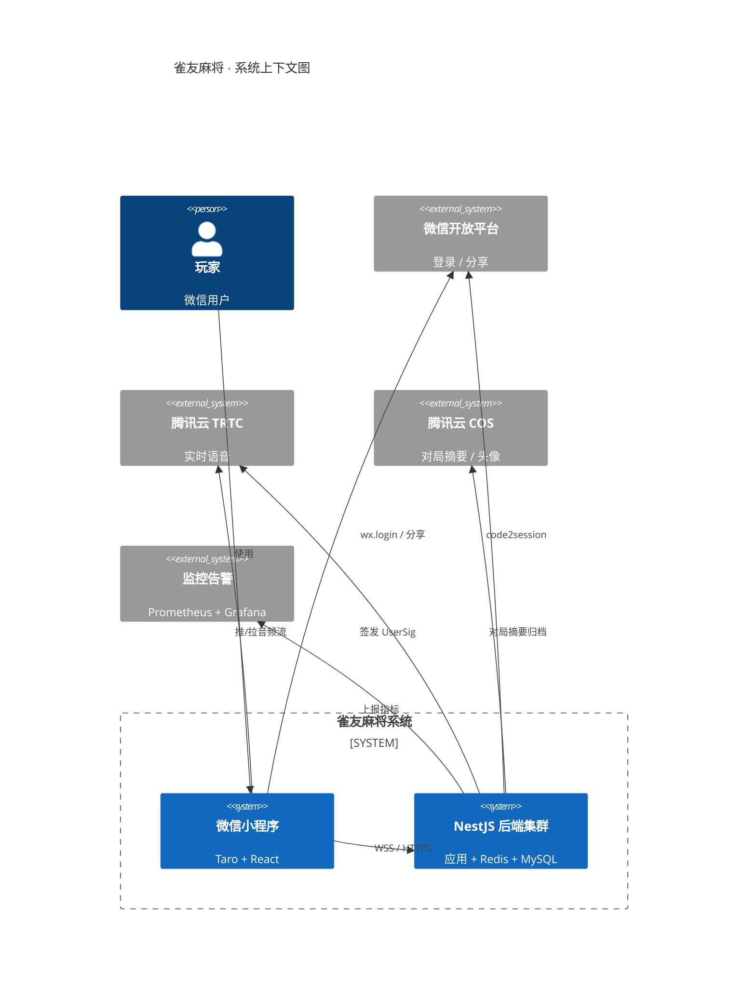
```mermaid
C4Context
    title 雀友麻将 · 系统上下文图

    Person(player, "玩家", "微信用户")

    System_Boundary(queyou, "雀友麻将系统") {
        System(miniprog, "微信小程序", "Taro + React")
        System(backend, "NestJS 后端集群", "应用 + Redis + MySQL")
    }

    System_Ext(wx, "微信开放平台", "登录 / 分享")
    System_Ext(trtc, "腾讯云 TRTC", "实时语音")
    System_Ext(cos, "腾讯云 COS", "对局摘要 / 头像")
    System_Ext(monitor, "监控告警", "Prometheus + Grafana")

    Rel(player, miniprog, "使用")
    Rel(miniprog, backend, "WSS / HTTPS")
    Rel(miniprog, wx, "wx.login / 分享")
    Rel(miniprog, trtc, "推/拉音频流")
    Rel(backend, wx, "code2session")
    Rel(backend, trtc, "签发 UserSig")
    Rel(backend, cos, "对局摘要归档")
    Rel(backend, monitor, "上报指标")
```

### 1.2 容器（C4 - Container · 单体模块化）

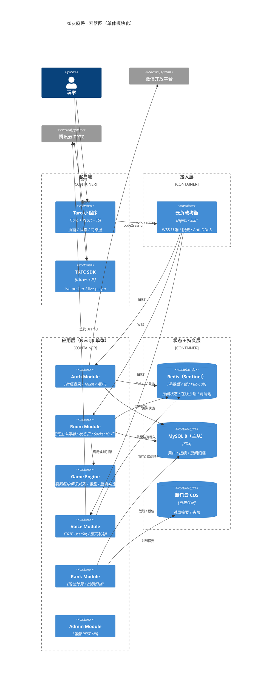
```mermaid
C4Container
    title 雀友麻将 · 容器图（单体模块化）

    Person(player, "玩家")

    Container_Boundary(client, "客户端") {
        Container(taro, "Taro 小程序", "Taro + React + TS", "页面 / 状态 / 网络层")
        Container(trtcSdk, "TRTC SDK", "trtc-wx-sdk", "live-pusher / live-player")
    }

    Container_Boundary(edge, "接入层") {
        Container(slb, "云负载均衡", "Nginx / SLB", "WSS 终端 / 限流 / Anti-DDoS")
    }

    Container_Boundary(app, "应用层（NestJS 单体）") {
        Container(authMod, "Auth Module", "微信登录 / Token / 用户")
        Container(roomMod, "Room Module", "房间生命周期 / 状态机 / Socket.IO 广播")
        Container(gameMod, "Game Engine", "襄阳红中癞子规则 / 番型 / 胜负判定")
        Container(voiceMod, "Voice Module", "TRTC UserSig / 房间映射")
        Container(rankMod, "Rank Module", "段位计算 / 战绩归档")
        Container(adminMod, "Admin Module", "运营 REST API")
    }

    Container_Boundary(state, "状态 + 持久层") {
        ContainerDb(redis, "Redis（Sentinel）", "热数据 / 锁 / Pub-Sub", "房间状态 / 在线会话 / 房号池")
        ContainerDb(mysql, "MySQL 8（主从）", "RDS", "用户 / 战绩 / 房间归档")
        ContainerDb(cos, "腾讯云 COS", "对象存储", "对局摘要 / 头像")
    }

    System_Ext(wxApi, "微信开放平台")
    System_Ext(trtcApi, "腾讯云 TRTC")

    Rel(player, taro, "")
    Rel(player, trtcSdk, "音频")

    Rel(taro, slb, "WSS / HTTPS")
    Rel(trtcSdk, trtcApi, "音频流")

    Rel(slb, authMod, "REST")
    Rel(slb, roomMod, "WSS")
    Rel(slb, voiceMod, "REST")

    Rel(authMod, wxApi, "code2session")
    Rel(authMod, mysql, "用户读写")
    Rel(authMod, redis, "Token / 会话")

    Rel(roomMod, redis, "房间状态")
    Rel(roomMod, gameMod, "调用规则引擎")
    Rel(roomMod, mysql, "终局结算写入")

    Rel(rankMod, mysql, "战绩 / 段位")
    Rel(rankMod, cos, "对局摘要")

    Rel(voiceMod, trtcApi, "签发 UserSig")
    Rel(voiceMod, redis, "TRTC 房间映射")
```

### 1.3 物理部署拓扑

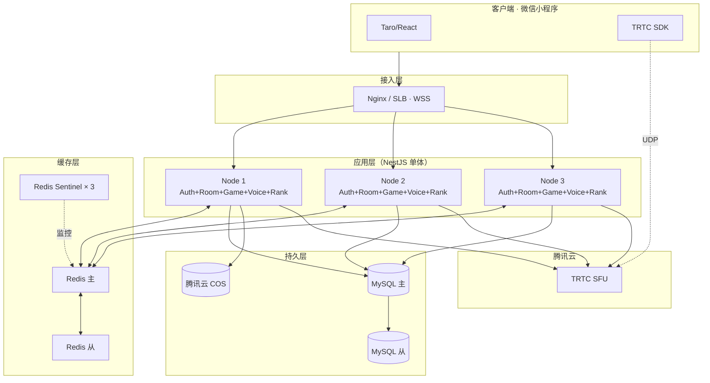
```mermaid
flowchart TB
    subgraph Client["客户端 · 微信小程序"]
        c1["Taro/React"]
        c2["TRTC SDK"]
    end

    subgraph LB["接入层"]
        lb1["Nginx / SLB · WSS"]
    end

    subgraph App["应用层（NestJS 单体）"]
        app1["Node 1<br/>Auth+Room+Game+Voice+Rank"]
        app2["Node 2<br/>Auth+Room+Game+Voice+Rank"]
        app3["Node 3<br/>Auth+Room+Game+Voice+Rank"]
    end

    subgraph Cache["缓存层"]
        r1["Redis 主"]
        r2["Redis 从"]
        rs["Redis Sentinel × 3"]
    end

    subgraph DB["持久层"]
        m1[("MySQL 主")]
        m2[("MySQL 从")]
        cos[("腾讯云 COS")]
    end

    subgraph TRTC["腾讯云"]
        trtc1["TRTC SFU"]
    end

    Client --> lb1
    c2 -.UDP.-> trtc1
    lb1 --> app1
    lb1 --> app2
    lb1 --> app3
    app1 <--> r1
    app2 <--> r1
    app3 <--> r1
    r1 <--> r2
    rs -.监控.-> r1
    app1 --> m1
    app2 --> m1
    app3 --> m1
    m1 --> m2
    app1 --> cos
    app1 --> trtc1
    app2 --> trtc1
    app3 --> trtc1
```

> **关键设计**：所有 Module 在同一 NestJS 进程内运行（单体应用），通过水平扩展 NestJS 节点支撑容量。

---

## 2. 前后端通信架构

### 2.1 通信通道分层

| 通道 | 协议 | 用途 | 时延要求 | 可靠性 |
|------|------|------|---------|--------|
| **HTTPS** | RESTful | 登录、创房、战绩、配置 | < 500ms | At-least-once |
| **业务 WS** | WSS / Socket.IO | 房间内对局动作、广播 | < 200ms (95th) | At-least-once + Idempotent |
| **TRTC** | UDP / RTP | 音频流 | < 150ms | Best-effort |
| **微信订阅消息** | HTTPS Push | 离线邀请 | 秒级 | At-least-once |

### 2.2 通道选择决策树

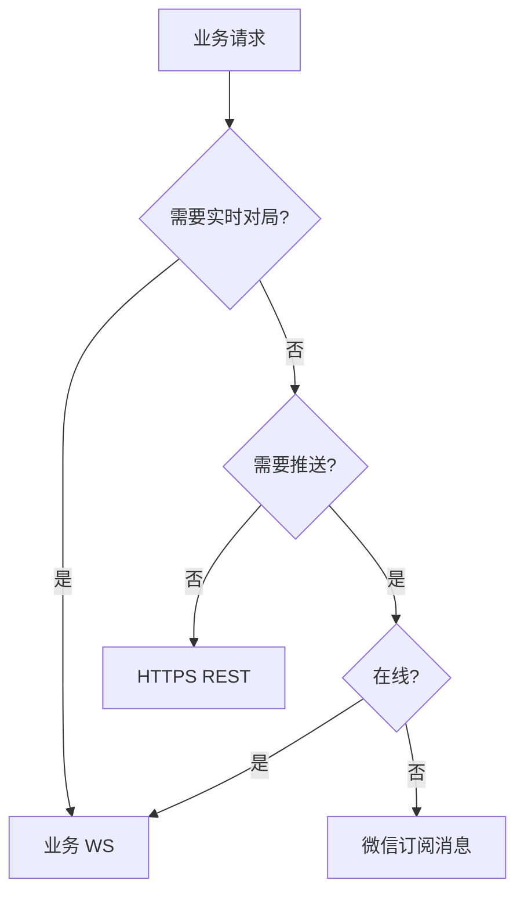
```mermaid
flowchart TD
    Start[业务请求] --> Q1{需要实时对局?}
    Q1 -->|是| WS[业务 WS]
    Q1 -->|否| Q2{需要推送?}
    Q2 -->|否| HTTPS[HTTPS REST]
    Q2 -->|是| Q3{在线?}
    Q3 -->|是| WS
    Q3 -->|否| Push[微信订阅消息]
```

### 2.3 关键设计

- **HTTPS 用于无状态请求**：登录、查询等。缓存友好，监控成熟
- **业务 WS 用于实时对局**：心跳 5s，断线 30s 内可重连恢复
- **TRTC 完全独立**：不通过业务 WS 中转，端到端 SFU 直连
- **小程序限制**：单 WS 帧 4096 字节，大快照通过 HTTPS 拉取

---

## 3. WebSocket 架构

### 3.1 连接生命周期

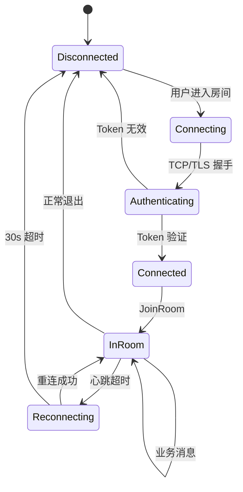
```mermaid
stateDiagram-v2
    [*] --> Disconnected
    Disconnected --> Connecting: 用户进入房间
    Connecting --> Authenticating: TCP/TLS 握手
    Authenticating --> Connected: Token 验证
    Authenticating --> Disconnected: Token 无效
    Connected --> InRoom: JoinRoom
    InRoom --> InRoom: 业务消息
    InRoom --> Reconnecting: 心跳超时
    Reconnecting --> InRoom: 重连成功
    Reconnecting --> Disconnected: 30s 超时
    InRoom --> Disconnected: 正常退出
```

### 3.2 多节点 WS 拓扑（Redis Adapter 跨节点广播）

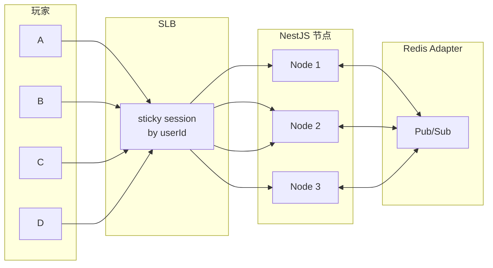
```mermaid
flowchart LR
    subgraph Clients[玩家]
        c1[A]
        c2[B]
        c3[C]
        c4[D]
    end

    subgraph SLB[SLB]
        lb[sticky session<br/>by userId]
    end

    subgraph Nodes[NestJS 节点]
        n1[Node 1]
        n2[Node 2]
        n3[Node 3]
    end

    subgraph Bus[Redis Adapter]
        rd[Pub/Sub]
    end

    c1 --> lb --> n1
    c2 --> lb --> n2
    c3 --> lb --> n2
    c4 --> lb --> n3
    n1 <--> rd
    n2 <--> rd
    n3 <--> rd
```

### 3.3 房间归属（Room Owner Node）

- 同一房间在任何时刻**只有一个节点持有"房间锁"**（`SETNX room:{code}:owner Node EX 30`）
- 持锁节点处理该房间所有动作；其他节点收到该房间消息时通过 Redis Pub/Sub 转发到持锁节点
- 持锁节点每 10s 续期；崩溃后 30s 自动释放，新节点接管 + 从 Redis 重建状态

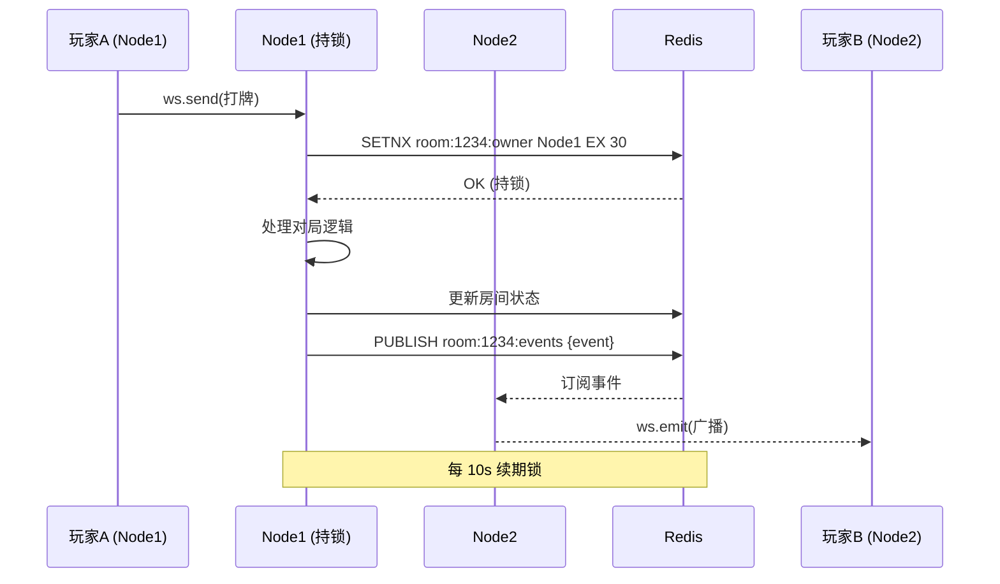
```mermaid
sequenceDiagram
    participant A as 玩家A (Node1)
    participant N1 as Node1 (持锁)
    participant N2 as Node2
    participant R as Redis
    participant B as 玩家B (Node2)

    A->>N1: ws.send(打牌)
    N1->>R: SETNX room:1234:owner Node1 EX 30
    R-->>N1: OK (持锁)
    N1->>N1: 处理对局逻辑
    N1->>R: 更新房间状态
    N1->>R: PUBLISH room:1234:events {event}
    R-->>N2: 订阅事件
    N2-->>B: ws.emit(广播)
    Note over N1,R: 每 10s 续期锁
```

---

## 4. TRTC 集成架构

### 4.1 边界

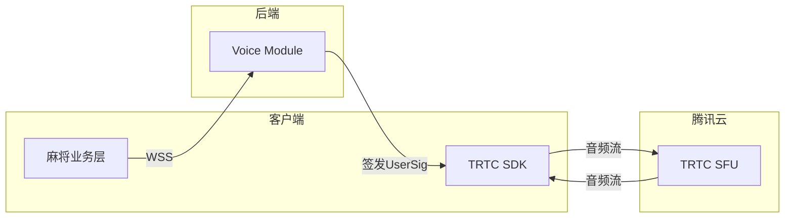
```mermaid
flowchart LR
    subgraph C[客户端]
        c1[麻将业务层]
        c2[TRTC SDK]
    end
    subgraph BE[后端]
        b1[Voice Module]
    end
    subgraph T[腾讯云]
        t1[TRTC SFU]
    end
    c1 --WSS--> b1
    b1 --签发UserSig--> c2
    c2 --音频流--> t1
    t1 --音频流--> c2
```

### 4.2 进房 → 开麦 → 离房

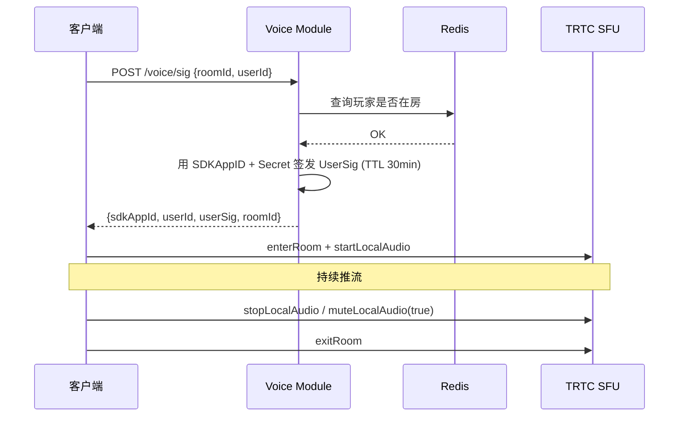
```mermaid
sequenceDiagram
    participant C as 客户端
    participant API as Voice Module
    participant Redis as Redis
    participant TRTC as TRTC SFU

    C->>API: POST /voice/sig {roomId, userId}
    API->>Redis: 查询玩家是否在房
    Redis-->>API: OK
    API->>API: 用 SDKAppID + Secret 签发 UserSig (TTL 30min)
    API-->>C: {sdkAppId, userId, userSig, roomId}
    C->>TRTC: enterRoom + startLocalAudio
    Note over C,TRTC: 持续推流
    C->>TRTC: stopLocalAudio / muteLocalAudio(true)
    C->>TRTC: exitRoom
```

### 4.3 麦克风三态机

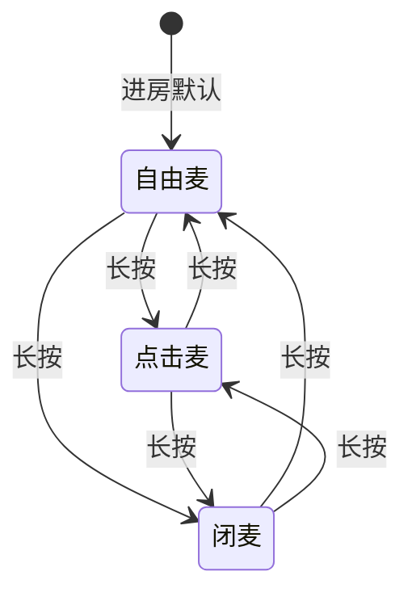
```mermaid
stateDiagram-v2
    [*] --> 自由麦: 进房默认
    自由麦 --> 点击麦: 长按
    自由麦 --> 闭麦: 长按
    点击麦 --> 自由麦: 长按
    点击麦 --> 闭麦: 长按
    闭麦 --> 自由麦: 长按
    闭麦 --> 点击麦: 长按
```

### 4.4 降级策略

| 场景 | 处理 |
|------|------|
| TRTC 进房 3 次失败 | toast「语音不可用」，30s 后台重试，不阻塞游戏 |
| 麦克风权限被拒 | 该玩家自动闭麦，其他人不受影响 |
| 弱网（RTT>800ms） | TRTC 自动降码率 + UI 黄条提示 |
| 切后台 | 暂停推流；onAppShow 自动恢复 |
| 来电中断 | TRTC 自动暂停 → 来电结束自动恢复 |

---

## 5. Redis 缓存架构

### 5.1 数据分层

| 层 | Key | 数据 | TTL |
|----|-----|------|-----|
| 会话 | `sess:{userId}` | Token / sessionKey | 7 天 |
| 在线 | `online:{userId}` | 当前节点 / sockId | 30 分（自动续期） |
| 房间元 | `room:{code}:meta` | 规则 / 局数 / 状态 | 房销 + 5 分 |
| 座位 | `room:{code}:seats` | 座位 → userId | 同上 |
| 玩家集合 | `room:{code}:users` | Set<userId> | 同上 |
| 当前局 | `room:{code}:game:cur` | 局面快照 | 同上 |
| 操作日志 | `room:{code}:game:cur:oplog` | List<event> | 同上 |
| 事件 seq | `room:{code}:seq` | Counter（INCR） | 同上 |
| 幂等表 | `room:{code}:idemp:{userId}` | Hash<clientSeq, ack> | 同上 |
| 房间锁 | `room:{code}:owner` | NodeId | 30s |
| 房号池 | `roomcode:pool` | Set，10 万号 | 永久 |
| 限流 | `rl:{userId}:{action}` | Counter | 1 分 |

### 5.2 房间状态结构

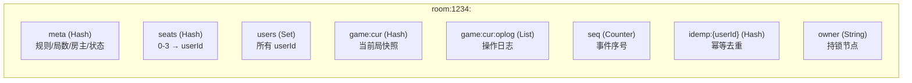
```mermaid
flowchart LR
    subgraph Room["room:1234:"]
        meta["meta (Hash)<br/>规则/局数/房主/状态"]
        seats["seats (Hash)<br/>0-3 → userId"]
        users["users (Set)<br/>所有 userId"]
        game["game:cur (Hash)<br/>当前局快照"]
        oplog["game:cur:oplog (List)<br/>操作日志"]
        seq["seq (Counter)<br/>事件序号"]
        idemp["idemp:{userId} (Hash)<br/>幂等去重"]
        owner["owner (String)<br/>持锁节点"]
    end
```

### 5.3 房号池设计

| 方案 | 实现 | 优劣 |
|------|------|------|
| **预生成池**（推荐） | 启动时一次性 SADD 10 万号；分配走 SPOP，归还走 SADD | O(1)，无碰撞 |
| 实时随机 | 每次随机生成，碰撞重试 | 房间多时碰撞频繁 |
| 自增号 | INCR | 顺序可猜，安全性差 |

实施要点：
- 启动 init 脚本一次性生成
- 监控池容量，余量 < 1 万时报警
- 房间销毁后归还到池

---

## 6. MySQL 架构

### 6.1 表设计原则

| 原则 | 说明 |
|------|------|
| 读写分离 | 主写从读，战绩查询走从库 |
| 对局过程不写库 | 全部走 Redis；终局批量写入 |
| 软删除 | 用 `deleted_at` 字段 |
| 索引节制 | 仅高频查询路径建索引 |
| 事务粒度 | 单局结算放在一个事务，避免长事务 |

### 6.2 ER 图

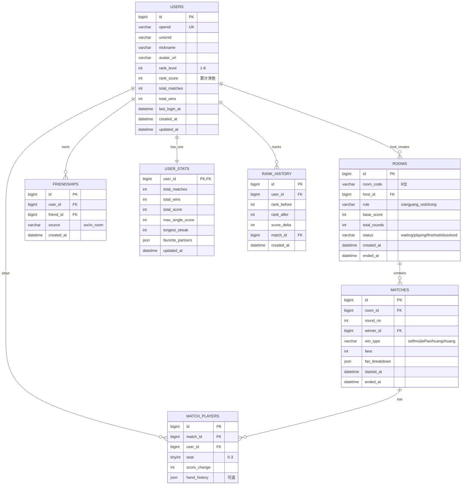
```mermaid
erDiagram
    USERS ||--o{ ROOMS : "host_creates"
    USERS ||--o{ MATCH_PLAYERS : "plays"
    USERS ||--o{ FRIENDSHIPS : "owns"
    USERS ||--|| USER_STATS : "has_one"
    USERS ||--o{ RANK_HISTORY : "tracks"
    ROOMS ||--o{ MATCHES : "contains"
    MATCHES ||--o{ MATCH_PLAYERS : "has"

    USERS {
        bigint id PK
        varchar openid UK
        varchar unionid
        varchar nickname
        varchar avatar_url
        int rank_level "1-8"
        int rank_score "累计净胜"
        int total_matches
        int total_wins
        datetime last_login_at
        datetime created_at
        datetime updated_at
    }

    ROOMS {
        bigint id PK
        varchar room_code "6位"
        bigint host_id FK
        varchar rule "xiangyang_redzhong"
        int base_score
        int total_rounds
        varchar status "waiting/playing/finished/dissolved"
        datetime created_at
        datetime ended_at
    }

    MATCHES {
        bigint id PK
        bigint room_id FK
        int round_no
        bigint winner_id FK
        varchar win_type "selfmo/jiePao/huangzhuang"
        int fans
        json fan_breakdown
        datetime started_at
        datetime ended_at
    }

    MATCH_PLAYERS {
        bigint id PK
        bigint match_id FK
        bigint user_id FK
        tinyint seat "0-3"
        int score_change
        json hand_history "可选"
    }

    FRIENDSHIPS {
        bigint id PK
        bigint user_id FK
        bigint friend_id FK
        varchar source "wx/in_room"
        datetime created_at
    }

    USER_STATS {
        bigint user_id PK,FK
        int total_matches
        int total_wins
        int total_score
        int max_single_score
        int longest_streak
        json favorite_partners
        datetime updated_at
    }

    RANK_HISTORY {
        bigint id PK
        bigint user_id FK
        int rank_before
        int rank_after
        int score_delta
        bigint match_id FK
        datetime created_at
    }
```

### 6.3 关键索引

| 表 | 索引 | 用途 |
|----|------|------|
| users | UNIQUE(openid) | 登录查询 |
| users | INDEX(rank_level, rank_score) | 排行榜（v1.1+） |
| rooms | INDEX(host_id, created_at) | 我的房间 |
| rooms | INDEX(room_code, status) | 活跃房号查询 |
| matches | INDEX(room_id) | 房间对局 |
| matches | INDEX(winner_id, ended_at) | 个人胡牌历史 |
| match_players | INDEX(user_id, ended_at) | 个人战绩 |
| match_players | INDEX(match_id) | 单局玩家 |
| friendships | UNIQUE(user_id, friend_id) | 去重 |

### 6.4 终局结算写入路径

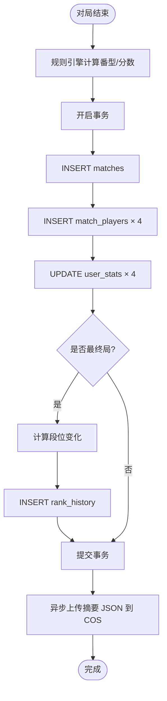
```mermaid
flowchart TD
    Start([对局结束]) --> Calc[规则引擎计算番型/分数]
    Calc --> Tx[开启事务]
    Tx --> M1[INSERT matches]
    M1 --> M2[INSERT match_players × 4]
    M2 --> M3[UPDATE user_stats × 4]
    M3 --> Q1{是否最终局?}
    Q1 -->|是| M4[计算段位变化]
    M4 --> M5[INSERT rank_history]
    M5 --> Commit[提交事务]
    Q1 -->|否| Commit
    Commit --> COS[异步上传摘要 JSON 到 COS]
    COS --> Done([完成])
```

---

## 7. Prisma 设计方案

### 7.1 选型理由

| 选项 | 优势 | 劣势 |
|------|------|------|
| **Prisma** ⭐ | 类型安全、Migration 自动、查询直观、社区活跃 | 性能略低于裸 SQL（对当前规模可忽略） |
| TypeORM | NestJS 默认 | 类型推导弱、Migration 易冲突 |
| Knex + 手写类型 | 性能好、灵活 | 类型维护成本高 |

### 7.2 Schema 关键定义

```prisma
generator client {
  provider = "prisma-client-js"
}

datasource db {
  provider = "mysql"
  url      = env("DATABASE_URL")
}

model User {
  id            BigInt    @id @default(autoincrement())
  openid        String    @unique @db.VarChar(64)
  unionid       String?   @db.VarChar(64)
  nickname      String    @db.VarChar(64)
  avatarUrl     String?   @db.VarChar(255) @map("avatar_url")
  rankLevel     Int       @default(1) @map("rank_level")
  rankScore     Int       @default(0) @map("rank_score")
  totalMatches  Int       @default(0) @map("total_matches")
  totalWins     Int       @default(0) @map("total_wins")
  lastLoginAt   DateTime? @map("last_login_at")
  createdAt     DateTime  @default(now()) @map("created_at")
  updatedAt     DateTime  @updatedAt @map("updated_at")
  deletedAt     DateTime? @map("deleted_at")

  hostedRooms   Room[]    @relation("RoomHost")
  matchPlayers  MatchPlayer[]
  wonMatches    Match[]   @relation("MatchWinner")
  friends       Friendship[] @relation("UserFriends")
  rankHistory   RankHistory[]
  stats         UserStats?

  @@index([rankLevel, rankScore])
  @@index([lastLoginAt])
  @@map("users")
}

model Room {
  id              BigInt    @id @default(autoincrement())
  roomCode        String    @db.VarChar(6) @map("room_code")
  hostId          BigInt    @map("host_id")
  rule            String    @db.VarChar(32)
  baseScore       Int       @default(1) @map("base_score")
  totalRounds     Int       @default(8) @map("total_rounds")
  status          String    @db.VarChar(16)
  createdAt       DateTime  @default(now()) @map("created_at")
  endedAt         DateTime? @map("ended_at")

  host            User      @relation("RoomHost", fields: [hostId], references: [id])
  matches         Match[]

  @@index([hostId, createdAt])
  @@index([roomCode, status])
  @@map("rooms")
}

model Match {
  id              BigInt    @id @default(autoincrement())
  roomId          BigInt    @map("room_id")
  roundNo         Int       @map("round_no")
  winnerId        BigInt?   @map("winner_id")
  winType         String?   @db.VarChar(32) @map("win_type")
  fans            Int       @default(0)
  fanBreakdown    Json?     @map("fan_breakdown")
  startedAt       DateTime  @map("started_at")
  endedAt         DateTime  @map("ended_at")

  room            Room      @relation(fields: [roomId], references: [id])
  winner          User?     @relation("MatchWinner", fields: [winnerId], references: [id])
  players         MatchPlayer[]

  @@index([roomId])
  @@index([winnerId, endedAt])
  @@map("matches")
}

model MatchPlayer {
  id            BigInt    @id @default(autoincrement())
  matchId       BigInt    @map("match_id")
  userId        BigInt    @map("user_id")
  seat          Int
  scoreChange   Int       @map("score_change")
  handHistory   Json?     @map("hand_history")

  match         Match     @relation(fields: [matchId], references: [id])
  user          User      @relation(fields: [userId], references: [id])

  @@index([userId, matchId])
  @@index([matchId])
  @@map("match_players")
}

model UserStats {
  userId            BigInt    @id @map("user_id")
  totalMatches      Int       @default(0) @map("total_matches")
  totalWins         Int       @default(0) @map("total_wins")
  totalScore        Int       @default(0) @map("total_score")
  maxSingleScore    Int       @default(0) @map("max_single_score")
  longestStreak     Int       @default(0) @map("longest_streak")
  favoritePartners  Json?     @map("favorite_partners")
  updatedAt         DateTime  @updatedAt @map("updated_at")

  user              User      @relation(fields: [userId], references: [id])

  @@map("user_stats")
}

model Friendship {
  id          BigInt    @id @default(autoincrement())
  userId      BigInt    @map("user_id")
  friendId    BigInt    @map("friend_id")
  source      String    @db.VarChar(16)
  createdAt   DateTime  @default(now()) @map("created_at")

  user        User      @relation("UserFriends", fields: [userId], references: [id])

  @@unique([userId, friendId])
  @@map("friendships")
}

model RankHistory {
  id          BigInt    @id @default(autoincrement())
  userId      BigInt    @map("user_id")
  rankBefore  Int       @map("rank_before")
  rankAfter   Int       @map("rank_after")
  scoreDelta  Int       @map("score_delta")
  matchId     BigInt?   @map("match_id")
  createdAt   DateTime  @default(now()) @map("created_at")

  user        User      @relation(fields: [userId], references: [id])

  @@index([userId, createdAt])
  @@map("rank_history")
}
```

### 7.3 使用纪律

| 规则 | 说明 |
|------|------|
| 对局过程**禁用** Prisma | 仅在结算时使用，避免 N+1 |
| 批量插入用 `createMany` | match_players 一次插 4 条 |
| 关系查询用 `select` 而非 `include` | 避免拉太多字段 |
| 长事务拆短 | 避免 MySQL 锁占用过长 |
| 高频查询走原生 SQL | 用 `prisma.$queryRaw` |
| Migration 必须 review | `prisma migrate dev` → 人工审 SQL → `migrate deploy` |

---

## 8. 房间管理架构

### 8.1 房间生命周期

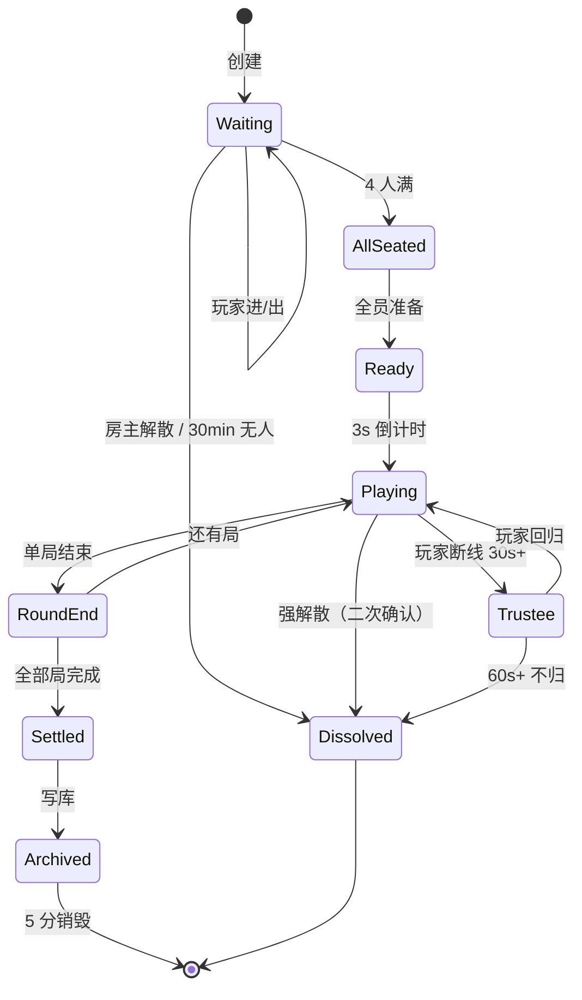
```mermaid
stateDiagram-v2
    [*] --> Waiting: 创建
    Waiting --> Waiting: 玩家进/出
    Waiting --> AllSeated: 4 人满
    AllSeated --> Ready: 全员准备
    Ready --> Playing: 3s 倒计时
    Playing --> RoundEnd: 单局结束
    RoundEnd --> Playing: 还有局
    RoundEnd --> Settled: 全部局完成
    Settled --> Archived: 写库
    Archived --> [*]: 5 分销毁

    Waiting --> Dissolved: 房主解散 / 30min 无人
    Playing --> Dissolved: 强解散（二次确认）
    Playing --> Trustee: 玩家断线 30s+
    Trustee --> Playing: 玩家回归
    Trustee --> Dissolved: 60s+ 不归
    Dissolved --> [*]
```

### 8.2 数据生命周期

| 阶段 | Redis | MySQL |
|------|-------|-------|
| 创建 | meta + seats + users | INSERT rooms (status=waiting) |
| 等待 | 实时读写 | - |
| 对局中 | game:cur + oplog 实时读写 | - |
| 单局结束 | game:cur 滚动到 game:N | （可选）异步 INSERT matches |
| 终局 | TTL 5 分 | 一次事务写 matches + match_players + 更新 user_stats |
| 销毁 | DEL 全部 keys | 保留归档 |

### 8.3 创建房间序列

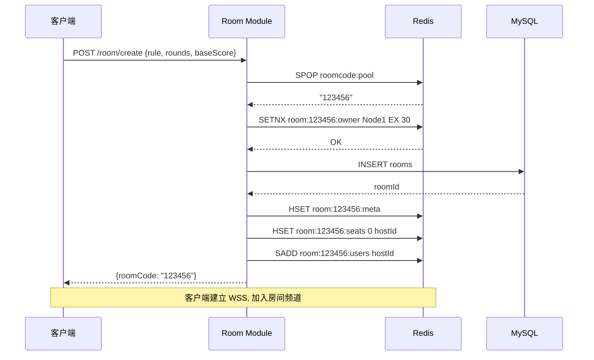
```mermaid
sequenceDiagram
    participant C as 客户端
    participant API as Room Module
    participant R as Redis
    participant DB as MySQL

    C->>API: POST /room/create {rule, rounds, baseScore}
    API->>R: SPOP roomcode:pool
    R-->>API: "123456"
    API->>R: SETNX room:123456:owner Node1 EX 30
    R-->>API: OK
    API->>DB: INSERT rooms
    DB-->>API: roomId
    API->>R: HSET room:123456:meta
    API->>R: HSET room:123456:seats 0 hostId
    API->>R: SADD room:123456:users hostId
    API-->>C: {roomCode: "123456"}
    Note over C,R: 客户端建立 WSS, 加入房间频道
```

---

## 9. 断线重连架构

### 9.1 多层重连策略

| 层 | 时机 | 动作 |
|----|------|------|
| TCP/WS | 心跳超时 5s × 3 = 15s | 客户端自动重连，指数退避（1/2/4/8s） |
| 业务 | 重连后 | 发 `Resume {lastSeq}`，服务端补帧或全量快照 |
| 状态 | 收到 Resume | 计算 `serverSeq - lastSeq` 决定增量/全量 |
| 兜底 | 30s 未恢复 | 进入 AI 托管，释放 TRTC，保留座位 60s |

### 9.2 重连数据流

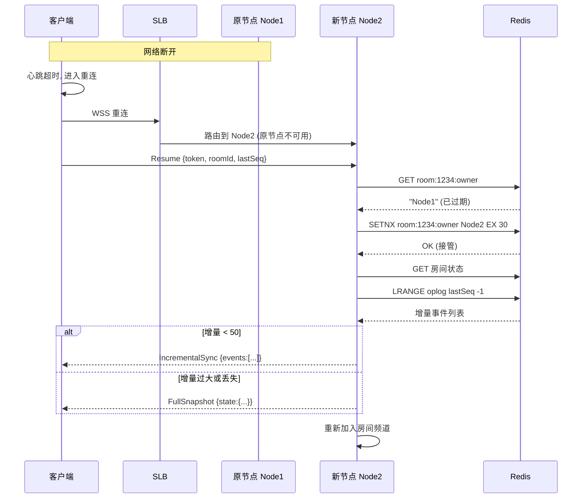
```mermaid
sequenceDiagram
    participant C as 客户端
    participant LB as SLB
    participant N1 as 原节点 Node1
    participant N2 as 新节点 Node2
    participant R as Redis

    Note over C,N1: 网络断开
    C->>C: 心跳超时, 进入重连
    C->>LB: WSS 重连
    LB->>N2: 路由到 Node2 (原节点不可用)
    C->>N2: Resume {token, roomId, lastSeq}
    N2->>R: GET room:1234:owner
    R-->>N2: "Node1" (已过期)
    N2->>R: SETNX room:1234:owner Node2 EX 30
    R-->>N2: OK (接管)
    N2->>R: GET 房间状态
    N2->>R: LRANGE oplog lastSeq -1
    R-->>N2: 增量事件列表
    alt 增量 < 50
        N2-->>C: IncrementalSync {events:[...]}
    else 增量过大或丢失
        N2-->>C: FullSnapshot {state:{...}}
    end
    N2->>N2: 重新加入房间频道
```

### 9.3 服务端响应策略

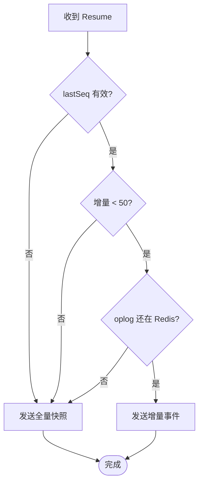
```mermaid
flowchart TD
    R[收到 Resume] --> Q1{lastSeq 有效?}
    Q1 -->|否| Full[发送全量快照]
    Q1 -->|是| Q2{增量 < 50?}
    Q2 -->|是| Q3{oplog 还在 Redis?}
    Q2 -->|否| Full
    Q3 -->|是| Inc[发送增量事件]
    Q3 -->|否| Full
    Full --> End([完成])
    Inc --> End
```

### 9.4 关键设计

- **客户端缓存最近 N 条事件**用于断线后比对
- **每个事件有 serverSeq**，单调递增，供客户端去重
- **client hash ≠ server hash**（可选）→ 强制全量快照
- **超时 30s** 释放实时态，但保留座位 60s 供重进
- **TRTC 房间不在重连范围**，重连后客户端独立 enterRoom

---

## 10. 状态同步架构

### 10.1 三种同步模式

| 模式 | 适用 | 频率 | 大小 |
|------|------|------|------|
| 全量快照 | 进房 / 重连 / 心跳同步 | 低 | 5–20 KB |
| 增量事件 | 对局动作 | 高 | < 500 B |
| 心跳保活 | 持续 | 5s/次 | < 50 B |

### 10.2 增量事件结构

```typescript
interface ServerEvent {
  serverSeq: number;        // 单调递增，全局唯一
  roomId: string;
  type: EventType;
  actor: string;            // userId 或 'system'
  payload: Record<string, any>;
  timestamp: number;
  visibility: 'all' | 'self' | 'others';
}
```

### 10.3 事件清单（核心）

| Event | 来源 | 范围 | 携带 |
|-------|------|------|------|
| `room_created` | system | all | room meta |
| `player_joined` | system | all | userId, seat |
| `player_left` | system | all | userId |
| `player_ready` | user | all | userId |
| `game_started` | system | all | round, dealer |
| `tile_drawn` | system | self | tile（自家可见） |
| `tile_drawn_visible` | system | others | userId（不带牌） |
| `tile_discarded` | user | all | tile, userId |
| `pong` | user | all | tile, userId |
| `kong` | user | all | type, userId, tile |
| `ting` | user | all/self | listenTiles（仅自家可见） |
| `hu` | user | all | userId, fans, fanBreakdown |
| `round_settled` | system | all | scoreChanges |
| `match_settled` | system | all | rankings |
| `player_offline` | system | all | userId |
| `player_trustee` | system | all | userId |
| `player_resumed` | system | all | userId |
| `room_dissolved` | system | all | reason |

### 10.4 服务端权威 vs 客户端预测

| 操作 | 服务端 | 客户端 |
|------|--------|--------|
| 摸牌 | 服务端取牌、下发 `tile_drawn` | 不预测 |
| 出牌 | 客户端发 `discard`，服务端验证后广播 | 乐观显示牌动画，状态以服务端为准 |
| 碰/杠/胡 | 服务端裁定优先级 | 仅显示按钮，等服务端确认 |
| 听牌 | 服务端计算听张，仅自家可见 | 展示，不影响判定 |

> 麻将节奏慢（10–30s/动作）→ **完全不需要客户端预测**，仅做轻微动画补偿。

### 10.5 状态同步顺序图

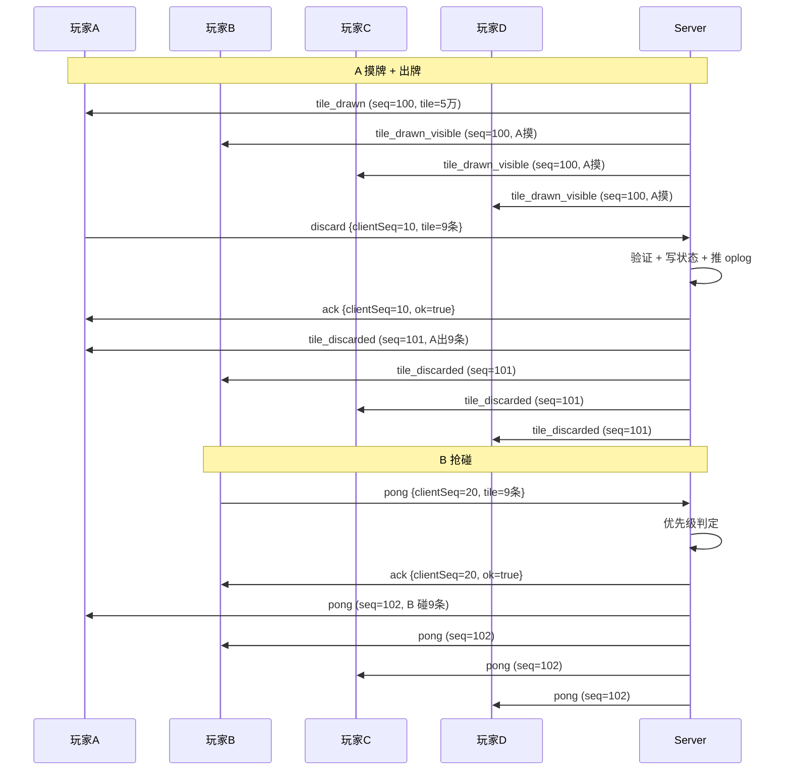
```mermaid
sequenceDiagram
    participant A as 玩家A
    participant B as 玩家B
    participant C as 玩家C
    participant D as 玩家D
    participant S as Server

    Note over A,S: A 摸牌 + 出牌
    S->>A: tile_drawn (seq=100, tile=5万)
    S->>B: tile_drawn_visible (seq=100, A摸)
    S->>C: tile_drawn_visible (seq=100, A摸)
    S->>D: tile_drawn_visible (seq=100, A摸)

    A->>S: discard {clientSeq=10, tile=9条}
    S->>S: 验证 + 写状态 + 推 oplog
    S->>A: ack {clientSeq=10, ok=true}
    S->>A: tile_discarded (seq=101, A出9条)
    S->>B: tile_discarded (seq=101)
    S->>C: tile_discarded (seq=101)
    S->>D: tile_discarded (seq=101)

    Note over B,S: B 抢碰
    B->>S: pong {clientSeq=20, tile=9条}
    S->>S: 优先级判定
    S->>B: ack {clientSeq=20, ok=true}
    S->>A: pong (seq=102, B 碰9条)
    S->>B: pong (seq=102)
    S->>C: pong (seq=102)
    S->>D: pong (seq=102)
```

---

## 11. 权威服务器架构（Server-Authoritative）

### 11.1 信任边界

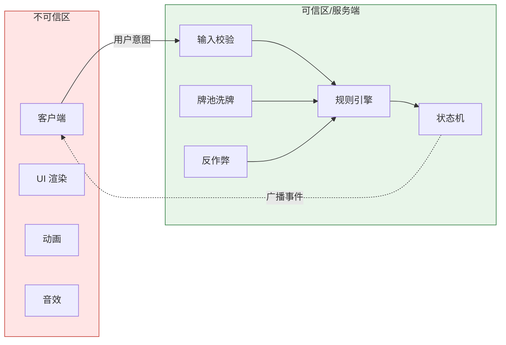
```mermaid
flowchart LR
    subgraph U[不可信区]
        client[客户端]
        ui[UI 渲染]
        anim[动画]
        sound[音效]
    end

    subgraph T[可信区/服务端]
        valid[输入校验]
        engine[规则引擎]
        state[状态机]
        rng[牌池洗牌]
        anti[反作弊]
    end

    client --用户意图--> valid
    valid --> engine --> state
    state -.广播事件.-> client
    rng --> engine
    anti --> engine

    style U fill:#FFE5E5,stroke:#C4382E
    style T fill:#E8F5E9,stroke:#2B7A3D
```

### 11.2 服务端职责

| 职责 | 说明 |
|------|------|
| 输入校验 | 检查动作合法性（轮到谁、是否拥有该牌、是否符合规则） |
| 规则引擎 | 襄阳红中癞子规则的 Pure TS 实现，可单元测试 |
| 状态机 | 房间/对局/玩家状态统一管理 |
| 牌池随机 | `crypto.randomBytes` + Fisher-Yates，禁用 Math.random |
| 隐私控制 | 自家手牌仅推送给自家 |
| 反作弊 | 检测异常出牌速度、违规操作 |
| 超时兜底 | 出牌 15s 倒计时，超时自动弃牌 |

### 11.3 牌池设计

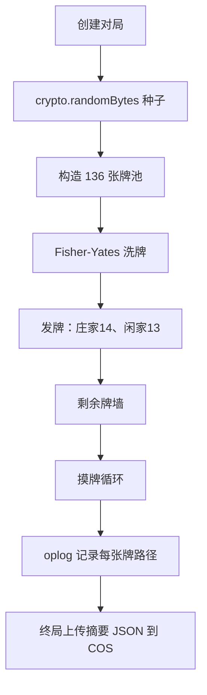
```mermaid
flowchart TD
    Init[创建对局] --> Seed[crypto.randomBytes 种子]
    Seed --> Build[构造 136 张牌池]
    Build --> Shuffle[Fisher-Yates 洗牌]
    Shuffle --> Reveal[发牌：庄家14、闲家13]
    Reveal --> Wall[剩余牌墙]
    Wall --> Draw[摸牌循环]
    Draw --> Op[oplog 记录每张牌路径]
    Op --> End[终局上传摘要 JSON 到 COS]
```

### 11.4 反作弊清单

| 风险 | 防范 |
|------|------|
| 客户端伪造手牌 | 手牌只在服务端，"自家可见"事件单独推送 |
| 客户端伪造摸牌 | 服务端权威发牌 |
| 客户端篡改番型 | 服务端独立计算 |
| 多开同账号 | userId 单连接，新连接踢旧连接 |
| 改包/抓包 | TLS + 业务签名（HMAC，可选） |
| 自动出牌脚本 | 检测出牌间隔分布异常 |

---

## 12. 安全设计

### 12.1 安全分层

| 层 | 措施 |
|----|------|
| 传输 | 全程 HTTPS / WSS（TLS 1.2+） |
| 接入 | Nginx 限流（IP/用户级）、Anti-DDoS、CC 防护 |
| 认证 | JWT + Redis 黑名单、Token TTL 7 天、单设备 |
| 授权 | 房间动作必须 userId 在 seats 中 |
| 应用 | class-validator + Prisma 防注入（小程序天然 XSS 隔离） |
| 业务 | 服务端权威 + 反作弊 |
| 数据 | DB 最小权限 + 备份加密 |
| 日志 | 关键操作审计 + 异常聚合告警 |

### 12.2 鉴权流程

```mermaid
sequenceDiagram
    participant C as 客户端
    participant API as Auth Module
    participant WX as 微信
    participant R as Redis
    participant DB as MySQL

    C->>C: wx.login() → code
    C->>API: POST /auth/login {code}
    API->>WX: jscode2session
    WX-->>API: {openid, unionid, sessionKey}
    API->>DB: UPSERT users
    DB-->>API: userId
    API->>API: 签发 JWT (userId, exp=7d)
    API->>R: SET sess:{userId} sessionKey EX 7d
    API-->>C: {token, user}
```

### 12.3 WS 鉴权

```mermaid
sequenceDiagram
    participant C as 客户端
    participant WS as WS Gateway
    participant R as Redis

    C->>WS: WSS connect ?token=jwt
    WS->>WS: 验证 JWT 签名 + exp
    WS->>R: GET sess:{userId}
    R-->>WS: 存在 (有效)
    WS->>R: GET online:{userId}
    R-->>WS: 已存在 → 踢旧连接
    WS->>R: SET online:{userId} EX 30
    WS-->>C: connected
```

### 12.4 关键约束

- JWT 签名密钥定期轮换（30 天）
- 登录限频：同 IP 1 分钟最多 10 次
- 房号枚举限流（错误次数 > 阈值封禁）
- 客户端版本检查，旧版强制升级
- 后台操作全部记录 `audit_log`

---

## 13. 消息协议设计

### 13.1 设计原则

| 原则 | 说明 |
|------|------|
| 简洁 | 字段名短，传输量小（JSON 起步，未来可升 MsgPack/Protobuf） |
| 自描述 | type 决定 payload 解析 |
| 版本化 | 顶层 `v` 字段 |
| 向后兼容 | 新增字段不破坏旧客户端 |

### 13.2 消息信封

```typescript
// 客户端 → 服务端
interface C2SMessage {
  v: number;
  type: string;
  clientSeq: number;
  ts: number;
  payload: Record<string, any>;
  sig?: string;       // 可选 HMAC 签名
}

// 服务端 → 客户端
interface S2CMessage {
  v: number;
  type: string;       // ack | event | snapshot | error
  serverSeq?: number;
  clientSeq?: number;
  ts: number;
  payload: Record<string, any>;
}
```

### 13.3 核心消息类型

| C2S Type | 含义 | 关键字段 |
|----------|------|---------|
| `auth` | WS 鉴权 | token |
| `room.create` | 创建房间 | rule, rounds, baseScore |
| `room.join` | 加入 | roomCode |
| `room.leave` | 离开 | - |
| `room.ready` / `room.unready` | 准备 / 取消 | - |
| `room.dissolve` | 房主解散 | confirm |
| `game.discard` | 出牌 | tile |
| `game.pong` | 碰 | tile |
| `game.kong` | 杠 | type, tile |
| `game.ting` | 听 | - |
| `game.hu` | 胡 | - |
| `game.pass` | 过 | - |
| `voice.mute` | 切换麦 | mode |
| `resume` | 重连 | lastSeq |
| `heartbeat` | 心跳 | - |

| S2C Type | 含义 |
|----------|------|
| `ack` | 操作确认 |
| `event` | 增量事件 |
| `snapshot` | 全量快照 |
| `error` | 业务错误 |
| `kicked` | 被踢出 |
| `heartbeat` | 心跳响应 |

### 13.4 示例

```
C → S: { v:1, type:"game.discard", clientSeq:42, ts:..., payload:{tile:"9条"} }
S → C: { v:1, type:"ack", clientSeq:42, ts:..., payload:{ok:true} }
S → all: { v:1, type:"event", serverSeq:101, ts:..., payload:{type:"tile_discarded", actor:"user_A", tile:"9条"} }
```

---

## 14. ACK 机制

### 14.1 双向 ACK 流程

```mermaid
sequenceDiagram
    participant C as 客户端
    participant S as 服务端

    Note over C,S: C2S
    C->>S: discard {clientSeq=42, tile=9条}
    S->>S: 处理
    S-->>C: ack {clientSeq=42, ok=true}
    Note over C,S: 客户端收到 ack 才认为生效

    Note over C,S: S2C
    S->>C: event {serverSeq=101, ...}
    C->>S: ack {serverSeq=101}
    Note over C,S: 服务端清理重发缓存
```

### 14.2 超时与重发

| 场景 | 超时 | 重发 |
|------|------|------|
| C 等 ack | 3s | 同 clientSeq 重发，最多 3 次 |
| S 等 ack | 5s | 同 serverSeq 重发，最多 3 次 |
| 重发达上限 | - | 触发重连（Resume） |

### 14.3 实现要点

- **客户端**：维护 `pendingAcks: Map<clientSeq, {msg, retries, timer}>`
- **服务端**：维护 `outboundQueue: Map<userId, Array<{serverSeq, msg, retries}>>`
- **批量 ACK**：客户端可累积 100ms 后一次 ACK 多个 serverSeq

---

## 15. 幂等机制

### 15.1 关键

任何"非读"操作必须幂等。`(roomId, userId, clientSeq)` 三元组是唯一标识。

### 15.2 幂等数据结构（Redis）

```
key:    room:{roomId}:idemp:{userId}
value:  Hash { clientSeq → ackResultJson }
TTL:    房间销毁前
```

### 15.3 处理流程

```mermaid
flowchart TD
    R[收到 C2S] --> P1[提取 clientSeq + userId]
    P1 --> P2{HEXISTS idemp clientSeq?}
    P2 -->|是| P3[返回缓存 ack]
    P2 -->|否| P4[执行业务]
    P4 --> P5[HSET 缓存结果 + TTL]
    P5 --> P6[返回 ack]
```

### 15.4 关键约束

- **clientSeq 单调递增**（客户端维护）
- **重启后不重置**（localStorage 持久化）
- **幂等 TTL > ACK 重发窗口**（≥1 分钟）
- **结果缓存包含完整 ack**

### 15.5 必须幂等的操作

| 操作 | 重复后果 | 保障 |
|------|---------|------|
| 出牌 | 牌不见 | clientSeq 去重 |
| 碰/杠/胡 | 状态错乱 | clientSeq 去重 |
| 创建房间 | 房号浪费 | requestId 去重 |
| 加入房间 | 座位冲突 | userId 唯一性 |
| 准备 | 无影响 | 天然幂等 |

---

## 16. 游戏状态机设计

### 16.1 房间状态机

（参见 §8.1）

### 16.2 单局对局状态机

```mermaid
stateDiagram-v2
    [*] --> Dealing: 开局
    Dealing --> WaitDealerDiscard: 庄家14张

    WaitDealerDiscard --> AfterDiscard: 庄家出牌
    AfterDiscard --> WaitClaim: 5s 抢牌窗口

    WaitClaim --> ClaimResolved: 收到所有 pass / 优先级裁定
    ClaimResolved --> NextDraw: 无人抢
    ClaimResolved --> AfterPong: 有人碰
    ClaimResolved --> AfterKong: 有人杠
    ClaimResolved --> Hu: 有人胡

    NextDraw --> WaitNonDealerDiscard: 下家摸牌
    WaitNonDealerDiscard --> AfterDiscard

    AfterPong --> WaitNonDealerDiscard
    AfterKong --> KongDraw: 补一张
    KongDraw --> WaitNonDealerDiscard

    Hu --> RoundEnd
    NextDraw --> Huangzhuang: 牌墙余 0
    Huangzhuang --> RoundEnd
    RoundEnd --> [*]
```

### 16.3 玩家状态机

```mermaid
stateDiagram-v2
    [*] --> Joined: 加入房间
    Joined --> Ready: 准备
    Ready --> Joined: 取消
    Ready --> Playing: 开局
    Playing --> Offline: 心跳超时
    Offline --> Playing: 30s 内重连
    Offline --> Trustee: 30s 超时
    Trustee --> Playing: 玩家回归
    Trustee --> Kicked: 60s+ 房主操作
    Playing --> Settled: 终局
    Joined --> Left: 主动退出（仅等待中）
    Settled --> Left: 终局后退出
    Kicked --> [*]
    Left --> [*]
```

### 16.4 麦克风状态机

（参见 §4.3）

### 16.5 状态机实现要点

- 用 TypeScript 枚举 + 转换表，编译期检查转换合法性
- 状态变更必须触发事件，不允许静默修改
- 服务端状态机优先；客户端状态机仅用于 UI
- 状态持久化在 Redis Hash，`status` 字段单独存储便于秒级查询
- 状态转换日志全部进 oplog，重连补帧用

---

## 17. 关键时序图汇总

### 17.1 完整对局流程

```mermaid
sequenceDiagram
    participant Host as 房主
    participant Wx as 微信
    participant API as Backend
    participant R as Redis
    participant TRTC as TRTC
    participant DB as MySQL

    Note over Host: ① 登录
    Host->>Wx: wx.login()
    Wx-->>Host: code
    Host->>API: POST /auth/login {code}
    API->>Wx: code2session
    Wx-->>API: openid
    API->>DB: UPSERT user
    API-->>Host: token

    Note over Host: ② 创建房间
    Host->>API: POST /room/create
    API->>R: SPOP roomcode:pool
    API->>R: HSET room:meta + seats
    API->>DB: INSERT rooms
    API-->>Host: {roomCode}

    Note over Host: ③ WS 建连
    Host->>API: WSS ?token
    API->>R: 验证 + online
    API-->>Host: connected

    Note over Host: ④ 邀请 + 凑齐 4 人
    Host->>API: room.invite (微信卡片)
    Note over Host: 其他 3 人陆续加入...

    Note over Host: ⑤ TRTC 进房
    Host->>API: POST /voice/sig
    API-->>Host: userSig
    Host->>TRTC: enterRoom + startLocalAudio

    Note over Host: ⑥ 全员准备 → 开局
    Host->>API: room.ready
    API->>R: 状态推进
    API-->>Host: event game_started
    Note over Host: 8 局对局循环...

    Note over Host: ⑦ 终局结算
    API->>DB: 事务写 matches + match_players + user_stats
    API->>R: 标记 finished, TTL 5min
    API-->>Host: event match_settled

    Note over Host: ⑧ 销毁
    Host->>TRTC: exitRoom
    Host->>API: room.leave
    R->>R: 5min 后清理
```

### 17.2 抢碰冲突处理（多家同时声明）

```mermaid
sequenceDiagram
    participant A as A出牌方
    participant B as B(碰)
    participant C as C(胡)
    participant D as D(过)
    participant S as Server

    A->>S: discard {tile=9条}
    S->>all: tile_discarded
    S->>S: 开 5s 抢牌窗口

    par 并发声明
        B->>S: pong {tile=9条}
        C->>S: hu
        D->>S: pass
    end

    S->>S: 优先级 胡>杠>碰
    Note over S: C 抢胡成功

    S-->>B: ack {ok=false, reason="被C抢胡"}
    S-->>C: ack {ok=true}
    S-->>D: ack {ok=true}
    S->>all: hu {actor=C, fans=...}
```

---

## 18. 演进路线

| 版本 | 重点 | 核心能力 | 升级触发 |
|------|------|---------|---------|
| **v0.1**（本文档 / MVP） | NestJS 单体集群 + Redis Sentinel + MySQL 主从 | 1–2 万房间 / 4–8 万在线 | 满足 50 万 WAU |
| v0.2 | Redis Cluster + 读写分离强化 + 分区域 | 5–10 万房间 / 20–40 万在线 | DAU 达 30 万+ |
| v1.0 | 微服务化（Auth / Room / Voice / Replay 拆分） | 10+ 万房间 / 50+ 万在线 | DAU 达 100 万+ |
| v1.5 | Kafka 事件总线 + 完整回放 + 灰度发布 | 50+ 万房间 | DAU 达 300 万+ |
| v2.0 | 多区域部署 + Actor 模型 + 全球加速 | 100+ 万房间 | 国际化 / 区域容灾 |

> **关键纪律**：v0.1 阶段**不引入 Kafka / 不微服务化 / 不灰度发布**。每个能力都有触发条件，到点再上。

### 性能目标（v0.1）

| 指标 | 单 NestJS Node | 集群（3 节点） |
|------|---------------|----------------|
| QPS（业务消息） | 5,000 / s | 15,000 / s |
| 并发 WS | 10,000 | 30,000 |
| 房间承载 | 2,000 | 6,000 |
| WS 消息 P99 | < 100ms | - |
| 重连成功率 | > 90% | - |
| TRTC 连通率 | > 98% | - |

> 数字仅为设计目标，实际容量需压测确认。

---

## 19. 监控与可观测性

### 19.1 关键指标

| 类型 | 指标 | 阈值 |
|------|------|------|
| 业务 | 房间创建成功率 | < 99% 报警 |
| 业务 | 单局完成率 | < 75% 报警 |
| 业务 | 平均对局时长 | < 18min 或 > 30min |
| 业务 | 邀请→进房转化率 | < 50% |
| 技术 | WS 建连成功率 | < 99% |
| 技术 | TRTC 连通率 | < 98% |
| 技术 | 重连成功率 | < 90% |
| 技术 | API P99 | > 200ms |
| 技术 | WS 消息 P99 | > 100ms |
| 技术 | Redis P99 | > 5ms |
| 技术 | MySQL 慢查询 | > 100ms |
| 资源 | CPU/Mem/Net | > 70% |
| 资源 | Redis 内存 | > 70% |
| 资源 | MySQL 连接数 | > 70% |

### 19.2 监控栈

| 类型 | 工具 |
|------|------|
| Metrics | Prometheus + Grafana |
| Logs | Loki / 阿里云 SLS |
| 错误聚合 | Sentry |
| 拨测 | UptimeRobot |
| 告警渠道 | 钉钉 / 飞书 webhook |

> **v0.1 不上 APM/分布式追踪**，单体应用日志 + 指标足够定位问题。等微服务化后再引入 Skywalking。

---

## 20. 风险与开放问题

| 风险 | 影响 | 缓解 |
|------|------|------|
| 单服务节点故障 | 该节点房间瘫痪 | Redis 锁 30s 超时 + 自动接管 |
| Redis 主挂 | 全站瘫痪 | Sentinel 自动切换 + 客户端重连 |
| 客户端时钟不准 | 倒计时显示错乱 | 服务端下发剩余秒数，客户端只显示 |
| 弱网导致 ACK 风暴 | 服务端 CPU 飙升 | 批量 ACK + 退避重发 |
| 房号池耗尽 | 无法创建新房 | 报警 + 池子动态扩容 |
| 微信限流 | code2session 失败 | 缓存 sessionKey + 失败降级 |
| TRTC 计费爆增 | 成本失控 | 闲置 5min 自动 exitRoom |
| 反作弊误杀 | 影响真实玩家 | 多维度评分 + 人工 review |

---

## 21. 设计决策日志（ADR）

| # | 决策 | 替代方案 | 选择理由 |
|---|------|---------|---------|
| 1 | 服务端权威 | 客户端权威 / P2P | 反作弊 + 节奏慢 + 状态简单 |
| 2 | NestJS 单体 + 模块化 | 一上来微服务 | MVP 简单可靠，等业务跑通再拆分 |
| 3 | Socket.IO + Redis Adapter | 原生 WS + 自建总线 | 跨节点广播成熟、断线重连有支持 |
| 4 | Redis 存运行时状态 | MySQL 直接持久化 | 性能 + 写热点规避 |
| 5 | Prisma | TypeORM | 类型推导强、Migration 友好 |
| 6 | JSON 协议（v0） | 一上来 Protobuf | 简单、调试友好；v1 再升级 |
| 7 | 单调递增 serverSeq | 时间戳 + 排序 | 严格全序、不依赖时钟 |
| 8 | 房号预生成池 | 实时随机 | O(1) 取还、无碰撞 |
| 9 | 6 位数字房号 | UUID / 词组 | 易记 + 易输入 + 容量充足 |
| 10 | TRTC 链路独立 | 业务 WS 中转 | 降级独立 + 节省服务器带宽 |
| 11 | 仅好友局段位 | 陌生人匹配赛 | 合规风险低 + 维持产品定位 |
| 12 | 不引入 Kafka（v0.1） | 一上来上 Kafka | MVP 不需要异步消息总线，单库事务足够 |
| 13 | 不做完整回放（v0.1） | 全量逐手回放 | 仅做"关键时刻摘要"满足 PRD 即可 |
| 14 | 不做灰度发布（v0.1） | 蓝绿/Canary | 业务量小，停服窗口可接受 |
| 15 | 不引入 APM（v0.1） | Skywalking / Jaeger | 单体应用日志+指标足够 |

---

## 附录 A · 关键术语表

| 术语 | 含义 |
|------|------|
| Server-Authoritative | 服务器权威 |
| Idempotent | 幂等 |
| ACK | 确认应答 |
| Server Seq / Client Seq | 服务端 / 客户端事件序号 |
| Resume / Snapshot / Increment | 重连协议 / 全量快照 / 增量同步 |
| TRTC / UserSig | 实时音视频 / 鉴权签名 |
| oplog | 操作日志 |
| Trustee | AI 托管 |
| Huangzhuang | 黄庄（流局） |

---

## 附录 B · 评审与下一步

### v0.1 实现路线图（参考）

| Sprint | 重点 |
|--------|------|
| Sprint 1 | NestJS 项目骨架 + Auth Module + Prisma + MySQL |
| Sprint 2 | Room Module + Redis 状态 + Socket.IO 多节点 |
| Sprint 3 | Game Engine（襄阳红中癞子规则）+ 单元测试 |
| Sprint 4 | Voice Module + TRTC 集成 + 客户端联调 |
| Sprint 5 | 断线重连 + ACK + 幂等 + 反作弊基础 |
| Sprint 6 | 战绩 / 段位 / Admin |
| Sprint 7 | 灰度内测（停服发布即可，不上灰度系统） |
| Sprint 8 | 压测 + 优化 + 上线 |

预估时间：**6–9 周** + **3–5 人团队**。

### 必须先解决的开放问题

1. **部署平台**：腾讯云 TKE（推荐，与 TRTC 同厂）/ 阿里云 ACK / 自建？
2. **Redis 部署**：腾讯云托管 / 阿里云托管 / 自建 Sentinel？
3. **MySQL 部署**：托管 RDS（推荐）/ 自建？
4. **CI/CD**：GitLab CI / GitHub Actions / 阿里云效？
5. **协议是否签名**：v0.1 启用 HMAC 签名 还是先不上？
6. **客户端版本检查**：硬性最低版本 + 强制升级流程？

### 建议下一步

1. ✅ 评审本文档，确认架构方向
2. 📝 写关键模块的 RFC（规则引擎、状态同步协议、断线重连协议）
3. 🧪 选型 POC（Socket.IO 跨节点广播实测、TRTC 集成 demo）
4. 🏗 NestJS Mono Repo 骨架搭建
5. 🚀 Sprint 1 开工
