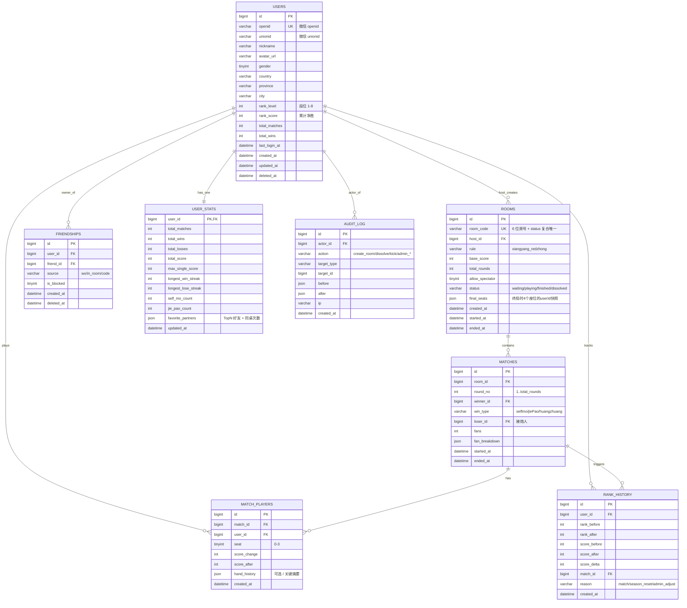
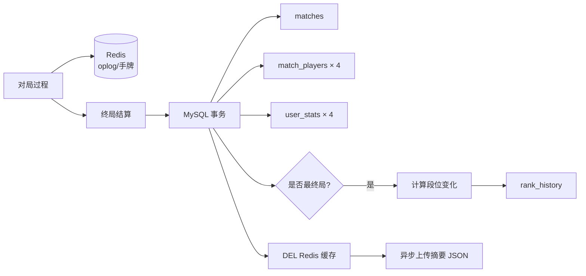
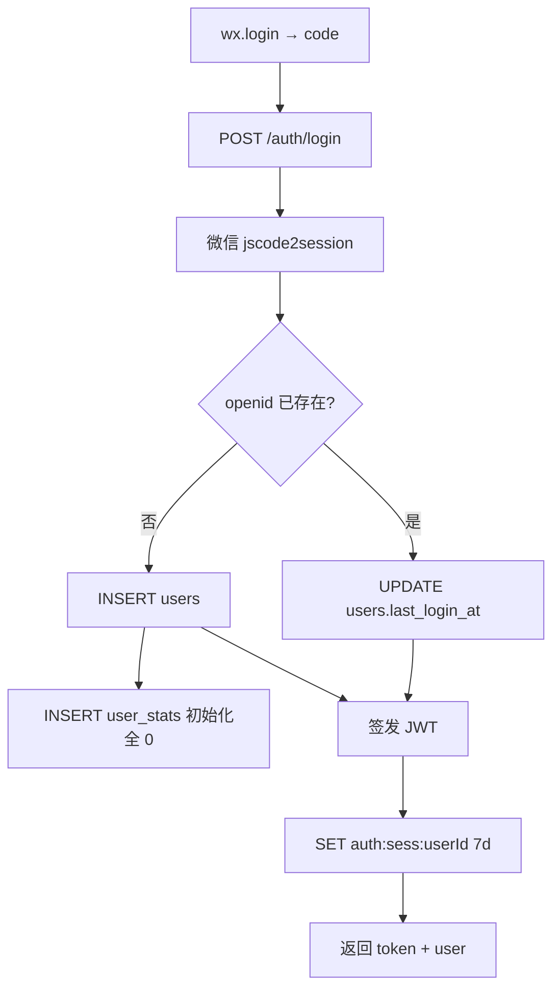
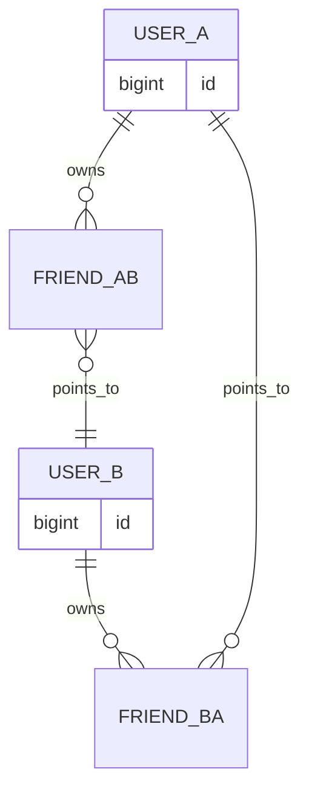
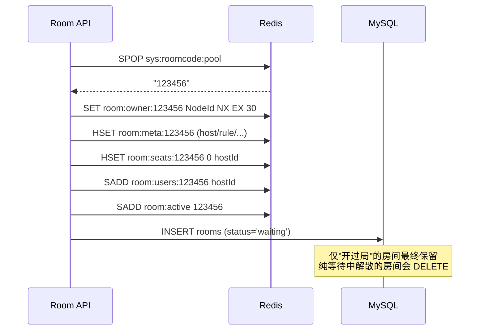

# 雀友麻将 · 数据库设计文档（DATABASE_SCHEMA.md）

> 版本 v0.1 · 2026-06-15
> 基于 PRD v0.2 + ARCHITECTURE v0.1
> 技术栈：MySQL 8 + Prisma ORM + Redis 7
> 字符集：MySQL 全局 `utf8mb4` / Collation `utf8mb4_0900_ai_ci`，引擎 `InnoDB`
> 时区：MySQL 服务器 `+08:00`；应用层全部存 UTC，展示层转换

---

## 0. 设计原则

| # | 原则 | 说明 |
|---|------|------|
| 1 | **冷热分离** | 运行时状态（房间/对局）只在 Redis；终局结算后才落 MySQL |
| 2 | **关系最小化** | MySQL 仅承载强一致需求（用户、战绩、段位）；非关系数据用 JSON 列收纳 |
| 3 | **幂等友好** | 所有"非读"操作配合 Redis 幂等表；MySQL 唯一索引兜底 |
| 4 | **写入收敛** | 对局过程不写库；终局事务一次写入 matches + match_players + user_stats + rank_history |
| 5 | **软删除** | 用户 / 好友 / 房间归档全部用 `deleted_at`，禁止物理删除 |
| 6 | **字符集统一** | `utf8mb4_0900_ai_ci`，支持 emoji 昵称 + 表情符号 |
| 7 | **时间统一** | `DATETIME(3)` 精度毫秒，便于事件排序；所有表必带 `created_at` |
| 8 | **ID 策略** | 单库阶段用 `BIGINT UNSIGNED AUTO_INCREMENT`；分库分表预留 Snowflake 接入位 |
| 9 | **审计内嵌** | 所有写表必带 `created_at/updated_at`；关键操作另写 `audit_log` |
| 10 | **JSON 列谨慎用** | 仅用于"展示型摘要 / 不参与查询过滤"的字段（如番型明细、手牌历史） |

---

## 1. ER 图



---

## 2. 数据字典

> 所有表 `ENGINE=InnoDB DEFAULT CHARSET=utf8mb4 COLLATE=utf8mb4_0900_ai_ci`。
> 时间字段统一 `DATETIME(3)`（毫秒精度），`created_at` 默认 `CURRENT_TIMESTAMP(3)`，`updated_at` 默认 `CURRENT_TIMESTAMP(3) ON UPDATE CURRENT_TIMESTAMP(3)`。

### 2.1 `users` · 用户主表

| 字段 | 类型 | NULL | 默认 | 说明 |
|------|------|------|------|------|
| id | BIGINT UNSIGNED | NO | AUTO_INCREMENT | 主键 |
| openid | VARCHAR(64) | NO | - | 微信 openid，appId 维度唯一 |
| unionid | VARCHAR(64) | YES | NULL | 微信 unionid（开放平台共享） |
| nickname | VARCHAR(64) | NO | '' | 昵称（最长 32 个汉字 ≈ 64 字节） |
| avatar_url | VARCHAR(512) | YES | NULL | 头像 URL（COS 或微信缓存地址） |
| gender | TINYINT UNSIGNED | NO | 0 | 0=未知 1=男 2=女 |
| country | VARCHAR(32) | YES | NULL | 注册时收集 |
| province | VARCHAR(32) | YES | NULL | - |
| city | VARCHAR(64) | YES | NULL | - |
| rank_level | TINYINT UNSIGNED | NO | 1 | 段位 1–8（雀友入门 → 雀神） |
| rank_score | INT | NO | 0 | 累计净胜分 |
| total_matches | INT UNSIGNED | NO | 0 | 总对局数（冗余，与 user_stats 同步） |
| total_wins | INT UNSIGNED | NO | 0 | 总胜局数 |
| last_login_at | DATETIME(3) | YES | NULL | 最近登录时间 |
| created_at | DATETIME(3) | NO | NOW(3) | - |
| updated_at | DATETIME(3) | NO | NOW(3) | ON UPDATE |
| deleted_at | DATETIME(3) | YES | NULL | 软删除标记 |

**关键约束**：
- `rank_level ∈ [1, 8]`（应用层校验，DB 暂不强制 CHECK）
- `rank_score >= 0`（升段不降，触发新赛季 reset 时清零）
- `nickname` 允许重名

### 2.2 `rooms` · 房间归档表

| 字段 | 类型 | NULL | 默认 | 说明 |
|------|------|------|------|------|
| id | BIGINT UNSIGNED | NO | AUTO_INCREMENT | 主键 |
| room_code | VARCHAR(6) | NO | - | 6 位数字房号 |
| host_id | BIGINT UNSIGNED | NO | - | 房主 |
| rule | VARCHAR(32) | NO | 'xiangyang_redzhong' | 玩法 |
| base_score | TINYINT UNSIGNED | NO | 1 | 底分 |
| total_rounds | TINYINT UNSIGNED | NO | 8 | 总局数（4/8/16） |
| allow_spectator | TINYINT(1) | NO | 0 | 是否允许观战（v0.1 = 0） |
| status | VARCHAR(16) | NO | 'waiting' | waiting / playing / finished / dissolved |
| final_seats | JSON | YES | NULL | 终局快照 `[{seat:0, userId:..}, ...]` |
| dissolve_reason | VARCHAR(32) | YES | NULL | host_left / timeout / admin / no_player |
| created_at | DATETIME(3) | NO | NOW(3) | - |
| started_at | DATETIME(3) | YES | NULL | 开第一局时间 |
| ended_at | DATETIME(3) | YES | NULL | 终局或解散时间 |

**说明**：
- `room_code` 不是 UNIQUE：因为同一房号可被多次复用（活跃房号唯一性靠 Redis 房号池保证）
- 仅"已发生过对局"的房间才会归档；纯等待中的房间解散不写库（避免脏数据）

### 2.3 `matches` · 单局记录表

| 字段 | 类型 | NULL | 默认 | 说明 |
|------|------|------|------|------|
| id | BIGINT UNSIGNED | NO | AUTO_INCREMENT | 主键 |
| room_id | BIGINT UNSIGNED | NO | - | 房间 |
| round_no | TINYINT UNSIGNED | NO | - | 第几局（从 1 开始） |
| winner_id | BIGINT UNSIGNED | YES | NULL | 胜家；流局为 NULL |
| loser_id | BIGINT UNSIGNED | YES | NULL | 接炮人；自摸 / 流局为 NULL |
| win_type | VARCHAR(16) | YES | NULL | selfmo / jiePao / huangzhuang |
| fans | INT UNSIGNED | NO | 0 | 总番数 |
| fan_breakdown | JSON | YES | NULL | `[{type:"清一色", fans:8}, ...]` |
| dealer_id | BIGINT UNSIGNED | NO | - | 庄家 |
| zhuang_continued | TINYINT(1) | NO | 0 | 是否连庄 |
| started_at | DATETIME(3) | NO | - | 开局时间 |
| ended_at | DATETIME(3) | NO | - | 单局结束时间 |

### 2.4 `match_players` · 单局-玩家关系表

| 字段 | 类型 | NULL | 默认 | 说明 |
|------|------|------|------|------|
| id | BIGINT UNSIGNED | NO | AUTO_INCREMENT | 主键 |
| match_id | BIGINT UNSIGNED | NO | - | 所属单局 |
| user_id | BIGINT UNSIGNED | NO | - | 玩家 |
| seat | TINYINT UNSIGNED | NO | - | 座位 0–3 |
| role | VARCHAR(16) | NO | 'normal' | dealer / normal |
| score_change | INT | NO | 0 | 本局得分变化（可负） |
| score_after | INT | NO | 0 | 本局后该玩家在房间内累计分（不参与段位） |
| hand_history | JSON | YES | NULL | 该玩家手牌+操作摘要（用于"关键时刻"回放） |
| trustee_seconds | INT UNSIGNED | NO | 0 | 该玩家本局托管秒数（反作弊参考） |
| created_at | DATETIME(3) | NO | NOW(3) | - |

**说明**：
- 每局正常情况下 4 条记录
- `hand_history` 不是完整逐手回放（v0.1 不做），只摘录关键节点（如终牌型、最大番组合）

### 2.5 `user_stats` · 用户战绩聚合表

| 字段 | 类型 | NULL | 默认 | 说明 |
|------|------|------|------|------|
| user_id | BIGINT UNSIGNED | NO | - | 主键 = users.id |
| total_matches | INT UNSIGNED | NO | 0 | 总局数 |
| total_wins | INT UNSIGNED | NO | 0 | 胜局数（含自摸+接炮） |
| total_losses | INT UNSIGNED | NO | 0 | 败局数（仅含放炮） |
| total_score | INT | NO | 0 | 累计净胜分（含未升段的部分） |
| max_single_score | INT | NO | 0 | 历史最大单局得分 |
| longest_win_streak | INT UNSIGNED | NO | 0 | 历史最长连胜 |
| longest_lose_streak | INT UNSIGNED | NO | 0 | 历史最长连败 |
| self_mo_count | INT UNSIGNED | NO | 0 | 自摸次数 |
| jie_pao_count | INT UNSIGNED | NO | 0 | 接炮（被胡）次数 |
| dian_pao_count | INT UNSIGNED | NO | 0 | 放炮次数 |
| huangzhuang_count | INT UNSIGNED | NO | 0 | 流局次数 |
| favorite_partners | JSON | YES | NULL | `[{userId, nickname, count, lastPlayedAt}, ...]` Top 10 |
| current_streak | INT | NO | 0 | 当前连胜（正）/连败（负），断了置 0 |
| updated_at | DATETIME(3) | NO | NOW(3) | ON UPDATE |

**说明**：
- 终局事务一次性 UPSERT 4 条
- `favorite_partners` 取 Top 10，按"同桌次数"排序，作为社交推荐基础

### 2.6 `friendships` · 好友关系表

| 字段 | 类型 | NULL | 默认 | 说明 |
|------|------|------|------|------|
| id | BIGINT UNSIGNED | NO | AUTO_INCREMENT | 主键 |
| user_id | BIGINT UNSIGNED | NO | - | 拥有者 |
| friend_id | BIGINT UNSIGNED | NO | - | 好友 |
| source | VARCHAR(16) | NO | 'in_room' | wx / in_room / code |
| nickname_remark | VARCHAR(32) | YES | NULL | 备注名 |
| is_blocked | TINYINT(1) | NO | 0 | 是否拉黑 |
| created_at | DATETIME(3) | NO | NOW(3) | - |
| deleted_at | DATETIME(3) | YES | NULL | 软删除（解除好友） |

**说明**：
- 好友是**双向**：A 加 B 时写入 (A,B) 与 (B,A) 两条记录（应用层维护对称）
- `(user_id, friend_id)` 加唯一索引，软删除存在时允许重新建立 → 应用层先 UPDATE deleted_at=NULL

### 2.7 `rank_history` · 段位变更流水

| 字段 | 类型 | NULL | 默认 | 说明 |
|------|------|------|------|------|
| id | BIGINT UNSIGNED | NO | AUTO_INCREMENT | 主键 |
| user_id | BIGINT UNSIGNED | NO | - | 用户 |
| rank_before | TINYINT UNSIGNED | NO | - | 变更前段位 |
| rank_after | TINYINT UNSIGNED | NO | - | 变更后段位 |
| score_before | INT | NO | - | 变更前累计分 |
| score_after | INT | NO | - | 变更后累计分 |
| score_delta | INT | NO | - | 本次变化分（净胜，含负） |
| match_id | BIGINT UNSIGNED | YES | NULL | 触发的单局 |
| reason | VARCHAR(32) | NO | 'match' | match / season_reset / admin_adjust |
| created_at | DATETIME(3) | NO | NOW(3) | - |

**说明**：
- 每个用户每个 match 最多 1 条
- 升段瞬间额外多写 1 条 `rank_after > rank_before` 标识

### 2.8 `audit_log` · 审计日志表

| 字段 | 类型 | NULL | 默认 | 说明 |
|------|------|------|------|------|
| id | BIGINT UNSIGNED | NO | AUTO_INCREMENT | 主键 |
| actor_id | BIGINT UNSIGNED | YES | NULL | 操作人；NULL 表示系统 |
| actor_role | VARCHAR(16) | NO | 'user' | user / admin / system |
| action | VARCHAR(32) | NO | - | dissolve_room / kick_player / admin_ban / ... |
| target_type | VARCHAR(16) | YES | NULL | room / user / match |
| target_id | BIGINT UNSIGNED | YES | NULL | - |
| before | JSON | YES | NULL | 变更前快照 |
| after | JSON | YES | NULL | 变更后快照 |
| ip | VARCHAR(45) | YES | NULL | IPv6 兼容 |
| user_agent | VARCHAR(255) | YES | NULL | - |
| extra | JSON | YES | NULL | 附加上下文 |
| created_at | DATETIME(3) | NO | NOW(3) | - |

**说明**：
- 所有"管理员后台操作 + 玩家关键操作（解散/踢人）"必须写
- 6 个月以上归档到冷库

---

## 3. Prisma Schema

> Prisma 完整定义。BigInt 主键，所有表 `@@map` 到下划线命名。

```prisma
generator client {
  provider        = "prisma-client-js"
  previewFeatures = ["fullTextSearch"]
}

datasource db {
  provider = "mysql"
  url      = env("DATABASE_URL")
}

// =====================================================
// User Domain
// =====================================================

model User {
  id            BigInt    @id @default(autoincrement()) @db.UnsignedBigInt
  openid        String    @unique @db.VarChar(64)
  unionid       String?   @db.VarChar(64)
  nickname      String    @default("") @db.VarChar(64)
  avatarUrl     String?   @db.VarChar(512) @map("avatar_url")
  gender        Int       @default(0) @db.UnsignedTinyInt
  country       String?   @db.VarChar(32)
  province      String?   @db.VarChar(32)
  city          String?   @db.VarChar(64)
  rankLevel     Int       @default(1) @db.UnsignedTinyInt @map("rank_level")
  rankScore     Int       @default(0) @map("rank_score")
  totalMatches  Int       @default(0) @db.UnsignedInt @map("total_matches")
  totalWins     Int       @default(0) @db.UnsignedInt @map("total_wins")
  lastLoginAt   DateTime? @map("last_login_at") @db.DateTime(3)
  createdAt     DateTime  @default(now()) @map("created_at") @db.DateTime(3)
  updatedAt     DateTime  @updatedAt @map("updated_at") @db.DateTime(3)
  deletedAt     DateTime? @map("deleted_at") @db.DateTime(3)

  hostedRooms     Room[]         @relation("RoomHost")
  matchPlayers    MatchPlayer[]
  wonMatches      Match[]        @relation("MatchWinner")
  lostMatches     Match[]        @relation("MatchLoser")
  dealtMatches    Match[]        @relation("MatchDealer")
  friendships     Friendship[]   @relation("FriendOwner")
  reverseFriends  Friendship[]   @relation("FriendOf")
  rankHistory     RankHistory[]
  auditLogs       AuditLog[]
  stats           UserStats?

  @@index([rankLevel, rankScore(sort: Desc)])
  @@index([lastLoginAt(sort: Desc)])
  @@index([unionid])
  @@map("users")
}

model UserStats {
  userId             BigInt    @id @db.UnsignedBigInt @map("user_id")
  totalMatches       Int       @default(0) @db.UnsignedInt @map("total_matches")
  totalWins          Int       @default(0) @db.UnsignedInt @map("total_wins")
  totalLosses        Int       @default(0) @db.UnsignedInt @map("total_losses")
  totalScore         Int       @default(0) @map("total_score")
  maxSingleScore     Int       @default(0) @map("max_single_score")
  longestWinStreak   Int       @default(0) @db.UnsignedInt @map("longest_win_streak")
  longestLoseStreak  Int       @default(0) @db.UnsignedInt @map("longest_lose_streak")
  selfMoCount        Int       @default(0) @db.UnsignedInt @map("self_mo_count")
  jiePaoCount        Int       @default(0) @db.UnsignedInt @map("jie_pao_count")
  dianPaoCount       Int       @default(0) @db.UnsignedInt @map("dian_pao_count")
  huangzhuangCount   Int       @default(0) @db.UnsignedInt @map("huangzhuang_count")
  favoritePartners   Json?     @map("favorite_partners")
  currentStreak      Int       @default(0) @map("current_streak")
  updatedAt          DateTime  @updatedAt @map("updated_at") @db.DateTime(3)

  user               User      @relation(fields: [userId], references: [id])

  @@map("user_stats")
}

// =====================================================
// Room Domain
// =====================================================

model Room {
  id              BigInt    @id @default(autoincrement()) @db.UnsignedBigInt
  roomCode        String    @db.VarChar(6) @map("room_code")
  hostId          BigInt    @db.UnsignedBigInt @map("host_id")
  rule            String    @default("xiangyang_redzhong") @db.VarChar(32)
  baseScore       Int       @default(1) @db.UnsignedTinyInt @map("base_score")
  totalRounds     Int       @default(8) @db.UnsignedTinyInt @map("total_rounds")
  allowSpectator  Boolean   @default(false) @map("allow_spectator")
  status          String    @default("waiting") @db.VarChar(16)
  finalSeats      Json?     @map("final_seats")
  dissolveReason  String?   @db.VarChar(32) @map("dissolve_reason")
  createdAt       DateTime  @default(now()) @map("created_at") @db.DateTime(3)
  startedAt       DateTime? @map("started_at") @db.DateTime(3)
  endedAt         DateTime? @map("ended_at") @db.DateTime(3)

  host    User    @relation("RoomHost", fields: [hostId], references: [id])
  matches Match[]

  @@index([hostId, createdAt(sort: Desc)])
  @@index([roomCode, status])
  @@index([status, endedAt(sort: Desc)])
  @@map("rooms")
}

// =====================================================
// Match Domain
// =====================================================

model Match {
  id                BigInt    @id @default(autoincrement()) @db.UnsignedBigInt
  roomId            BigInt    @db.UnsignedBigInt @map("room_id")
  roundNo           Int       @db.UnsignedTinyInt @map("round_no")
  dealerId          BigInt    @db.UnsignedBigInt @map("dealer_id")
  zhuangContinued   Boolean   @default(false) @map("zhuang_continued")
  winnerId          BigInt?   @db.UnsignedBigInt @map("winner_id")
  loserId           BigInt?   @db.UnsignedBigInt @map("loser_id")
  winType           String?   @db.VarChar(16) @map("win_type")
  fans              Int       @default(0) @db.UnsignedInt
  fanBreakdown      Json?     @map("fan_breakdown")
  startedAt         DateTime  @map("started_at") @db.DateTime(3)
  endedAt           DateTime  @map("ended_at") @db.DateTime(3)

  room      Room          @relation(fields: [roomId], references: [id])
  winner    User?         @relation("MatchWinner", fields: [winnerId], references: [id])
  loser     User?         @relation("MatchLoser", fields: [loserId], references: [id])
  dealer    User          @relation("MatchDealer", fields: [dealerId], references: [id])
  players   MatchPlayer[]
  rankLogs  RankHistory[]

  @@index([roomId, roundNo])
  @@index([winnerId, endedAt(sort: Desc)])
  @@index([endedAt(sort: Desc)])
  @@map("matches")
}

model MatchPlayer {
  id              BigInt    @id @default(autoincrement()) @db.UnsignedBigInt
  matchId         BigInt    @db.UnsignedBigInt @map("match_id")
  userId          BigInt    @db.UnsignedBigInt @map("user_id")
  seat            Int       @db.UnsignedTinyInt
  role            String    @default("normal") @db.VarChar(16)
  scoreChange     Int       @default(0) @map("score_change")
  scoreAfter      Int       @default(0) @map("score_after")
  handHistory     Json?     @map("hand_history")
  trusteeSeconds  Int       @default(0) @db.UnsignedInt @map("trustee_seconds")
  createdAt       DateTime  @default(now()) @map("created_at") @db.DateTime(3)

  match  Match @relation(fields: [matchId], references: [id])
  user   User  @relation(fields: [userId], references: [id])

  @@unique([matchId, userId])
  @@index([userId, createdAt(sort: Desc)])
  @@map("match_players")
}

// =====================================================
// Social Domain
// =====================================================

model Friendship {
  id              BigInt    @id @default(autoincrement()) @db.UnsignedBigInt
  userId          BigInt    @db.UnsignedBigInt @map("user_id")
  friendId        BigInt    @db.UnsignedBigInt @map("friend_id")
  source          String    @default("in_room") @db.VarChar(16)
  nicknameRemark  String?   @db.VarChar(32) @map("nickname_remark")
  isBlocked       Boolean   @default(false) @map("is_blocked")
  createdAt       DateTime  @default(now()) @map("created_at") @db.DateTime(3)
  deletedAt       DateTime? @map("deleted_at") @db.DateTime(3)

  user    User @relation("FriendOwner", fields: [userId], references: [id])
  friend  User @relation("FriendOf",    fields: [friendId], references: [id])

  @@unique([userId, friendId])
  @@index([userId, createdAt(sort: Desc)])
  @@map("friendships")
}

// =====================================================
// Rank Domain
// =====================================================

model RankHistory {
  id            BigInt    @id @default(autoincrement()) @db.UnsignedBigInt
  userId        BigInt    @db.UnsignedBigInt @map("user_id")
  rankBefore    Int       @db.UnsignedTinyInt @map("rank_before")
  rankAfter     Int       @db.UnsignedTinyInt @map("rank_after")
  scoreBefore   Int       @map("score_before")
  scoreAfter    Int       @map("score_after")
  scoreDelta    Int       @map("score_delta")
  matchId       BigInt?   @db.UnsignedBigInt @map("match_id")
  reason        String    @default("match") @db.VarChar(32)
  createdAt     DateTime  @default(now()) @map("created_at") @db.DateTime(3)

  user   User    @relation(fields: [userId], references: [id])
  match  Match?  @relation(fields: [matchId], references: [id])

  @@index([userId, createdAt(sort: Desc)])
  @@index([matchId])
  @@map("rank_history")
}

// =====================================================
// Audit
// =====================================================

model AuditLog {
  id          BigInt    @id @default(autoincrement()) @db.UnsignedBigInt
  actorId     BigInt?   @db.UnsignedBigInt @map("actor_id")
  actorRole   String    @default("user") @db.VarChar(16) @map("actor_role")
  action      String    @db.VarChar(32)
  targetType  String?   @db.VarChar(16) @map("target_type")
  targetId    BigInt?   @db.UnsignedBigInt @map("target_id")
  before      Json?
  after       Json?
  ip          String?   @db.VarChar(45)
  userAgent   String?   @db.VarChar(255) @map("user_agent")
  extra       Json?
  createdAt   DateTime  @default(now()) @map("created_at") @db.DateTime(3)

  actor User? @relation(fields: [actorId], references: [id])

  @@index([actorId, createdAt(sort: Desc)])
  @@index([action, createdAt(sort: Desc)])
  @@index([targetType, targetId])
  @@map("audit_log")
}
```

---

## 4. 索引设计

### 4.1 索引清单与查询场景对应

| 表 | 索引 | 类型 | 服务的查询 |
|----|------|------|-----------|
| users | `UNIQUE(openid)` | 唯一 | 登录：openid → user |
| users | `INDEX(unionid)` | 普通 | 跨 App 查找用户（v1 起用） |
| users | `INDEX(rank_level, rank_score DESC)` | 复合 | 段位排行榜（v1.1 段位榜） |
| users | `INDEX(last_login_at DESC)` | 普通 | 活跃用户筛选 / 数据看板 |
| user_stats | `PK(user_id)` | 主键 | 战绩查询 |
| rooms | `INDEX(host_id, created_at DESC)` | 复合 | "我创建的房间"列表 |
| rooms | `INDEX(room_code, status)` | 复合 | 通过房号 + 状态查询（兜底） |
| rooms | `INDEX(status, ended_at DESC)` | 复合 | 后台 / 报表：最近完成的房间 |
| matches | `INDEX(room_id, round_no)` | 复合 | 房间内某局查询 / 终局结算 |
| matches | `INDEX(winner_id, ended_at DESC)` | 复合 | 个人胡牌历史 |
| matches | `INDEX(ended_at DESC)` | 普通 | 全站近期战绩 / 看板 |
| match_players | `UNIQUE(match_id, user_id)` | 唯一 | 防重 + 联表查询 |
| match_players | `INDEX(user_id, created_at DESC)` | 复合 | 个人战绩流水（核心查询，覆盖战绩页） |
| friendships | `UNIQUE(user_id, friend_id)` | 唯一 | 好友去重 |
| friendships | `INDEX(user_id, created_at DESC)` | 复合 | 好友列表 |
| rank_history | `INDEX(user_id, created_at DESC)` | 复合 | 段位变化时间轴 |
| rank_history | `INDEX(match_id)` | 普通 | 单局触发的段位变更 |
| audit_log | `INDEX(actor_id, created_at DESC)` | 复合 | 用户操作流水 |
| audit_log | `INDEX(action, created_at DESC)` | 复合 | 按动作类型筛选 |
| audit_log | `INDEX(target_type, target_id)` | 复合 | 某资源被操作的全部记录 |

### 4.2 索引设计纪律

| 纪律 | 说明 |
|------|------|
| 排序顺序与查询匹配 | "最近优先"全部用 `DESC` 索引（MySQL 8 支持降序索引） |
| 不为低基数列单独建索引 | `gender / status` 等单列不建索引；总配合高基数列做复合索引 |
| 软删除不入索引 | 应用层 WHERE `deleted_at IS NULL`；不为 `deleted_at` 单独建索引（行数估算偏差问题） |
| 慎用覆盖索引 | 仅在能覆盖 80%+ 查询的字段上建覆盖索引，避免索引膨胀 |
| 唯一索引兼做幂等 | 关键业务用 UNIQUE 兜底（如 `match_players(match_id, user_id)`） |
| EXPLAIN 必跑 | 上线前所有 P0 查询必须 EXPLAIN，要求 `rows < 1000`、`type ≥ ref` |

### 4.3 高频查询路径预估

| 查询 | 索引命中 | 预估行数 |
|------|---------|---------|
| 登录：`SELECT * FROM users WHERE openid = ?` | `UNIQUE(openid)` | 1 |
| 战绩页：`SELECT * FROM match_players WHERE user_id = ? ORDER BY created_at DESC LIMIT 50` | `INDEX(user_id, created_at DESC)` | 50 |
| 好友 PK：`SELECT m.* FROM matches m JOIN match_players p ON ... WHERE p.user_id IN (?, ?) ...` | `INDEX(user_id, created_at DESC)` × 2 + JOIN | < 100 |
| 段位轨迹：`SELECT * FROM rank_history WHERE user_id = ? ORDER BY created_at DESC LIMIT 100` | `INDEX(user_id, created_at DESC)` | 100 |
| 后台搜房：`SELECT * FROM rooms WHERE room_code = ? AND status = 'finished'` | `INDEX(room_code, status)` | < 10 |

---

## 5. Redis Key 设计

### 5.1 命名约定

```
{业务域}:{资源}:{标识符}[:{子资源}]
```

- 全部小写，冒号分隔
- 业务域：`auth / room / game / user / rl / sys`
- 标识符部分使用稳定 ID（userId / roomCode）
- 严禁中文 / 空格 / 特殊符号

### 5.2 Key 全清单

> 以下 Key 全部存于业务热数据 Redis（Sentinel 模式）。
> 所有"房间相关"Key 在房间销毁后保留 5 分钟（供"再来一局"），到期 DEL。

#### 5.2.1 认证 / 会话

| Key | 类型 | 数据 | TTL | 访问模式 |
|-----|------|------|-----|---------|
| `auth:sess:{userId}` | String | JSON `{token, sessionKey, openid, ts}` | 7 天 | GET / SET / DEL（登录登出） |
| `auth:tok:black:{tokenId}` | String | "1" | Token 剩余 TTL | SETEX（黑名单） |
| `auth:wxsess:{openid}` | String | sessionKey | 30 分（微信限制） | GET / SETEX |

#### 5.2.2 在线状态

| Key | 类型 | 数据 | TTL | 访问模式 |
|-----|------|------|-----|---------|
| `user:online:{userId}` | Hash | `{nodeId, sockId, lastHeartbeat, currentRoom}` | 30 秒（心跳续期） | HSET / HGETALL |
| `user:online:nodes` | Set | NodeId 集合 | 永久 | SADD / SREM（节点上下线） |
| `user:online:friends:{userId}` | Set | 在线好友 userId 集合（缓存） | 60 秒 | SMEMBERS（好友页查询） |

#### 5.2.3 房间状态

| Key | 类型 | 数据 | TTL | 访问模式 |
|-----|------|------|-----|---------|
| `room:meta:{roomCode}` | Hash | `{hostId, rule, baseScore, totalRounds, status, createdAt, startedAt}` | 房销 + 5 分 | HSET / HGETALL |
| `room:seats:{roomCode}` | Hash | `{0:userId, 1:userId, 2:userId, 3:userId}` | 同上 | HSET / HDEL / HGETALL |
| `room:users:{roomCode}` | Set | `{userId, userId, ...}` | 同上 | SADD / SREM / SISMEMBER |
| `room:ready:{roomCode}` | Set | 已准备的 userId 集合 | 同上 | SADD / SREM / SCARD |
| `room:owner:{roomCode}` | String | NodeId（持锁节点） | 30 秒（10 秒续期） | SET NX EX / EXPIRE |
| `room:seq:{roomCode}` | String (counter) | 单调递增 serverSeq | 同上 | INCR |
| `room:active` | Set | 全部活跃房号（运维用） | 永久（销毁时 SREM） | SADD / SCARD |

#### 5.2.4 对局状态

| Key | 类型 | 数据 | TTL | 访问模式 |
|-----|------|------|-----|---------|
| `game:cur:{roomCode}` | Hash | 当前局快照（牌墙、手牌、出牌区、turn） | 房销 + 5 分 | HGET / HSET |
| `game:hand:{roomCode}:{userId}` | List | 自家手牌（仅自家可见） | 同上 | RPUSH / LRANGE |
| `game:meld:{roomCode}:{userId}` | List | 已碰/杠组合 | 同上 | RPUSH / LRANGE |
| `game:discard:{roomCode}:{userId}` | List | 该玩家已打出的牌 | 同上 | RPUSH / LRANGE |
| `game:wall:{roomCode}` | List | 牌墙剩余牌 | 同上 | LPOP（摸牌） |
| `game:oplog:{roomCode}` | List | 当前局事件流 [{seq, type, payload}, ...] | 同上 | RPUSH / LRANGE / LTRIM |
| `game:claim:{roomCode}` | Hash | 当前抢牌窗口投票 `{userId: action}` | 5 秒 | HSET / HGETALL / DEL |
| `game:turn:{roomCode}` | String | 当前轮到的 userId | 同上 | GET / SET |

#### 5.2.5 幂等表

| Key | 类型 | 数据 | TTL | 访问模式 |
|-----|------|------|-----|---------|
| `room:idemp:{roomCode}:{userId}` | Hash | `{clientSeq: ackResultJson}` | 房销 + 5 分 | HEXISTS / HGET / HSET |

> **关键约束**：每个 Hash 最多保留最近 200 条；超过用 LRU 兜底（应用层 HDEL 最早 clientSeq）。

#### 5.2.6 房号池

| Key | 类型 | 数据 | TTL | 访问模式 |
|-----|------|------|-----|---------|
| `sys:roomcode:pool` | Set | 10 万个 6 位房号 | 永久 | SPOP（分配）/ SADD（归还） |
| `sys:roomcode:pool:size` | String | 当前池大小（监控） | 60 秒 | INCR/DECR（异步同步） |

**初始化**：启动时先 SCARD，若 < 5 万则 SADD 补充至 10 万。

#### 5.2.7 限流

| Key | 类型 | 数据 | TTL | 访问模式 |
|-----|------|------|-----|---------|
| `rl:login:ip:{ip}` | String | 计数 | 60 秒 | INCR EX |
| `rl:login:user:{userId}` | String | 计数 | 60 秒 | INCR EX |
| `rl:room:create:{userId}` | String | 计数 | 60 秒 | INCR EX |
| `rl:room:join:{userId}` | String | 计数 | 10 秒 | INCR EX |
| `rl:msg:{userId}` | String | 计数（业务消息频率） | 1 秒 | INCR EX |

**限流值**（应用层判断）：
- 登录：每 IP 10/min，每用户 5/min
- 创房：每用户 10/min
- 加房：每用户 30/min
- 业务消息：每用户 30/秒（防脚本）

#### 5.2.8 Pub/Sub 频道

| Channel | 用途 | 订阅方 |
|---------|------|--------|
| `chan:room:{roomCode}:events` | 房间内事件广播（跨节点） | 其他持连接的节点 |
| `chan:room:{roomCode}:cmd` | 转发命令到持锁节点 | 持锁节点 |
| `chan:user:{userId}:notify` | 离线时缓存通知（v1.1） | 用户上线时拉取 |
| `chan:sys:nodes` | 节点上下线广播 | 全部节点 |

#### 5.2.9 缓存（用户 / 战绩）

| Key | 类型 | 数据 | TTL | 备注 |
|-----|------|------|-----|------|
| `user:profile:{userId}` | String (JSON) | 用户资料 | 1 小时 | 改资料时 DEL |
| `user:stats:{userId}` | String (JSON) | UserStats 快照 | 5 分 | 终局后 DEL |
| `user:rank:{userId}` | String (JSON) | `{rankLevel, rankScore, nextLevelScore}` | 5 分 | 段位变化时 DEL |
| `room:recent:{userId}` | List | 最近 3 个房间摘要 | 30 分 | 进新房时 LPUSH+LTRIM |

#### 5.2.10 监控与运维

| Key | 类型 | 数据 | TTL | 访问模式 |
|-----|------|------|-----|---------|
| `sys:metrics:rooms:active` | String | 当前活跃房间数 | 永久 | INCR/DECR |
| `sys:metrics:online:total` | String | 当前在线人数 | 永久 | INCR/DECR |
| `sys:metrics:matches:today` | String | 今日开局数 | 跨日清零 | INCR |
| `sys:flag:maintenance` | String | "1" / 不存在 | 永久 | SET / DEL（停服开关） |

### 5.3 内存预估

| Key 族 | 单房间/单用户 | 全站峰值 | 估算 |
|--------|-------------|---------|------|
| 房间状态 (meta+seats+users) | ~1 KB | 10000 房间 | 10 MB |
| 对局状态 (game:* + oplog) | ~5 KB | 10000 房间 | 50 MB |
| 用户在线 (user:online) | ~200 B | 40000 用户 | 8 MB |
| 幂等表 (room:idemp) | ~5 KB | 10000 房间 | 50 MB |
| 房号池 | ~600 KB | 全站共享 | 600 KB |
| 缓存 (user:* / room:recent) | ~500 B | 40000 用户 | 20 MB |
| **小计** | - | - | **~140 MB** |

> 加上 Redis 自身开销 + 突发缓存，**单实例 4GB 内存足够支撑 10000 房间**。监控阈值 70% 即触发扩容。

### 5.4 Redis 操作约束

| 约束 | 说明 |
|------|------|
| 禁用 KEYS / FLUSHALL | 生产强制屏蔽 |
| 大 Key 拆分 | 单 Key 不超 100 KB；List/Hash 不超 5000 元素 |
| 写操作必带 TTL | 非永久数据强制 EXPIRE，防止内存泄漏 |
| Pipeline 优先 | 多操作合并 Pipeline，减少 RTT |
| Lua 脚本封装事务 | 抢锁、幂等检查走 Lua 保证原子性 |
| 慢查询监控 | `slowlog-log-slower-than 10000`（10ms） |

---

## 6. 战绩统计设计

### 6.1 数据流总览



### 6.2 字段划分：表 vs 表 vs JSON vs Redis 缓存

| 数据 | 落盘位置 | 实时计算 | 备注 |
|------|---------|---------|------|
| 总局数 / 胜局 / 败局 | `user_stats` 列 | 终局事务 +1 | 高频读 |
| 累计净胜分 | `users.rank_score` + `user_stats.total_score` | 终局事务 += score_change | 段位计算用 |
| 最大单局得分 | `user_stats.max_single_score` | 终局事务 GREATEST(old, new) | - |
| 最长连胜/连败 | `user_stats.longest_*_streak` | 应用层维护 `current_streak` 后取最大 | - |
| 自摸 / 接炮 / 放炮次数 | `user_stats.*_count` | 终局事务按 `win_type` 分类累加 | - |
| 番型明细 | `matches.fan_breakdown` (JSON) | 写入即定型 | 不参与查询 |
| 手牌历史 | `match_players.hand_history` (JSON) | 终局摘要 | 关键时刻摘要 |
| Top10 同桌好友 | `user_stats.favorite_partners` (JSON) | 终局后异步重算（频次低） | 推荐源 |
| 战绩列表 | 实时查 `match_players` | 索引 `(user_id, created_at DESC)` | - |
| 段位变化轨迹 | `rank_history` | 段位变化时 INSERT | - |

### 6.3 段位计算

| 段位 | 累计净胜阈值 | 命名 |
|------|-------------|------|
| 1 | 0 | 雀友 · 入门 |
| 2 | 50 | 雀友 · 一段 |
| 3 | 200 | 雀友 · 二段 |
| 4 | 500 | 麻雀师 · 三段 |
| 5 | 1000 | 麻雀师 · 四段 |
| 6 | 2000 | 麻雀师 · 五段 |
| 7 | 4000 | 雀圣 |
| 8 | 8000+ | 雀神 |

**算法（伪逻辑，应用层）**：
```
score_after = users.rank_score + score_delta_in_match
if score_delta_in_match > 0:
    rank_level_after = compute_rank(score_after)
    if rank_level_after > rank_level_before:
        // 升段，写 rank_history
elif score_delta_in_match < 0:
    // 输分不掉段：rank_score 仍累加（含负），但不降级
    // 仅在 score_after >= 该段位下限时维持当前段位
```

> **关键纪律**（PRD 决策）：
> - **仅升不降**：本设计的 rank_level 永远不下调
> - **新赛季 reset**（v1.1+）：清零 `rank_score`，但保留 `rank_history`

### 6.4 战绩查询场景

| 场景 | SQL | 来源 |
|------|-----|------|
| 战绩页头部"本周 +138 分" | `SELECT SUM(score_change) FROM match_players WHERE user_id=? AND created_at >= ?` | match_players |
| 14 天趋势折线 | `SELECT DATE(created_at), SUM(score_change) FROM match_players WHERE user_id=? AND created_at >= ? GROUP BY DATE(created_at)` | match_players |
| 历史对局列表 | `SELECT m.* FROM match_players mp JOIN matches m ON mp.match_id=m.id WHERE mp.user_id=? ORDER BY mp.created_at DESC LIMIT 50` | matches + match_players |
| 段位卡 | `SELECT rank_level, rank_score FROM users WHERE id=?` | users |
| 段位轨迹 | `SELECT * FROM rank_history WHERE user_id=? ORDER BY created_at DESC` | rank_history |
| 好友 PK 统计 | `SELECT COUNT(*), SUM(...) FROM match_players ... WHERE user_id IN (?, ?)` | match_players |

### 6.5 战绩归档与冷热分离

| 时间窗 | 位置 | 查询性能 |
|--------|------|---------|
| 0–6 个月 | 主库 | < 100ms |
| 6–12 个月 | 从库（只读副本） | < 300ms |
| 12 个月+ | 冷库（独立 MySQL 实例 / 归档表） | < 1s（接受） |

> v0.1 阶段不做冷热分离；DAU 10 万+ 后启用。

---

## 7. 用户系统设计

### 7.1 注册与登录



### 7.2 账号安全

| 风险 | 防范 |
|------|------|
| 多端同时登录 | `user:online:{userId}` 单值，新登录踢旧连接 |
| Token 泄漏 | Token TTL 7 天 + 黑名单 + 强制下线接口 |
| 恶意注册 | IP 限频 + 微信封号联动 |
| 撞库 | 微信生态封闭，不存在传统密码场景 |
| 软删除恢复 | `deleted_at IS NOT NULL` 时 30 天内可恢复，30 天后物理清理（GDPR 友好） |

### 7.3 头像与昵称策略

| 项 | 策略 |
|----|------|
| 头像 | 微信 chooseAvatar API（2024 新规） + 上传 COS |
| 昵称 | nickname-input 组件（2024 新规） |
| 默认头像 | 预置 8 个浅色 SVG（从 deco-tile 系列衍生） |
| 默认昵称 | "雀友" + 4 位随机数字 |
| 敏感词 | 接腾讯云内容安全 API；命中则强制改名 |

### 7.4 好友图谱



**双向写入**：A 加 B 时写 (A,B) + (B,A) 两条；删除时同步软删两条。

### 7.5 用户数据生命周期

| 阶段 | 数据状态 |
|------|---------|
| 注册 | INSERT users + user_stats |
| 活跃 | last_login_at 持续更新；rank_score / stats 持续累加 |
| 半年不登录 | 不做处理（v0.1） |
| 主动注销 | UPDATE users SET deleted_at=NOW() + DEL 缓存 |
| 注销 30 天后 | CRON 物理清理（仅删 PII，保留 user_stats / matches 用于统计完整性，user_id 保留但置匿名） |

---

## 8. 房间系统设计

### 8.1 房间数据双轨

| 数据 | Redis（运行时） | MySQL（归档） |
|------|----------------|---------------|
| 元信息 | `room:meta:{code}` | `rooms` 行 |
| 座位 | `room:seats:{code}` | 终局快照写 `final_seats` |
| 准备状态 | `room:ready:{code}` | 不归档 |
| 锁 / seq | `room:owner` / `room:seq` | 不归档 |
| 状态 | `meta.status` | `rooms.status` |

### 8.2 创建房间数据动作



### 8.3 状态推进对应数据动作

| 状态 | Redis 动作 | MySQL 动作 |
|------|-----------|-----------|
| waiting → playing | meta.status = playing；启动第一局 game:cur | UPDATE rooms.started_at |
| 单局结束 | game:cur 滚动到 game:N；INSERT oplog | INSERT matches + match_players |
| playing → finished | meta.status = finished；TTL 5 分 | UPDATE rooms.status + ended_at + final_seats |
| → dissolved | meta.status = dissolved；TTL 5 分 | UPDATE rooms.status + ended_at + dissolve_reason；若没开过局则 DELETE rooms |

### 8.4 房间销毁策略

| 触发 | 行为 |
|------|------|
| 终局自然结束 | finished + 5 分保留供"再来一局" |
| 房主等待中解散 | 立即销毁 + DELETE rooms（无对局发生） |
| 房主对局中解散 | dissolved + 5 分保留 + 仍写归档（已开过局） |
| 30 分钟无人开局 | 立即销毁 + DELETE rooms |
| 5 分钟保留期到 | DEL 全部 Redis Keys + SREM room:active |
| 节点崩溃接管 | 新节点重建状态 + 继续 |

---

## 9. 对局记录设计

### 9.1 单局完整生命周期数据

```mermaid
flowchart TD
    Start[开局] --> Init[初始化牌池 / 发牌]
    Init --> RedisInit[Redis: game:cur, game:wall, game:hand:×4]
    RedisInit --> Loop[摸-打-碰-杠循环]
    Loop --> WriteOp[每动作 RPUSH game:oplog:{code}]
    WriteOp --> Q1{是否胜负?}
    Q1 -->|否| Loop
    Q1 -->|是| Settle[结算]
    Settle --> Calc[计算番型 + score_change]
    Calc --> Tx[开启 MySQL 事务]
    Tx --> Ins1[INSERT matches]
    Ins1 --> Ins2[INSERT match_players × 4 - createMany]
    Ins2 --> Upd[UPDATE user_stats × 4]
    Upd --> Q2{终局?}
    Q2 -->|是| Rank[计算段位 - INSERT rank_history]
    Q2 -->|否| Commit
    Rank --> Commit[COMMIT]
    Commit --> Roll[Redis: game:cur 滚 game:N + 清 oplog]
    Roll --> Done([完成])
```

### 9.2 事务边界（关键）

```sql
-- 单局结算事务（伪代码）
BEGIN;
INSERT INTO matches (...) RETURNING id;
INSERT INTO match_players (match_id, ...) VALUES (...), (...), (...), (...);  -- createMany
UPDATE user_stats SET total_matches = total_matches + 1, total_score = total_score + ?, ... WHERE user_id IN (?, ?, ?, ?);
-- 如果是终局：
UPDATE users SET rank_score = rank_score + ?, rank_level = ? WHERE id IN (?, ?, ?, ?);
INSERT INTO rank_history (...) VALUES (...);  -- 仅段位变化的玩家
COMMIT;
```

> **失败处理**：事务回滚 + Redis 状态保持 + 进重试队列；3 次失败转人工 review。

### 9.3 hand_history JSON 摘要结构

```json
{
  "version": 1,
  "initialHand": ["1m","2m","3m","..."],
  "draws": [{"seq":3,"tile":"5m"}, ...],
  "discards": [{"seq":4,"tile":"9s"}, ...],
  "melds": [
    {"type":"pong","tile":"3p","fromSeq":12,"fromUser":"userB"}
  ],
  "winInfo": {
    "winType":"selfmo",
    "winTile":"4m",
    "fans":[{"type":"清一色","fans":8},{"type":"自摸","fans":1}],
    "totalFans":9
  },
  "trustees": [{"fromSeq":15,"toSeq":18}]
}
```

> **设计立场**：v0.1 不存完整逐手回放（碰/杠的牌路完整重建数据量过大），仅存"关键摘要"；客户端展示用，不做严格回放。完整回放在 v1.5+ 引入。

### 9.4 对局数据规模预估

| 项 | 单局 | 单房间（8 局） | 100 万房间 / 月 |
|----|------|-------------|-----------------|
| matches 行 | 1 | 8 | 800 万行 / 月 |
| match_players 行 | 4 | 32 | 3200 万行 / 月 |
| matches 大小 | ~500 B | ~4 KB | ~4 GB / 月 |
| match_players 大小 | ~500 B / 行 | ~16 KB | ~16 GB / 月 |
| **总写入** | - | - | **~20 GB / 月** |

> 单库 1 年内可承载，无需分表；DAU 100 万+ 后再考虑按 `room_id` 分库或归档冷库。

### 9.5 对局查询性能

| 查询 | 命中索引 | 期望耗时 |
|------|---------|---------|
| 单房 8 局列表 | `INDEX(room_id, round_no)` | < 5ms |
| 用户最近 50 局 | `INDEX(user_id, created_at DESC)` | < 20ms |
| 用户胡牌局 | `INDEX(winner_id, ended_at DESC)` | < 30ms |
| 单局完整玩家 | `UNIQUE(match_id, user_id)` 配合 | < 5ms |

---

## 10. 数据迁移与版本管理

### 10.1 Prisma Migration 流程

```
开发阶段：
  prisma migrate dev --name <descriptive_name>
    ↓
  生成 prisma/migrations/{timestamp}_xxx/migration.sql
    ↓
  人工审核 SQL（必须）
    ↓
  Code Review
    ↓
  入主干

部署阶段：
  prisma migrate deploy （生产）
    ↓
  仅执行未应用的 migrations
    ↓
  自动写 _prisma_migrations 表
```

### 10.2 Migration 强制纪律

| 规则 | 说明 |
|------|------|
| 不可逆改动需双步 | 删字段：先 deprecate（保留 2 个版本），再 DROP |
| 大表改动必走 OnlineDDL | gh-ost / pt-osc，禁止直接 ALTER |
| 索引创建用 INVISIBLE 验证 | MySQL 8 支持，先 invisible 后 visible |
| 数据回填走脚本 | 不在 migration SQL 里 UPDATE 全表 |
| Rollback SQL 必须准备 | 任何 migration 提交时附 rollback.sql |

---

## 11. 备份与容灾

| 项 | 策略 |
|----|------|
| MySQL 全量 | 每日 03:00 全备到 OSS / COS，保留 30 天 |
| MySQL 增量 | binlog 实时同步从库 + 7 天保留 |
| Redis | RDB 每小时 + AOF appendfsync everysec |
| Redis 灾备 | Sentinel 自动主从切换；主挂 30s 内恢复 |
| MySQL 灾备 | 主从复制延迟监控 < 1s；主挂手动切换（v0.1） |
| 关键数据 | matches / users 双写从库 + 跨可用区备份 |
| 恢复演练 | 每月一次从备份恢复演练，记录 RTO / RPO |

---

## 12. 评审清单

| 项 | 状态 | 备注 |
|----|------|------|
| ER 图覆盖核心域 | ✅ | 7 个核心表 + audit |
| 索引覆盖高频查询 | ✅ | 战绩 / 房间 / 段位查询命中索引 |
| Prisma Schema 可生成 | ✅ | 全部 @map 到下划线命名 |
| Redis Key 命名规范 | ✅ | 4 段式分层 |
| 内存预估合理 | ✅ | 4GB 实例支撑 1 万房间 |
| 战绩计算路径清晰 | ✅ | 终局事务一次性写入 |
| 段位算法明确 | ✅ | 8 段 + 仅升不降 |
| 房间冷热分离 | ✅ | Redis 实时 + MySQL 归档 |
| 对局完整字段定义 | ✅ | 含番型 / 手牌摘要 |
| Migration 流程定义 | ✅ | 双步纪律 |
| 备份容灾策略 | ✅ | MySQL + Redis 全覆盖 |

---

## 附录 A · 关键术语

| 术语 | 含义 |
|------|------|
| openid / unionid | 微信 App 内 ID / 跨 App ID |
| rank_score | 累计净胜分（驱动段位） |
| rank_level | 段位等级 1–8 |
| score_change | 单局得分变化（含负） |
| score_after | 房间内累计分（不参与段位） |
| dealer | 庄家 |
| zhuang_continued | 连庄标记 |
| selfmo | 自摸 |
| jiePao | 接炮（被胡） |
| dianPao | 放炮（点炮） |
| huangzhuang | 黄庄（流局） |
| fan / fans | 番 / 番数 |
| fan_breakdown | 番型明细（JSON） |

---

## 附录 B · 后续增强清单（不在 v0.1）

- 完整逐手回放（matches.replay_url 接 COS）
- 段位赛季表（seasons）+ 赛季奖励
- 排行榜（rank_leaderboard 物化视图，定时刷新）
- 反作弊画像表（anti_cheat_profile）
- 对局观战记录（spectator_logs）
- 金币 / 道具系统（user_wallet / wallet_logs）—— PRD 已明确不做
- 客服工单（support_tickets）
- 分库分表（按 user_id 哈希）

---

**评审通过后**，下一步可生成：
1. 完整 SQL DDL（所有 CREATE TABLE 语句）
2. 初始数据 SQL（房号池初始化、默认头像配置等）
3. Migration 脚本第 1 版
4. ER 图高清 PNG 导出
5. Redis 操作 Lua 脚本（抢锁、幂等、原子状态推进）
