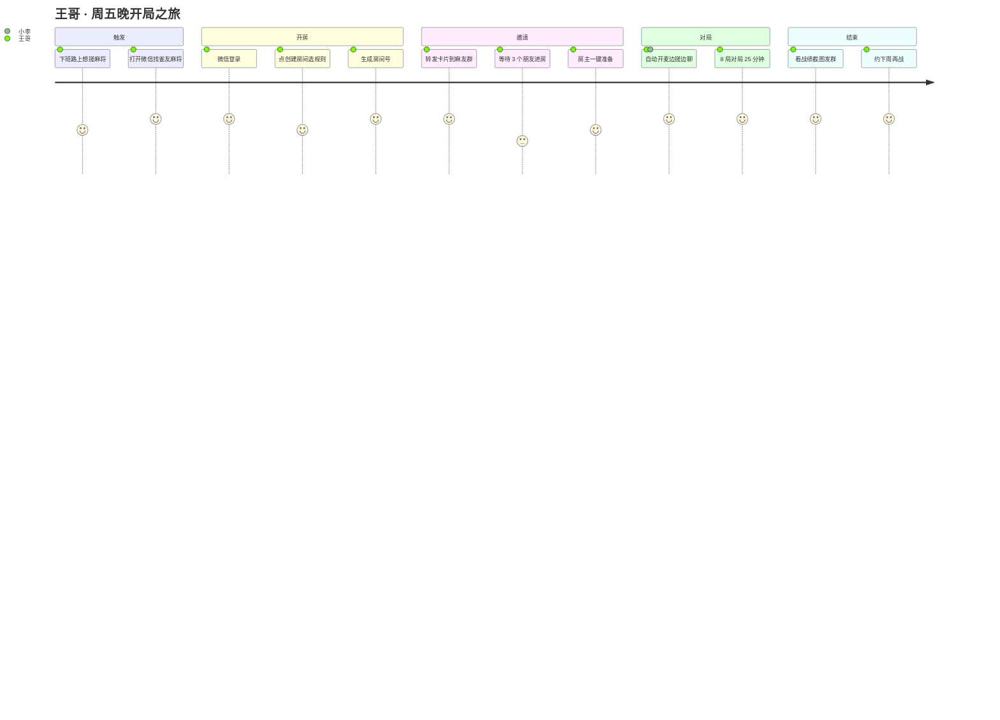
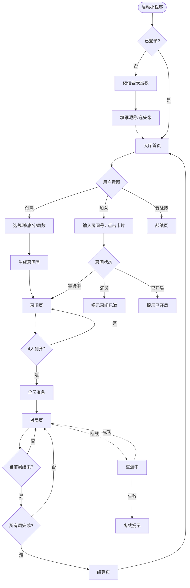
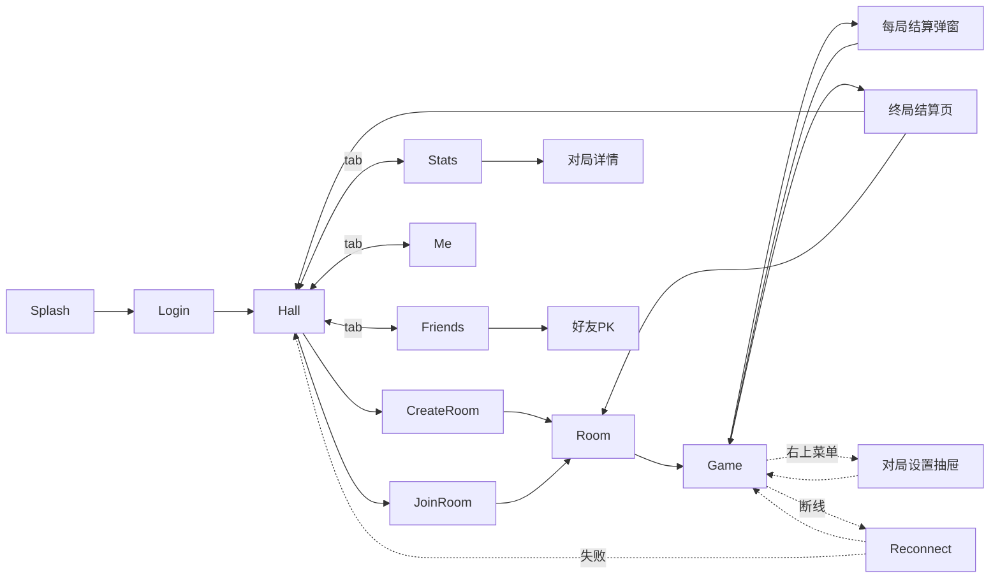
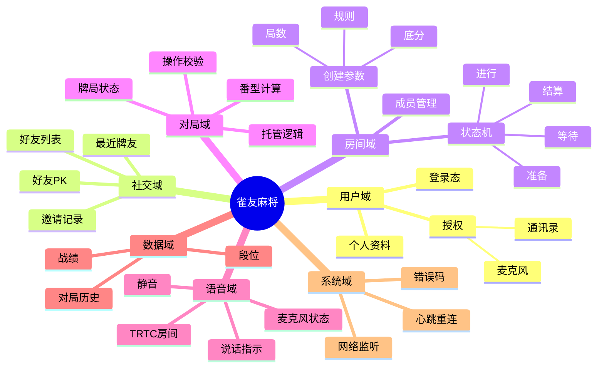
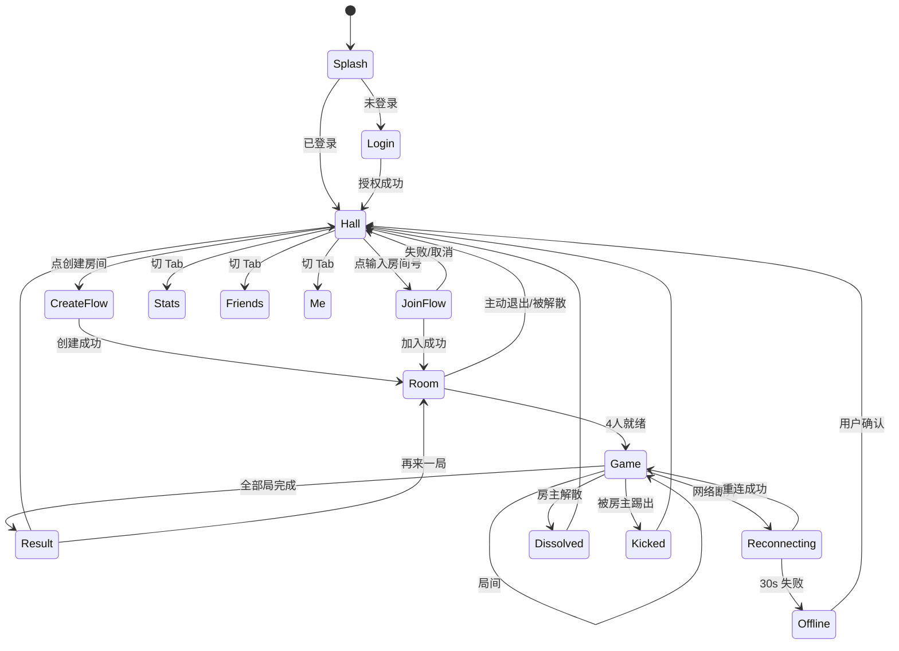
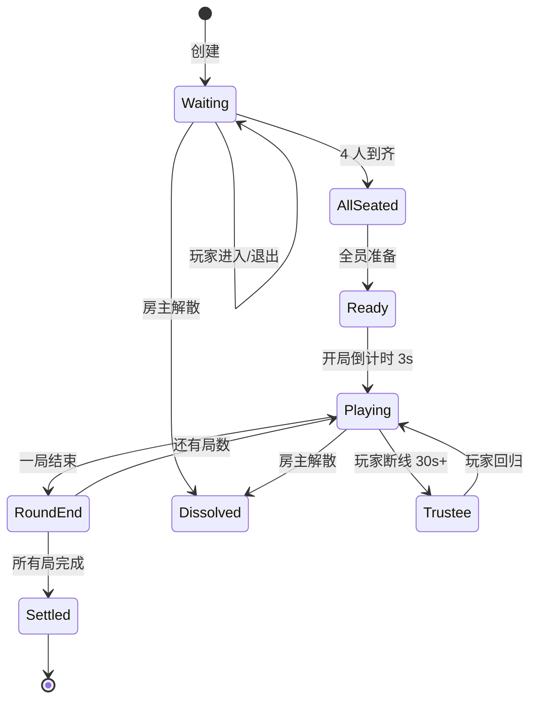
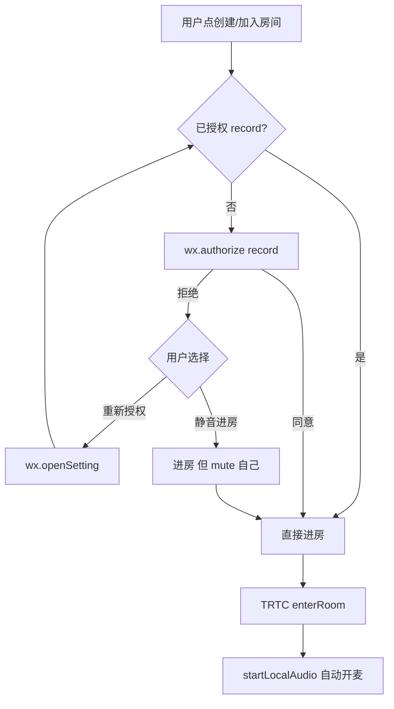

# 雀友麻将 · 产品设计评审文档

> 版本 v0.1 评审稿 · 2026-06-15
> 状态：待评审决策（9 个关键决策点）

---

## 文档先行：5 个最该被你"驳回"的假设

| # | 我的假设 | 替代选项 | 影响 |
|---|---------|---------|------|
| A | **MVP 麻将规则 = 广东推倒胡**（简单、20-30 分钟一局、社交向） | 国标 88 番 / 四川血战到底 / 血流成河 | 决定整个对局页操作面板和番型 UI |
| B | **对局视角 = 竖屏**（小程序场景多在通勤/碎片，符合微信生态） | 横屏围坐 4 家电视视角 | 决定整个对局布局——决策错了重做 |
| C | **TRTC 接入 = trtc-wx-sdk（基于 live-pusher/live-player）** | 自研 WebSocket OPUS 推流 | 决定语音质量和断线策略 |
| D | **MVP 不做金币/段位/付费**，只做战绩和好友局 | 上线即段位 + 金豆经济 | 影响合规风险和主页层级 |
| E | **房间号 = 6 位数字 + 微信卡片分享双通道** | 4 位 / 词组房号 | 影响邀请页 UI 和后端房号池策略 |
| F | **默认竖屏 + 自动开麦**，麦克风权限在"创建/加入房间"时申请 | 登录时一并申请 | 影响 D1 留存（前置授权拦人） |

---

## 1. 产品需求文档（PRD）

### 1.1 项目背景

- **市场缺口**：腾讯欢乐麻将偏陌生人 + 重氪；微信小游戏麻将多无语音；亲友局多依赖"麻友圈/雀神/微乐"等独立 App，**注册门槛高、群里发链接转化差**。
- **机会点**：微信生态 + 小程序卡片分享 + TRTC 语音 = "群里发卡片，30 秒开局"的最低摩擦体验。
- **差异化**：**好友局优先 + 自动开麦 + 不强求注册**。

### 1.2 目标用户与场景

- 25–45 岁城市麻友、家庭麻将群、办公室同事局、异地老友局
- 典型场景：周五晚 22:00、午休、周末家庭群、节假日远距离亲属

### 1.3 功能范围

| 优先级 | 功能 | 说明 |
|-------|------|------|
| **P0** | 微信登录 | `wx.login` + 后端换 unionId/openId；昵称/头像走"头像选择+昵称填写"组件（适配 2024+ 新规） |
| P0 | 创建房间 | 选规则、底分、局数（4/8/16）、是否允许观战 |
| P0 | 加入房间 | 6 位房间号 / 微信卡片直达 |
| P0 | 四人麻将对局 | 推倒胡，听/碰/杠/胡核心操作 |
| P0 | TRTC 实时语音 | 自动入麦克风房、自动开麦、说话指示 |
| P0 | 战绩统计 | 个人战绩、对局回放摘要、与好友 PK 数据 |
| P0 | 断线重连 | WS 心跳 + 状态快照 + 30 秒等位 + AI 托管兜底 |
| P0 | 异常处理 | 房主解散、踢人、超时托管、网络降级 |
| **P1** | 好友列表 | 微信关系链授权（受限）+ 房内加好友 |
| P1 | 表情/快捷语 | 6 个预设语音表情，弱网时替代 TRTC |
| P1 | 邀请卡片美化 | 动态卡片、自定义台名 |
| **P2** | 段位/排行榜 | 周榜、好友榜、段位赛 |
| P2 | 观战 | 观战席最多 4 人，仅看不发声 |
| P2 | AI 托管 | 简易托管 |

### 1.4 非目标

- ❌ 现金兑换 / 金豆充值 / 大额博弈（合规风险）
- ❌ 陌生人匹配
- ❌ 视频通话
- ❌ 国标 88 番

### 1.5 北极星指标

| 类型 | 指标 | 目标（3 个月） |
|------|------|---------------|
| 北极星 | 周活创房用户（Host-WAU） | 50 万 |
| 增长 | 邀请→进房转化率 | ≥ 60% |
| 健康度 | 单局完成率 | ≥ 75% |
| 健康度 | 平均对局时长 | 18–28 分钟 |
| 留存 | D1 / D7 / D30 | 50% / 25% / 12% |
| 技术 | TRTC 通道连通率 | ≥ 98% |
| 技术 | 断线重连成功率 | ≥ 90% |

---

## 2. 用户角色分析

### 2.1 三类核心角色

| 角色 | 房主 · 王哥 | 受邀者 · 小李 | 旁观者 · 李姐（P2） |
|------|------------|--------------|--------------------|
| 画像 | 35 岁，销售经理 | 28 岁，程序员 | 42 岁，全职妈妈 |
| 使用频率 | 周 3–4 次 | 周 1–2 次 | 偶尔 |
| 核心诉求 | 一键开房、不被打扰 | 收到链接立刻能玩 | 看朋友打、聊聊天 |
| 痛点 | 老 App 邀请流程长 | 注册/手机号绑定烦 | 没有合适的"陪看"位 |
| 关键路径 | 创建→分享→等齐→开局 | 点卡片→进房→开麦 | 进房→选观战席→听语音 |

### 2.2 用户旅程图



---

## 3. 主用户流程图



---

## 4. 页面流程图



---

## 5. 信息架构图



---

## 6. 页面树结构

```
雀友麻将 (Mini Program)
│
├── pages/                                          # 主包 ≤2MB
│   ├── splash/                  启动页 (1.5s 品牌过场)
│   ├── login/                   登录页 (微信授权 + 资料完善)
│   │
│   ├── hall/                    大厅 (Tab 1) ★ 默认页
│   │   ├── index               首页 - 创房/加房入口 + 最近对局
│   │   └── components/
│   │       ├── HostBanner       创房 CTA 卡
│   │       ├── JoinDialog       房间号输入弹层
│   │       └── RecentRooms      最近 3 个房间快速重入
│   │
│   ├── stats/                   战绩 (Tab 2)
│   │   ├── index                总览 + 折线图
│   │   └── detail               单局详情
│   │
│   ├── friends/                 好友 (Tab 3)
│   │   ├── index                好友列表
│   │   └── pk                   好友 PK 详情
│   │
│   └── me/                      我的 (Tab 4)
│       ├── index                头像/设置/客服/隐私
│       ├── notice               公告/规则说明
│       └── feedback             反馈
│
├── packageGame/                                    # 分包：对局 (重 UI)
│   ├── room/                    房间页 (等待+座位+准备)
│   ├── game/                    对局页 ★核心
│   │   └── components/
│   │       ├── MahjongTable     桌面/牌堆/牌墙
│   │       ├── HandTiles        手牌区(自家)
│   │       ├── OtherSeat        其他三家座位
│   │       ├── ActionBar        碰/杠/胡/听/过
│   │       ├── VoiceHUD         语音指示
│   │       ├── EachRoundResult  每局小结弹窗
│   │       └── SettingsDrawer   对局设置抽屉
│   └── result/                  终局结算页
│
├── packageError/                                   # 分包：异常态
│   ├── reconnecting             重连中 (全屏)
│   ├── offline                  网络断开
│   ├── kicked                   被踢出
│   ├── dissolved                房间解散
│   └── violation                违规提示
│
└── components/                  全局通用组件
    ├── ToastModal/  ConfirmDialog/  AvatarPicker/  ...
```

---

## 7. 页面跳转关系



---

## 8. 低保真线框图

> 屏幕基准 750rpx 宽，iPhone 安全区已避让。

### 8.1 大厅首页

```
┌──────────────────────────────────┐
│  胶囊按钮区域(系统占)              │
├──────────────────────────────────┤
│  雀友麻将 / 大厅                   │
├──────────────────────────────────┤
│ ┌──────────────────────────────┐ │
│ │  ✦ 创建房间                   │ │  ← 主 CTA, 96rpx
│ │     选规则 · 邀请好友 · 开打    │ │
│ └──────────────────────────────┘ │
│                                  │
│ ┌──────────────────────────────┐ │
│ │  # 输入房间号                 │ │  ← 次要 CTA
│ │     ━━━━━━ 6 位数字           │ │
│ └──────────────────────────────┘ │
│                                  │
│  最近对局 ─────────────  更多 >   │
│ ┌─────┐ ┌─────┐ ┌─────┐         │
│ │+25  │ │-12  │ │+8   │         │
│ │王/李 │ │王/张 │ │...  │         │
│ │6.13 │ │6.11 │ │6.08 │         │
│ └─────┘ └─────┘ └─────┘         │
│                                  │
├──────────────────────────────────┤
│  🀄 大厅  ⚂ 战绩  👥 好友  👤 我  │
└──────────────────────────────────┘
```

### 8.2 房间页（等待中）

```
┌──────────────────────────────────┐
│  ←  房间 1234-56     ⚙️ 邀请       │
├──────────────────────────────────┤
│  推倒胡 · 8 局 · 底分 1            │
│                                  │
│        ┌────────────┐             │
│        │ [对家空位]  │             │
│        │  + 邀请     │             │
│        └────────────┘             │
│                                  │
│  ┌──────┐          ┌──────┐      │
│  │[上家]│          │[下家]│      │
│  │👤小李│          │+ 邀请 │      │
│  │待准备 │          │       │      │
│  └──────┘          └──────┘      │
│                                  │
│        ┌────────────┐             │
│        │ 👤 王哥(房主)│             │
│        │   ✓ 已准备   │             │
│        └────────────┘             │
│                                  │
│  📋 复制房间号  📤 微信邀请        │
│                                  │
│  ┌──────────────────────────────┐ │
│  │     等待 2 人加入...          │ │
│  └──────────────────────────────┘ │
└──────────────────────────────────┘
```

### 8.3 对局页（竖屏）

```
┌──────────────────────────────────┐
│  ⏸ 设置        🀄  3/8 局         │
├──────────────────────────────────┤
│            👤 对家(李姐)           │
│           [背面 13 张牌]           │
│              [打出区]              │
│                                  │
│  ┌────┐                  ┌────┐  │
│  │👤  │     [牌墙圈]     │👤  │  │
│  │上家│      24 张        │下家│  │
│  │    │                  │    │  │
│  │[暗牌│   [东]  [出牌堆] │ [暗│  │
│  │ 13]│                  │ 牌]│  │
│  └────┘                  └────┘  │
│                                  │
│            🎤 在说话: 王哥          │
│                                  │
│       [我打出的牌区域]              │
│   ━━━━━━━━━━━━━━━━━━━━━━━━━━     │
│   🀇🀈🀉  🀙🀚🀛🀜  🀐🀑🀒  🀊🀊  │
│   ━━━━━━━━━━━━━━━━━━━━━━━━━━     │
│  ┌─────────────────────────────┐ │
│  │  [过] [碰] [杠] [听] [胡]    │ │
│  └─────────────────────────────┘ │
└──────────────────────────────────┘
```

### 8.4 终局结算

```
┌──────────────────────────────────┐
│  ←      终局结算                  │
├──────────────────────────────────┤
│           🏆 王哥 +42              │
│                                  │
│  ┌──────────────────────────────┐ │
│  │ 🥈 小李   +18                │ │
│  │ 🥉 张姐   -22                │ │
│  │ 4️⃣ 李哥   -38                │ │
│  └──────────────────────────────┘ │
│                                  │
│  本局战况 ─────────────────      │
│  自摸 3 次 · 杠 2 次 · 平均 12 番 │
│  最大胡牌：清一色 + 自摸 (32番)   │
│                                  │
│  ┌──────────┐  ┌──────────┐     │
│  │ 再来一局 │  │ 截图分享 │     │
│  └──────────┘  └──────────┘     │
│                                  │
│       回到大厅                    │
└──────────────────────────────────┘
```

---

## 9. 高保真 UI 设计方案（视觉方向）

### 9.1 三个备选视觉方向

| 方向 | 命名 | 核心气质 | 参考品味 |
|------|------|---------|---------|
| **A** ⭐ 推荐 | 现代东方茶馆 | 翠竹绿 + 米麻底，朱砂点缀，温润有文化感 | 原研哉 + Airbnb 早期 + 茶颜悦色 |
| **B** | 极简棋牌室 | 哑光黑 + 暖白 + 单色 accent | Linear / Apple Sports |
| **C** | 国潮赛博 | 玄黑 + 朱砂 + 点缀霓虹 | 黑神话风、王者荣耀 |

### 9.2 方向 A · 视觉 DNA

- **氛围词**：温润、有秩序、不喧哗、像清晨竹林
- **关键签名**：① 牌面用朱黑双色，弱去金色 ② 桌面贴米麻纹理 ③ 圆角而非直角，但克制 ④ 主 CTA 是叶脉绿渐变
- **不做**：金色边框、龙凤花纹、爆裂特效、紫色渐变、emoji 图标
- **会做**：120% 的细节——牌打出时的轻微 z-rotate + 落桌阴影 + "嗒"音效

---

## 10. 设计规范（Design System）

### 10.1 色板

| Token | HEX | 用途 |
|-------|-----|------|
| --brand-jade | #2B7A3D | 主品牌色 / 主 CTA |
| --brand-jade-soft | #5BA56A | hover/pressed |
| --ink-deep | #1F2933 | 一级文字 / 牌面字 |
| --ink-soft | #52606D | 二级文字 |
| --ink-mute | #9AA5B1 | 占位/禁用 |
| --cream | #F4EFE6 | 背景（米麻） |
| --cream-deep | #E8DFCE | 牌面底 |
| --cinnabar | #C4382E | 强调色（万字、胡牌、警告） |
| --warning | #D9883B | 网络弱、托管警示 |
| --mask | rgba(31,41,51,0.55) | 蒙层 |

### 10.2 字型

| Role | Stack | Size · Weight |
|------|-------|--------------|
| Display | PingFang SC | 48-64rpx · 600 |
| H1 | 同上 | 40rpx · 600 |
| H2 | 同上 | 32rpx · 600 |
| Body | 同上 | 28rpx · 400 |
| Caption | 同上 | 24rpx · 400 |
| Number | SF Mono / DIN | 等宽，letter-spacing 0.05em |

### 10.3 间距/圆角/阴影

- **间距**：4 / 8 / 12 / 16 / 24 / 32 / 48 / 64 rpx
- **圆角**：xs 8 · sm 16 · md 24 · lg 32 · pill 999 rpx
- **阴影**：elev-1/2/3 三档

---

## 11. 微信小程序交互规范

| 项 | 规范 |
|----|------|
| 胶囊按钮避让 | 顶部留 safeArea.top + 88rpx |
| 底部 Home Indicator | env(safe-area-inset-bottom) 必须避让 |
| 登录授权 | wx.login + chooseAvatar + nickname-input（2024 新规） |
| 麦克风权限 | 延后到"创建/加入房间"时申请 |
| 网络监听 | wx.onNetworkStatusChange + 心跳 5s/次 |
| 后台/前台 | onAppHide 暂停 TRTC 上行；onAppShow 恢复 |
| 分享 | onShareAppMessage 房间页带房号 |
| 长按禁用 | 牌面禁用系统菜单 |
| 震动反馈 | 出牌 light，胡牌 medium |
| 音频 | 对局开始时背景音音量降到 30% |
| 包体 | 主包 ≤2MB，对局 UI 走分包 |
| 弱网降级 | RTT > 800ms 关动画 + 提示 |

---

## 12. 房间交互逻辑

### 12.1 房间状态机



### 12.2 关键规则

| 场景 | 行为 |
|------|------|
| 房主创建后未邀请就退出 | 房间立即销毁 |
| 等待中玩家退出 | 该座位变空，可被新人加入 |
| 对局中玩家退出 | 进入"AI 托管"，30 秒倒计时召回 |
| 房主退出（等待中） | 房间解散 |
| 房主退出（对局中） | 自动让位给"房主候补"（最先加入的玩家） |
| 房主踢人 | 仅等待阶段可用 |
| 房间号有效期 | 创建后 30 分钟无人开局自动销毁 |

### 12.3 邀请机制

- 房间号 6 位数字，10 万级容量
- 微信卡片：onShareAppMessage 自定义 path = `/packageGame/room/index?id=123456`
- 复制口令：「【雀友麻将】房间号 123456，戳 → 链接 进来开打」

---

## 13. 语音房交互逻辑（TRTC）

### 13.1 接入方案

- 使用 trtc-wx-sdk（基于 live-pusher + live-player）
- 房间号：TRTC 房间号 = 麻将 roomId
- 角色：anchor（玩家）/ audience（观战）
- 音频编码：OPUS 32kbps，单声道
- 自动开麦：进房成功后 200ms 内 startLocalAudio

### 13.2 麦克风权限策略



### 13.3 房内语音 UI 规则

| 元素 | 行为 |
|------|------|
| 麦克风图标 | 自家：左下角浮标，常显；其他：座位头像下方小图标 |
| 说话指示 | 头像周围"翠竹绿"光圈呼吸动画，音量越大光圈越粗 |
| 自身静音 | 左下麦图标点击切换 |
| 房主一键全员静音 | 仅房主可见入口（设置抽屉里） |
| 网络降级 | TRTC 上行码率自动降；UI 顶部"网络较差"黄条 |
| 对手离线 | 头像变灰 + 麦图标变红斜杠 |

### 13.4 兼容性

- 后台保活：小程序后台 5s 后系统停 push stream，回前台需重新 startLocalAudio
- 音频独占：来电自动暂停 → 来电结束自动恢复
- iOS 后台限制：≥30s 无 UI 系统会回收

---

## 14. 对局页面布局设计

### 14.1 视角与坐标系（竖屏）

- 设计稿基准：750 × 1624 rpx
- 9 区栅格：T(对家) / L(上家) / M(中央桌面) / R(下家) / B(自家)

### 14.2 各区元素清单

| 区域 | 内容 | 高度 |
|------|------|------|
| 顶 status bar | 设置/局数/规则名/退出 | 88rpx |
| 对家区 T | 头像+昵称+番分 / 13 张暗牌 / 已碰杠 / 已打出 | 280rpx |
| 左右家 L/R | 头像+暗牌（竖向叠 13 张）+ 已碰杠 | flex |
| 中央 M | 牌墙圆 + 圈风 + 出牌动画 + 剩余牌数 | flex |
| 自家手牌区 B | 14 张大牌 + 已碰杠 + 出牌轨迹 | 320rpx |
| 操作栏 | 过/碰/杠/听/胡 五大按钮 | 144rpx |

### 14.3 关键交互

| 操作 | 反馈 |
|------|------|
| 摸牌 | 自家手牌区右侧出现新牌 + 弹起 16rpx + light vibrate |
| 出牌 | 长按抬起选中（高亮翠竹绿）→ 上滑/释放确认；落下 + 阴影 + "嗒" |
| 碰/杠按钮 | 仅在合法时机可点；按下后短暂禁用 1s 防双击 |
| 胡牌 | 全屏朱砂闪光 + 番型展示 + 音效"和！" + medium vibrate |
| 听牌 | 自家区出现"听"标识 + 听的牌透明展示在右上角 |
| 倒计时 | 出牌阶段 15s，最后 5s 头像描边变红，超时自动弃牌 |

---

## 15. 战绩系统设计

### 15.1 数据模型

```sql
users(id, openid, unionid, nickname, avatar, created_at)
rooms(id, room_code, host_id, rule, base_score, total_rounds, status, created_at, ended_at)
matches(id, room_id, round_no, started_at, ended_at, winner_id, win_type, fans)
match_players(match_id, user_id, seat, score_change, hands_history_json)
user_stats(user_id, total_matches, wins, total_score, max_single, last_played_at)
```

### 15.2 战绩页 UI 结构

```
┌──────────────────────────────────┐
│  战绩                              │
├──────────────────────────────────┤
│  ┌────────────────────────────┐  │
│  │  本周 +138 分               │  │
│  │  胜率 52% · 32 局            │  │
│  └────────────────────────────┘  │
│                                  │
│  ── 趋势 ────────────────        │
│  [近 14 天得分折线图]             │
│                                  │
│  ── 数据 ────────────────        │
│  最大单局   +84                   │
│  最长连胜   5                    │
│  最爱打     王哥(12 局)           │
│                                  │
│  ── 历史对局 ────────  全部 >    │
│  ┌──────────────────────────┐   │
│  │ 6.13 22:30  +25  vs 王李张│   │
│  │ 6.11 21:00  -12  vs 王张李│   │
│  └──────────────────────────┘   │
└──────────────────────────────────┘
```

### 15.3 单局详情

- 基础信息（时间 / 房号 / 规则 / 4 位玩家）
- 每小局得分流水（折线 + 表格）
- 关键时刻（最大胡 / 自摸 / 杠 / 漏胡）
- "再战一次"按钮

### 15.4 边界

- MVP 不实现完整回放，只做"关键时刻摘要"
- 只展示与"已对局过"的玩家数据，不暴露陌生人数据

---

## 16. 异常场景设计

### 16.1 场景全清单

| 场景 | 触发 | 用户态 | 系统行为 |
|------|------|--------|---------|
| 网络抖动 | 单次 ping 失败 | 顶部 banner "网络较差" | 不打断流程 |
| 断线 | 心跳 3 次失败（15s） | 全屏"重连中..." + 倒计时 30s | WS 重连 + 状态拉取 |
| 断线超时 | 30s 重连失败 | "网络无法连接" | 释放 TRTC，保留对局位 60s |
| 重连成功 | 重新握手 | 退出全屏遮罩 + 简化补帧 | 拉取最近 5 步操作日志 |
| 玩家短暂掉线 | 30s 内 | 该座位头像灰 + "🔄 重连中" | 该位托管出牌 |
| 玩家长时间掉线 | 60s+ | 该座位"AI 托管"标 | 自动出最右手牌 |
| 房主退出（等待中） | 房主点退出 | 全员收到"房间已解散" | 房间销毁 |
| 房主退出（对局中） | 房主点退出 | 弹出二次确认，转让房主给候补 | 不影响对局 |
| 被踢出 | 房主踢人 | 全屏"你已被房主请离" | 退回大厅 |
| 房间已满 | 加入时 | toast "房间已满（4/4）" | 退回大厅 |
| 房间已开局 | 加入时 | toast "房间已开局" | 退回大厅 |
| 房间不存在 | 房号错误/已销毁 | toast "房号无效或已解散" | 退回大厅 |
| TRTC 失败 | 进房或推流失败 3 次 | toast "语音不可用，可继续游戏" | 自动重试 1 次 |
| 后台被杀 | iOS 系统回收 | 重启时检测有未结束房间 | 弹"上局未完成，是否继续？" |
| 违规检测 | 后端识别异常 | "检测到异常行为" | 限时封禁 |

### 16.2 容错原则

1. 网络问题永远不"完全失败"——给至少一个 retry
2. 对局状态永远在后端——客户端崩溃后能从快照恢复
3. 语音失败不阻塞游戏——TRTC 是 nice-to-have
4. 任何"被踢出"都给文案——告诉用户为什么、能做什么

---

## 待确认决策清单

| # | 问题 | 我的建议 |
|---|------|---------|
| A | 麻将规则版本？ | 广东推倒胡（MVP）；下个版本再加四川血战 |
| B | 对局视角横屏 / 竖屏？ | 竖屏 |
| C | TRTC 接入方式？ | trtc-wx-sdk |
| D | MVP 是否做段位/金币？ | 不做 |
| E | 房间号策略？ | 6 位数字 + 微信卡片双通道 |
| F | 麦克风权限申请时机？ | 进房间时申请 |
| G | 视觉方向 A/B/C？ | A · 现代东方茶馆 |
| H | 观战、AI 托管、好友列表 在 MVP？ | 全部放 P1/P2 |
| I | 是否包含商业化模型？ | MVP 不做 |

---

## 下一步路线

1. 你确认上面 9 个决策点 → 我会更新文档
2. 我开始做 3 个高保真 mockup HTML（大厅 / 房间 / 对局），并排展示
3. 你选定方向后 → 我做剩余 5–6 屏（结算 / 战绩 / 异常态）
4. 最终交付：可点击的 iPhone 原型 + 完整设计标注 + 资产包

> 在收到你的确认前，我不会进入下一步。
