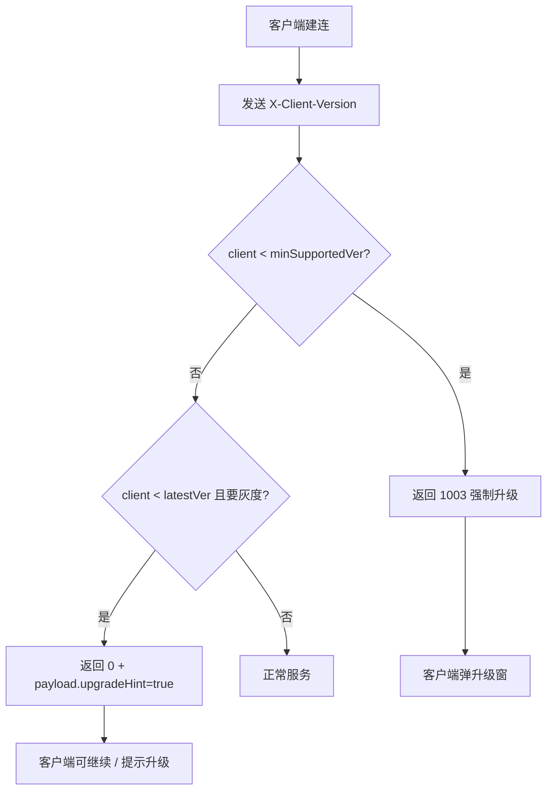
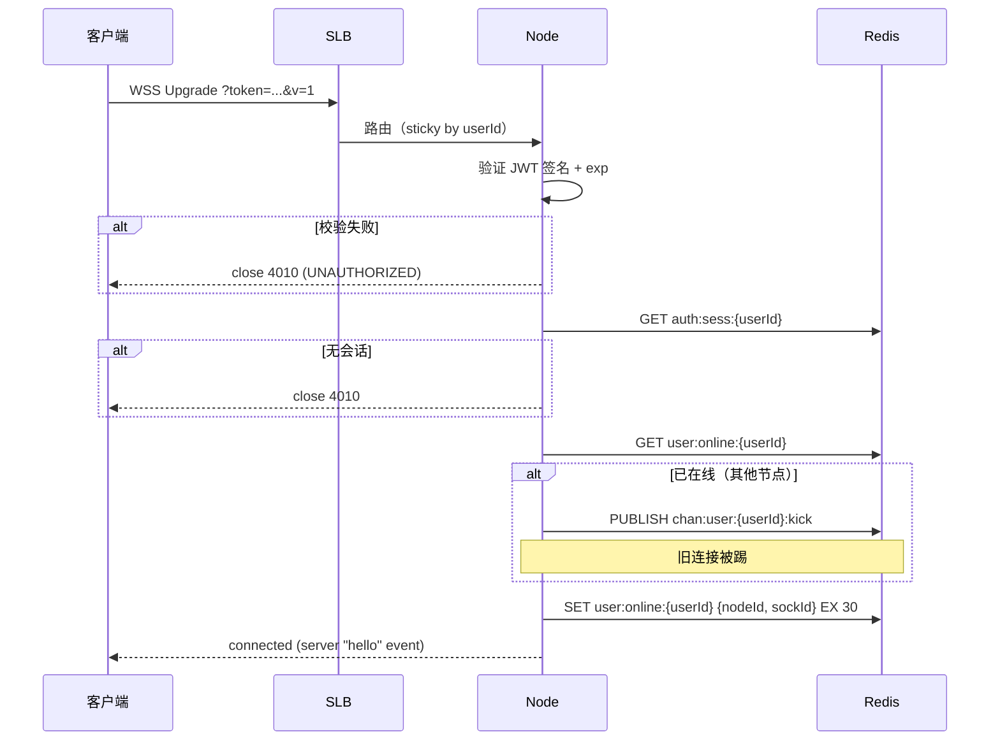
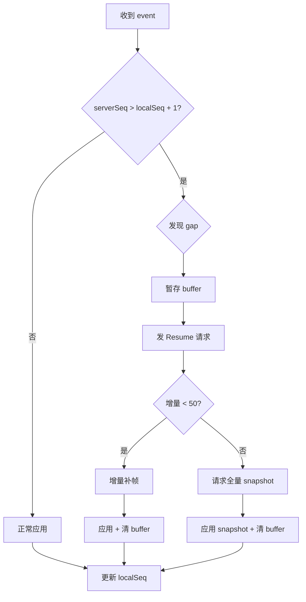
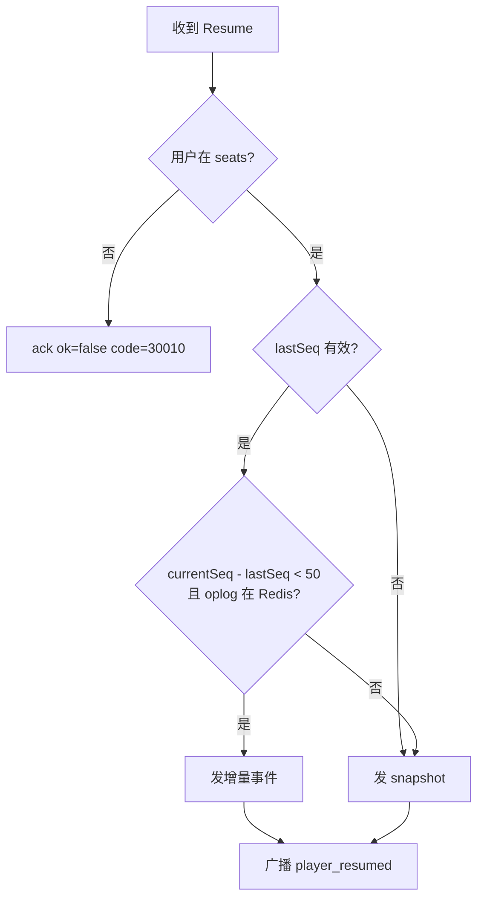
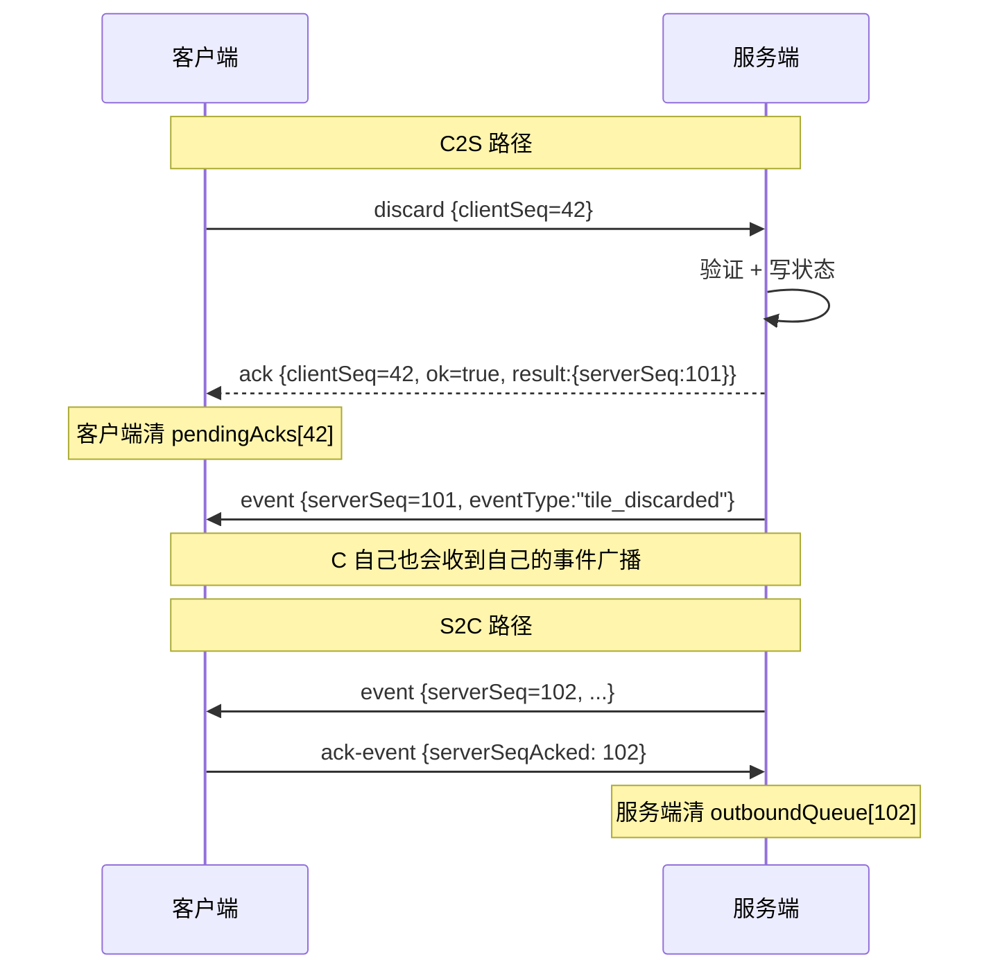
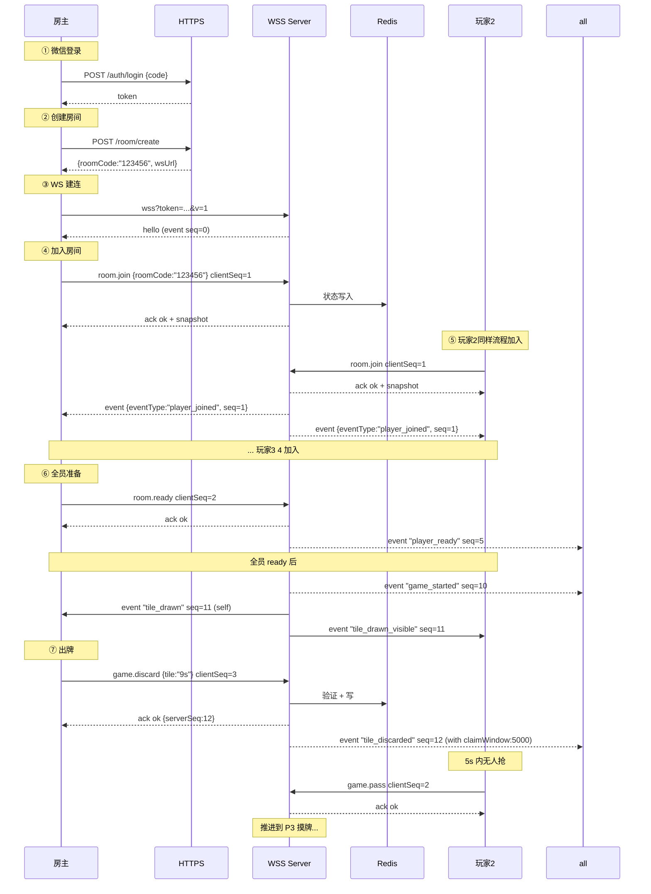
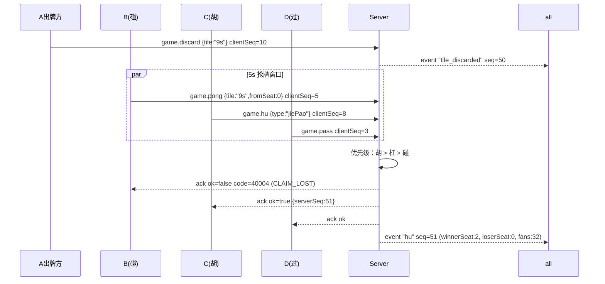
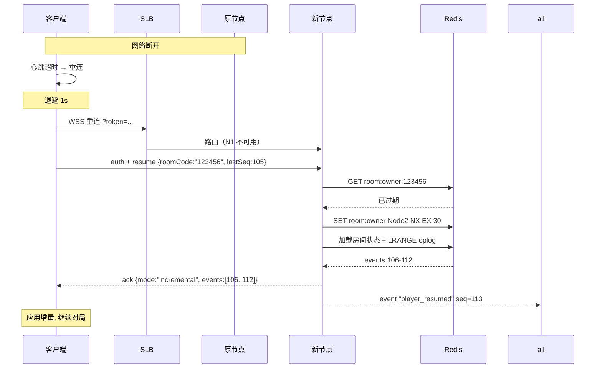
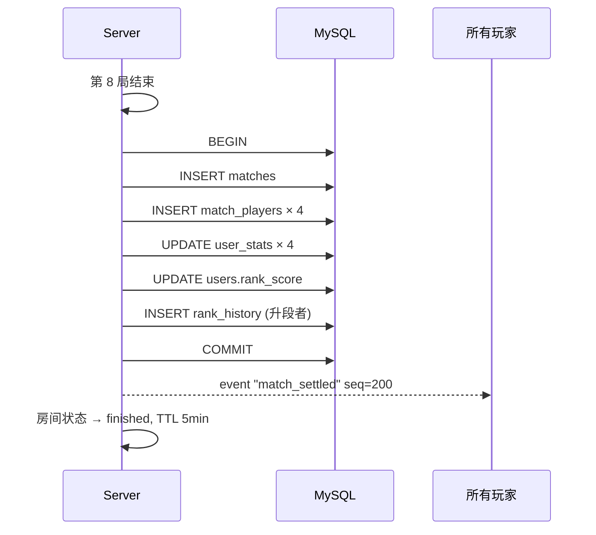

# 雀友麻将 · 通信协议设计文档（WEBSOCKET_PROTOCOL.md）

> 版本 v0.1 · 2026-06-15
> 基于 PRD v0.2 + ARCHITECTURE v0.1 + DATABASE_SCHEMA v0.1
> 涵盖：HTTP REST API + WebSocket 业务协议
> 协议格式：JSON（v0.1）；后续可平滑升级 MsgPack / Protobuf

---

## 0. 设计原则

| # | 原则 | 说明 |
|---|------|------|
| 1 | **双通道隔离** | HTTPS 用于无状态请求；WSS 用于实时对局；TRTC 信令直连腾讯云不走业务协议 |
| 2 | **统一信封** | 所有 C2S / S2C 消息共用 `{v, type, ...payload}` 结构，便于路由与版本演进 |
| 3 | **服务端权威** | 客户端永远只发"意图"，不发"状态"；服务端裁定 + 广播 |
| 4 | **幂等优先** | 客户端发送的写动作必带 `clientSeq`；同 `(roomCode, userId, clientSeq)` 仅生效一次 |
| 5 | **双向 ACK** | C2S 收 ack 才算成功；S2C event 客户端也要 ack（让服务端清重发缓存） |
| 6 | **向后兼容** | 新增字段不破坏旧客户端；废弃字段保留 ≥ 2 个版本 |
| 7 | **隐私可见性** | 自家手牌只发自家；他家事件区分 `self/others/all` |
| 8 | **错误码体系化** | 错误码分层（系统/业务/规则），便于客户端文案映射 |
| 9 | **小程序 4KB 友好** | 单包 < 4096 字节；超出走 HTTPS 拉取或分片 |
| 10 | **可观测** | 每条消息携带 `ts`，便于端到端时延采样 |

---

## 1. 版本控制

### 1.1 协议版本字段

所有 HTTP 请求与 WS 消息必须携带顶层 `v` 字段：

```typescript
// HTTP 请求 Header
"X-Protocol-Version: 1"

// WS 消息 Body
{ "v": 1, "type": "...", ... }
```

### 1.2 版本号语义

- `v` 为 **主协议版本**（major），不兼容变更才升
- 新增字段 / 新增 type / 新增错误码 → **不升 v**
- 字段改名 / 字段语义变化 / 删除字段 → **必须升 v**
- 客户端版本另发 `X-Client-Version: 1.2.3`（用于灰度/强升）

### 1.3 服务端兼容策略

| 客户端 v | 服务端 v=1 | 服务端 v=2 |
|---------|-----------|-----------|
| v=1 | ✅ 处理 | ✅ 旧版处理器（保留 ≥ 2 个大版本） |
| v=2 | ❌ 拒绝（升级提示） | ✅ 处理 |
| v=未发送 | ❌ 拒绝（视为非法客户端） | ❌ 拒绝 |

### 1.4 强制升级流程



---

## 2. 通用消息格式

### 2.1 HTTP 请求 / 响应信封

```typescript
// 通用响应信封
interface HttpResponse<T = unknown> {
  code: number;          // 0 = 成功；非 0 = 错误码
  message: string;       // 人类可读消息（不要直接展示给玩家）
  data: T | null;        // 业务数据
  traceId: string;       // 请求追踪 ID
  ts: number;            // 服务端时间戳（毫秒）
}

// 错误响应（保持同一结构）
interface HttpErrorResponse {
  code: number;          // 非 0
  message: string;
  data: null;
  traceId: string;
  ts: number;
  errorDetail?: {        // 可选：详细错误上下文
    field?: string;
    reason?: string;
    [k: string]: unknown;
  };
}
```

### 2.2 WebSocket C2S 信封

```typescript
interface C2SMessage<P = unknown> {
  v: number;             // 协议版本
  type: string;          // 消息类型，e.g. "game.discard"
  clientSeq: number;     // 客户端单调递增序号（幂等键）
  ts: number;            // 客户端时间戳
  payload: P;            // 业务数据
  sig?: string;          // 可选 HMAC 签名（v0.1 可不开）
}
```

### 2.3 WebSocket S2C 信封

```typescript
interface S2CMessage<P = unknown> {
  v: number;
  type:
    | "ack"              // 对 C2S 的应答
    | "event"            // 服务端推送的增量事件
    | "snapshot"         // 全量快照
    | "error"            // 业务错误（不针对某条 C2S）
    | "kicked"           // 被踢出
    | "heartbeat";       // 心跳响应
  serverSeq?: number;    // event/snapshot 携带；单调递增
  clientSeq?: number;    // ack 时回传 C2S 的 clientSeq
  ts: number;            // 服务端时间戳
  payload: P;
}
```

### 2.4 ACK 子结构

```typescript
interface AckPayload<R = unknown> {
  ok: boolean;           // 是否成功
  code: number;          // 0 或 错误码
  message?: string;      // 错误消息
  result?: R;            // 成功时的结果数据
}
```

### 2.5 Event 子结构

```typescript
interface EventPayload<P = unknown> {
  eventType: string;     // 见 §10.3 事件清单
  actor: string;         // userId 或 "system"
  visibility: "all" | "self" | "others";
  data: P;
}
```

### 2.6 错误信封

```typescript
interface ErrorPayload {
  code: number;
  message: string;
  context?: Record<string, unknown>;
  fatal?: boolean;       // true 时客户端应主动断连
}
```

---

## 3. 错误码体系

### 3.1 编码规范

错误码采用 **5 位数字**，分层编码：

```
1xxxx · 系统级（鉴权 / 限流 / 协议）
2xxxx · 用户域（账号 / 资料 / 好友）
3xxxx · 房间域（创建 / 加入 / 状态）
4xxxx · 对局域（规则违例 / 状态错乱）
5xxxx · 语音域（TRTC）
9xxxx · 服务端内部（5xx 类）
```

### 3.2 全量错误码

| 码 | 名称 | 触发条件 | 客户端处理 |
|----|------|---------|-----------|
| **0** | OK | 成功 | - |
| 10001 | INVALID_PROTOCOL_VERSION | 客户端 v 不支持 | 强制升级 |
| 10002 | INVALID_MESSAGE_FORMAT | JSON 解析失败 / 必填字段缺失 | 重连 |
| 10003 | CLIENT_VERSION_TOO_LOW | 客户端版本低于最低支持 | 强制升级 |
| 10010 | UNAUTHORIZED | Token 缺失/过期/非法 | 重新登录 |
| 10011 | TOKEN_EXPIRED | JWT 过期 | 静默 refresh |
| 10012 | TOKEN_REVOKED | 黑名单命中 | 重新登录 |
| 10020 | RATE_LIMITED | 限流 | 退避重试 |
| 10021 | TOO_MANY_CONNECTIONS | 同账号连接数超限 | 提示"账号在他处登录" |
| 10030 | DUPLICATE_REQUEST | 幂等命中（已处理） | 忽略（用缓存结果） |
| 10031 | CLIENT_SEQ_OUT_OF_ORDER | clientSeq 倒退 | 修正本地计数器 |
| 10040 | MAINTENANCE | 系统维护中 | 提示停服 |
| 20001 | USER_NOT_FOUND | 用户不存在 | toast |
| 20002 | NICKNAME_INVALID | 昵称非法 / 含敏感词 | 提示重填 |
| 20003 | AVATAR_UPLOAD_FAILED | 头像上传失败 | 重试 |
| 20010 | WX_LOGIN_FAILED | code2session 失败 | 重新 wx.login |
| 20011 | WX_CODE_USED | code 已被使用 | 重新 wx.login |
| 20020 | FRIEND_NOT_EXIST | 好友不存在 | toast |
| 20021 | ALREADY_FRIEND | 已是好友 | 静默 |
| 30001 | ROOM_NOT_FOUND | 房间不存在 / 已销毁 | 退回大厅 |
| 30002 | ROOM_FULL | 房间已满 4 人 | 退回大厅 |
| 30003 | ROOM_ALREADY_STARTED | 房间已开局 | 退回大厅 |
| 30004 | ROOM_DISSOLVED | 房间已解散 | 退回大厅 |
| 30005 | ROOM_CODE_INVALID | 房号格式错误 | 提示 |
| 30010 | NOT_IN_ROOM | 该用户不在该房 | 退回大厅 |
| 30011 | NOT_HOST | 非房主操作 | 提示 |
| 30012 | ALREADY_IN_ROOM | 已在房间中 | 静默 |
| 30013 | ALREADY_READY | 已准备 | 静默 |
| 30014 | NOT_ALL_READY | 未全员准备无法开局 | 等待 |
| 30020 | ROOMCODE_POOL_EXHAUSTED | 房号池耗尽（运维问题） | 重试 / 报错 |
| 40001 | NOT_YOUR_TURN | 不是你的回合 | toast |
| 40002 | INVALID_TILE | 你手中没有该牌 | toast |
| 40003 | INVALID_ACTION | 当前状态不允许该操作 | toast |
| 40004 | CLAIM_LOST | 抢牌被更高优先级覆盖 | 静默更新 |
| 40005 | TIMEOUT_AUTO_DISCARD | 出牌超时已自动弃牌 | 静默 |
| 40006 | ALREADY_HU | 已胡牌不可重复操作 | 静默 |
| 40007 | RULE_VIOLATION | 违反规则（更具体见 context.rule） | toast |
| 40008 | TRUSTEE_MODE | 托管中无法手动操作 | 提示"已托管" |
| 50001 | TRTC_SIG_FAILED | UserSig 签发失败 | 退化为无语音模式 |
| 50002 | TRTC_NOT_AUTHORIZED | 麦克风权限被拒 | 提示授权 |
| 50003 | TRTC_ENTER_ROOM_FAILED | TRTC 进房失败 | 静默重试 / 降级 |
| 90001 | INTERNAL_ERROR | 服务端 5xx | 提示稍后重试 |
| 90002 | DEPENDENCY_TIMEOUT | 下游依赖超时 | 重试 |
| 90099 | UNKNOWN | 兜底 | 上报 |

---

## 4. HTTP API · 通用约定

### 4.1 基础信息

| 项 | 值 |
|----|---|
| Base URL | `https://api.queyou.example.com` |
| 协议 | HTTPS (TLS 1.2+) |
| 编码 | UTF-8 / `Content-Type: application/json` |
| 鉴权 | `Authorization: Bearer {jwt}` |
| 协议版本 | `X-Protocol-Version: 1` |
| 客户端版本 | `X-Client-Version: 1.0.0` |
| Trace | 服务端在响应头返回 `X-Trace-Id` |

### 4.2 鉴权约定

- 登录类接口（`/auth/login`）**无需** Bearer Token
- 其他所有接口必须携带 Bearer Token
- Token 失效时返回 `code: 10010` + HTTP 401

### 4.3 限流策略

| 接口族 | 限制 | 超限错误 |
|-------|------|---------|
| `/auth/*` | 每 IP 10/min；每账号 5/min | 10020 |
| `/user/*` | 每账号 30/min | 10020 |
| `/stats/*` | 每账号 60/min | 10020 |
| `/room/*` | 每账号 30/min | 10020 |
| `/voice/*` | 每账号 20/min | 10020 |

### 4.4 通用响应

```json
{
  "code": 0,
  "message": "OK",
  "data": { /* ... */ },
  "traceId": "8f3e7c2a-...",
  "ts": 1750046400123
}
```

错误响应：

```json
{
  "code": 30001,
  "message": "ROOM_NOT_FOUND",
  "data": null,
  "traceId": "8f3e7c2a-...",
  "ts": 1750046400456,
  "errorDetail": { "roomCode": "123456" }
}
```

---

## 5. HTTP API · 登录

### 5.1 `POST /auth/login` · 微信登录

**请求**

```typescript
interface LoginRequest {
  code: string;                  // wx.login() 返回的 code
  encryptedData?: string;        // 可选：encrypted user info
  iv?: string;                   // 可选：iv
  signature?: string;            // 可选
  nickname?: string;             // chooseAvatar 后用户填写
  avatarUrl?: string;            // chooseAvatar 后用户选择
}
```

**请求示例**

```http
POST /auth/login HTTP/1.1
Content-Type: application/json
X-Protocol-Version: 1
X-Client-Version: 1.0.0

{
  "code": "081xxxxxxxxxxxxxxxxxxxx",
  "nickname": "王哥",
  "avatarUrl": "https://thirdwx.qlogo.cn/..."
}
```

**响应**

```typescript
interface LoginResponse {
  token: string;                 // JWT, TTL 7 天
  refreshToken: string;          // refresh JWT, TTL 30 天
  expiresIn: number;             // token 剩余秒数
  user: UserBrief;
  isNewUser: boolean;            // 是否新注册
}

interface UserBrief {
  id: string;                    // BigInt 转 string（避免 JS 精度丢失）
  nickname: string;
  avatarUrl: string;
  rankLevel: number;             // 1-8
  rankScore: number;
  totalMatches: number;
  totalWins: number;
}
```

**响应示例**

```json
{
  "code": 0,
  "message": "OK",
  "data": {
    "token": "eyJhbGciOi...",
    "refreshToken": "eyJhbGciOi...",
    "expiresIn": 604800,
    "user": {
      "id": "10086",
      "nickname": "王哥",
      "avatarUrl": "https://...",
      "rankLevel": 3,
      "rankScore": 218,
      "totalMatches": 156,
      "totalWins": 81
    },
    "isNewUser": false
  },
  "traceId": "...",
  "ts": 1750046400123
}
```

**可能错误**：`20010 / 20011 / 10002 / 10020`

### 5.2 `POST /auth/refresh` · 刷新 Token

**请求**

```typescript
interface RefreshRequest {
  refreshToken: string;
}
```

**响应**

```typescript
interface RefreshResponse {
  token: string;
  expiresIn: number;
}
```

**可能错误**：`10010 / 10011 / 10012`

### 5.3 `POST /auth/logout` · 登出

**请求**：空 body（Token 来自 Header）
**响应**：`data: null`

服务端动作：
- JWT 加入黑名单
- DEL `auth:sess:{userId}`
- 强制断 WS

---

## 6. HTTP API · 用户信息

### 6.1 `GET /user/me` · 获取当前用户

**响应**

```typescript
interface UserMeResponse {
  id: string;
  openid: string;                // 仅返回给本人
  nickname: string;
  avatarUrl: string;
  gender: 0 | 1 | 2;
  city?: string;
  rankLevel: number;
  rankScore: number;
  rankName: string;              // "雀友 · 三段"
  nextLevelScore: number;        // 距离下一段位的累计分阈值
  totalMatches: number;
  totalWins: number;
  createdAt: number;             // 注册时间戳
}
```

### 6.2 `PATCH /user/me` · 更新资料

**请求**

```typescript
interface UpdateUserRequest {
  nickname?: string;             // 1-32 字符
  avatarUrl?: string;
  gender?: 0 | 1 | 2;
  city?: string;
}
```

**响应**：同 `UserMeResponse`

**可能错误**：`20002 / 20003`

### 6.3 `GET /user/{id}` · 查询他人资料（脱敏）

**响应**

```typescript
interface UserPublicResponse {
  id: string;
  nickname: string;
  avatarUrl: string;
  rankLevel: number;
  rankName: string;
  totalMatches: number;          // 公开
  totalWins: number;             // 公开
  // openid / city / gender 等不返回
}
```

### 6.4 `GET /user/me/friends` · 好友列表

**响应**

```typescript
interface FriendsListResponse {
  total: number;
  online: number;
  list: FriendBrief[];
}

interface FriendBrief {
  userId: string;
  nickname: string;
  avatarUrl: string;
  rankLevel: number;
  isOnline: boolean;
  lastPlayedAt?: number;
  inRoom?: { roomCode: string };  // 仅在线 + 对方允许查看时返回
}
```

### 6.5 `POST /user/me/friends/{userId}` · 添加好友

**响应**：`data: null`

**可能错误**：`20020 / 20021`

### 6.6 `DELETE /user/me/friends/{userId}` · 删除好友

**响应**：`data: null`

---

## 7. HTTP API · 战绩

### 7.1 `GET /stats/me` · 个人战绩总览

**响应**

```typescript
interface MyStatsResponse {
  // 段位
  rank: {
    level: number;
    name: string;                // "雀友 · 三段"
    score: number;
    nextLevelScore: number;
    progress: number;            // 0-1
  };

  // 总数据
  totalMatches: number;
  totalWins: number;
  totalLosses: number;
  winRate: number;               // 0-1
  totalScore: number;
  maxSingleScore: number;
  longestWinStreak: number;
  selfMoCount: number;
  jiePaoCount: number;
  dianPaoCount: number;

  // 周/月
  thisWeek: PeriodStats;
  thisMonth: PeriodStats;
}

interface PeriodStats {
  matches: number;
  wins: number;
  scoreSum: number;
  winRate: number;
  largestWin: number;
}
```

### 7.2 `GET /stats/me/recent?limit=50&before={ts}` · 历史对局列表

**Query**

| 参数 | 类型 | 默认 | 说明 |
|------|------|------|------|
| limit | int | 20 | 1-100 |
| before | int (ms) | - | 时间游标（仅返回该时间之前的） |

**响应**

```typescript
interface RecentMatchesResponse {
  list: MatchBrief[];
  hasMore: boolean;
  nextCursor: number | null;
}

interface MatchBrief {
  matchId: string;
  roomCode: string;
  roundNo: number;
  rule: string;                  // "xiangyang_redzhong"
  totalRounds: number;
  myScoreChange: number;         // 含正负
  winnerId: string | null;
  winType: "selfmo" | "jiePao" | "huangzhuang" | null;
  fans: number;
  opponents: PlayerBrief[];      // 同桌其他 3 人（含自家共 4 个）
  startedAt: number;
  endedAt: number;
  durationSec: number;
}

interface PlayerBrief {
  userId: string;
  nickname: string;
  avatarUrl: string;
  seat: number;
  scoreChange: number;
}
```

### 7.3 `GET /stats/me/trend?days=14` · 趋势曲线

**响应**

```typescript
interface TrendResponse {
  days: number;
  points: TrendPoint[];
}

interface TrendPoint {
  date: string;                  // "2026-06-13"
  matches: number;
  scoreSum: number;
  cumulativeScore: number;       // 累计净胜
}
```

### 7.4 `GET /stats/me/pk/{userId}` · 与某好友 PK 数据

**响应**

```typescript
interface PkStatsResponse {
  opponent: UserPublicResponse;
  totalMatches: number;
  myWins: number;
  hisWins: number;
  myWinRate: number;
  recent5: MatchBrief[];
}
```

### 7.5 `GET /stats/me/rank-history?limit=20` · 段位变更轨迹

**响应**

```typescript
interface RankHistoryResponse {
  list: RankChange[];
}

interface RankChange {
  rankBefore: number;
  rankAfter: number;
  scoreBefore: number;
  scoreAfter: number;
  scoreDelta: number;
  matchId?: string;
  reason: "match" | "season_reset" | "admin_adjust";
  createdAt: number;
}
```

### 7.6 `GET /match/{matchId}` · 单局详情

**响应**

```typescript
interface MatchDetailResponse {
  matchId: string;
  roomCode: string;
  roundNo: number;
  startedAt: number;
  endedAt: number;
  dealerId: string;
  winnerId: string | null;
  loserId: string | null;
  winType: "selfmo" | "jiePao" | "huangzhuang" | null;
  fans: number;
  fanBreakdown: { type: string; fans: number }[];
  players: MatchPlayerDetail[];
}

interface MatchPlayerDetail {
  userId: string;
  nickname: string;
  avatarUrl: string;
  seat: number;
  role: "dealer" | "normal";
  scoreChange: number;
  scoreAfter: number;
  trusteeSeconds: number;
  handHistory?: HandHistorySummary;     // 见 DATABASE_SCHEMA §9.3
}
```

---

## 8. HTTP API · 房间初始化（创建 / 查询）

> **设计说明**：v0.1 走"HTTP 创建 → WS 加入"的两步式。HTTP 仅做轻量初始化与房号分配。

### 8.1 `POST /room/create` · 创建房间

**请求**

```typescript
interface CreateRoomRequest {
  rule: "xiangyang_redzhong";
  totalRounds: 4 | 8 | 16;
  baseScore: 1 | 2 | 5;
  allowSpectator?: boolean;      // v0.1 强制 false
  requestId: string;             // 客户端 UUID，幂等键
}
```

**响应**

```typescript
interface CreateRoomResponse {
  roomCode: string;              // "123456"
  roomId: string;
  hostId: string;
  expiresAt: number;             // 30 分钟无人开局自动销毁
  wsUrl: string;                 // 推荐 WS 连接地址（含 region）
}
```

**可能错误**：`30020 / 10020`

### 8.2 `GET /room/{roomCode}` · 查询房间状态（轻量）

**响应**

```typescript
interface RoomQueryResponse {
  roomCode: string;
  status: "waiting" | "playing" | "finished" | "dissolved";
  rule: string;
  totalRounds: number;
  baseScore: number;
  hostId: string;
  seats: { seat: number; userId: string | null; nickname?: string; avatarUrl?: string }[];
  currentRound?: number;         // playing 时存在
  createdAt: number;
}
```

**可能错误**：`30001`

---

## 9. HTTP API · TRTC 语音

### 9.1 `POST /voice/sig` · 签发 TRTC UserSig

**请求**

```typescript
interface VoiceSigRequest {
  roomCode: string;              // 必须是当前用户所在房间
}
```

**响应**

```typescript
interface VoiceSigResponse {
  sdkAppId: number;
  userId: string;                // = users.id 字符串
  userSig: string;
  trtcRoomId: number;            // 整数房号（roomCode 的数值）
  expireAt: number;              // userSig 过期时间戳
  privateMapKey?: number;        // 房间权限位（可选）
}
```

**可能错误**：`50001 / 30010`

---

## 10. WebSocket · 连接生命周期

### 10.1 连接 URL

```
wss://api.queyou.example.com/socket.io/?token={jwt}&v=1&clientVer=1.0.0
```

| Query | 必需 | 说明 |
|-------|------|------|
| token | 是 | JWT |
| v | 是 | 协议版本 |
| clientVer | 是 | 客户端版本 |
| platform | 否 | wx / android / ios（统计用） |

### 10.2 建连流程



### 10.3 服务端 hello 事件

建连后服务端立即下发：

```json
{
  "v": 1,
  "type": "event",
  "serverSeq": 0,
  "ts": 1750046400123,
  "payload": {
    "eventType": "hello",
    "actor": "system",
    "visibility": "self",
    "data": {
      "userId": "10086",
      "nodeId": "node-3",
      "serverTime": 1750046400123,
      "minClientVer": "1.0.0",
      "latestClientVer": "1.0.5",
      "features": ["xiangyang_redzhong"]
    }
  }
}
```

### 10.4 关闭码（WebSocket close codes）

| Code | 含义 | 客户端处理 |
|------|------|-----------|
| 1000 | 正常关闭 | - |
| 1001 | 服务端下线 | 重连其他节点 |
| 1006 | 异常断开 | 进入重连流程 |
| 4010 | 鉴权失败 | 重新登录 |
| 4011 | Token 过期 | 静默 refresh + 重连 |
| 4020 | 限流 | 退避重连 |
| 4021 | 同账号其他端登录 | 提示用户 |
| 4030 | 协议版本不支持 | 强制升级 |
| 4040 | 维护中 | 提示维护 |
| 4090 | 未知错误 | 重连 |

---

## 11. WebSocket · 心跳

### 11.1 心跳约定

- 客户端每 **5 秒**发送一次 heartbeat
- 服务端连续 **15 秒**未收到 → 视为掉线，进入断线流程
- 心跳消息**不带 clientSeq**（不计入幂等表）

### 11.2 C2S `heartbeat`

```json
{
  "v": 1,
  "type": "heartbeat",
  "ts": 1750046400123,
  "payload": {}
}
```

### 11.3 S2C `heartbeat`

```json
{
  "v": 1,
  "type": "heartbeat",
  "ts": 1750046400125,
  "payload": {
    "serverTime": 1750046400125,
    "rttHint": 2
  }
}
```

> **时钟校准**：客户端用 `serverTime - ts(本地)` 估算偏差，用于服务端倒计时显示。

---

## 12. WebSocket · 鉴权（在线后）

虽然建连时已带 token，但 v0.1 仍要求显式发送 `auth` 消息以兼容代理场景：

### 12.1 C2S `auth`

```typescript
interface AuthC2S {
  token: string;                 // 同建连时的 jwt
  resumeRoomCode?: string;       // 重连时的房间号
  lastSeq?: number;              // 重连时的 lastSeq
}
```

```json
{
  "v": 1,
  "type": "auth",
  "clientSeq": 1,
  "ts": 1750046400123,
  "payload": { "token": "eyJhb..." }
}
```

### 12.2 S2C `ack` for auth

```json
{
  "v": 1,
  "type": "ack",
  "clientSeq": 1,
  "ts": 1750046400125,
  "payload": {
    "ok": true,
    "code": 0,
    "result": {
      "userId": "10086",
      "currentRoom": "123456"     // 若有进行中的房间
    }
  }
}
```

---

## 13. WebSocket · 房间操作

### 13.1 `room.create` ⚠️ 备用

> **设计立场**：v0.1 房间创建走 HTTP `/room/create`（见 §8.1）。WS 仅作为 fallback，正式部署可关闭。

### 13.2 `room.join` · 加入房间

**C2S**

```typescript
interface RoomJoinC2S {
  roomCode: string;
}
```

```json
{
  "v": 1,
  "type": "room.join",
  "clientSeq": 5,
  "ts": 1750046400123,
  "payload": { "roomCode": "123456" }
}
```

**S2C ack**

```typescript
interface RoomJoinAck {
  ok: boolean;
  code: number;
  result?: {
    roomCode: string;
    seat: number;                // 0-3
    snapshot: RoomSnapshot;      // 见 §15.1
  };
}
```

**ack 成功示例**

```json
{
  "v": 1,
  "type": "ack",
  "clientSeq": 5,
  "ts": 1750046400125,
  "payload": {
    "ok": true,
    "code": 0,
    "result": {
      "roomCode": "123456",
      "seat": 2,
      "snapshot": { /* 见 §15.1 */ }
    }
  }
}
```

**广播事件**：服务端向房内所有玩家广播 `event { eventType: "player_joined", ... }`

**可能错误**：`30001 / 30002 / 30003 / 30004 / 30012`

### 13.3 `room.leave` · 离开房间

**C2S**

```typescript
interface RoomLeaveC2S {
  reason?: "user_quit" | "back";
}
```

**说明**：
- 等待中：直接离开 → 广播 `player_left`
- 对局中：拒绝离开（必须解散），返回错误 `40003`

**可能错误**：`30010 / 40003`

### 13.4 `room.ready` · 准备

**C2S**

```typescript
interface RoomReadyC2S {}            // 空 payload
```

**S2C ack**：`{ ok: true, code: 0 }`

**广播事件**：`event { eventType: "player_ready", actor: userId }`

**可能错误**：`30010 / 30013`

### 13.5 `room.unready` · 取消准备

仅在"全员未准备完"前可取消。

### 13.6 `room.dissolve` · 房主解散

**C2S**

```typescript
interface RoomDissolveC2S {
  confirm: boolean;              // 必须 true（防误触）
}
```

**S2C 广播**

```json
{
  "v": 1,
  "type": "event",
  "serverSeq": 200,
  "ts": ...,
  "payload": {
    "eventType": "room_dissolved",
    "actor": "system",
    "visibility": "all",
    "data": { "reason": "host_dissolved", "by": "10086" }
  }
}
```

**可能错误**：`30010 / 30011`

### 13.7 `room.kick` · 房主踢人（仅等待中）

**C2S**

```typescript
interface RoomKickC2S {
  targetUserId: string;
}
```

被踢用户收到 `S2C kicked`：

```json
{
  "v": 1,
  "type": "kicked",
  "ts": ...,
  "payload": {
    "reason": "host_kick",
    "by": "10086",
    "message": "被房主请离"
  }
}
```

---

## 14. WebSocket · 对局操作

### 14.1 牌型编码

为 JSON 可读性，采用文本编码：

```
万 (m): 1m 2m 3m 4m 5m 6m 7m 8m 9m
筒 (p): 1p 2p 3p 4p 5p 6p 7p 8p 9p
条 (s): 1s 2s 3s 4s 5s 6s 7s 8s 9s
字 (z): 1z=东 2z=南 3z=西 4z=北 5z=中 6z=发 7z=白
```

**癞子标识**：襄阳红中癞子规则下，`5z` 即百搭。`tile.isWild` 字段在客户端 UI 渲染时使用。

### 14.2 `game.discard` · 出牌

**C2S**

```typescript
interface GameDiscardC2S {
  tile: string;                  // e.g. "9s"
}
```

```json
{
  "v": 1,
  "type": "game.discard",
  "clientSeq": 42,
  "ts": ...,
  "payload": { "tile": "9s" }
}
```

**S2C ack**

```typescript
interface GameDiscardAck {
  ok: boolean;
  code: number;
  result?: {
    serverSeq: number;           // 该动作的事件 seq
  };
}
```

**广播事件**：

```json
{
  "v": 1,
  "type": "event",
  "serverSeq": 101,
  "ts": ...,
  "payload": {
    "eventType": "tile_discarded",
    "actor": "10086",
    "visibility": "all",
    "data": {
      "tile": "9s",
      "seat": 0,
      "claimWindow": 5000        // 抢牌窗口毫秒
    }
  }
}
```

**可能错误**：`40001 / 40002 / 40003 / 40005 / 40008`

### 14.3 `game.draw` · 摸牌（被动）

> **设计说明**：摸牌由服务端驱动，客户端**不主动发**。轮到该玩家时服务端推送 `tile_drawn` 事件。

**S2C 事件（仅自家可见）**

```json
{
  "v": 1,
  "type": "event",
  "serverSeq": 100,
  "ts": ...,
  "payload": {
    "eventType": "tile_drawn",
    "actor": "system",
    "visibility": "self",
    "data": {
      "tile": "5m",
      "remainingWall": 38,
      "isWild": false
    }
  }
}
```

**S2C 事件（其他玩家可见）**

```json
{
  "v": 1,
  "type": "event",
  "serverSeq": 100,
  "ts": ...,
  "payload": {
    "eventType": "tile_drawn_visible",
    "actor": "system",
    "visibility": "others",
    "data": {
      "seat": 0,
      "userId": "10086",
      "remainingWall": 38
    }
  }
}
```

### 14.4 `game.pong` · 碰

**C2S**

```typescript
interface GamePongC2S {
  tile: string;                  // 要碰的牌
  fromSeat: number;              // 从哪家碰
}
```

**广播事件**

```json
{
  "v": 1,
  "type": "event",
  "serverSeq": 102,
  "ts": ...,
  "payload": {
    "eventType": "pong",
    "actor": "10086",
    "visibility": "all",
    "data": {
      "tile": "9s",
      "fromSeat": 1,
      "toSeat": 2,
      "meld": ["9s", "9s", "9s"]
    }
  }
}
```

**可能错误**：`40001 / 40002 / 40003 / 40004`

### 14.5 `game.kong` · 杠

**C2S**

```typescript
interface GameKongC2S {
  type: "ming" | "an" | "addedToPong";  // 明杠 / 暗杠 / 加杠
  tile: string;
  fromSeat?: number;             // 明杠时必填
}
```

**广播事件**

```json
{
  "v": 1,
  "type": "event",
  "serverSeq": 103,
  "ts": ...,
  "payload": {
    "eventType": "kong",
    "actor": "10086",
    "visibility": "all",
    "data": {
      "kongType": "ming",
      "tile": "3z",
      "fromSeat": 0,
      "toSeat": 2,
      "meld": ["3z","3z","3z","3z"],
      "willDrawTile": true       // 杠后补牌
    }
  }
}
```

**可能错误**：`40001 / 40002 / 40003 / 40004`

### 14.6 `game.ting` · 听

**C2S**：空 payload

**S2C ack（仅自家可见）**

```typescript
interface GameTingAck {
  ok: boolean;
  code: number;
  result?: {
    listenTiles: string[];       // 听的牌
    maxFans: number;             // 最大番数
  };
}
```

**广播事件（all）**：仅广播"该玩家听了"，不暴露具体听张

```json
{
  "v": 1,
  "type": "event",
  "serverSeq": 104,
  "ts": ...,
  "payload": {
    "eventType": "ting",
    "actor": "10086",
    "visibility": "all",
    "data": { "seat": 2 }
  }
}
```

### 14.7 `game.hu` · 胡

**C2S**

```typescript
interface GameHuC2S {
  type: "selfmo" | "jiePao";
}
```

**广播事件**

```json
{
  "v": 1,
  "type": "event",
  "serverSeq": 110,
  "ts": ...,
  "payload": {
    "eventType": "hu",
    "actor": "10086",
    "visibility": "all",
    "data": {
      "winType": "jiePao",
      "winnerSeat": 2,
      "loserSeat": 0,
      "winTile": "4m",
      "fans": 32,
      "fanBreakdown": [
        { "type": "qingyise", "fans": 8 },
        { "type": "ziyise", "fans": 16 },
        { "type": "jiePao", "fans": 1 }
      ],
      "scoreChanges": {
        "10086": 96,
        "10087": -32,
        "10088": -32,
        "10089": -32
      }
    }
  }
}
```

**可能错误**：`40001 / 40003 / 40006 / 40007`

### 14.8 `game.pass` · 过（不要碰/杠/胡）

抢牌窗口内必须主动 pass 或服务端 5s 后视为 pass。

**C2S**：空 payload

**S2C ack**：`{ ok: true, code: 0 }`

**不广播**（仅服务端记录），等其他玩家也表态后统一推进。

### 14.9 单局结算事件

```json
{
  "v": 1,
  "type": "event",
  "serverSeq": 120,
  "ts": ...,
  "payload": {
    "eventType": "round_settled",
    "actor": "system",
    "visibility": "all",
    "data": {
      "roundNo": 3,
      "totalRounds": 8,
      "winnerId": "10086",
      "winType": "jiePao",
      "fans": 32,
      "scoreChanges": { /* userId: delta */ },
      "scoreAfter": { /* userId: 累计分 */ },
      "nextDealerId": "10087",
      "nextStartAt": 1750046430000
    }
  }
}
```

### 14.10 终局结算事件

```json
{
  "v": 1,
  "type": "event",
  "serverSeq": 200,
  "ts": ...,
  "payload": {
    "eventType": "match_settled",
    "actor": "system",
    "visibility": "all",
    "data": {
      "rankings": [
        { "userId": "10086", "seat": 0, "score": 42, "rank": 1 },
        { "userId": "10087", "seat": 1, "score": 18, "rank": 2 },
        { "userId": "10088", "seat": 2, "score": -22, "rank": 3 },
        { "userId": "10089", "seat": 3, "score": -38, "rank": 4 }
      ],
      "rankChanges": [
        { "userId": "10086", "rankBefore": 3, "rankAfter": 3, "scoreDelta": 42 }
      ],
      "highlights": {
        "biggestWin": { "matchId": "...", "fans": 32, "type": "qingyise+selfmo" },
        "selfMoCount": 3
      }
    }
  }
}
```

### 14.11 麦克风状态切换

**C2S**

```typescript
interface VoiceMuteC2S {
  mode: "free" | "ptt" | "mute";  // 自由麦/点击麦/闭麦
}
```

**广播事件**：仅当 mode 改变时广播

```json
{
  "v": 1,
  "type": "event",
  "serverSeq": 105,
  "ts": ...,
  "payload": {
    "eventType": "voice_mode_changed",
    "actor": "10086",
    "visibility": "all",
    "data": { "mode": "mute" }
  }
}
```

---

## 15. WebSocket · 状态同步

### 15.1 全量快照（Snapshot）

**S2C**

```typescript
interface RoomSnapshot {
  roomCode: string;
  status: "waiting" | "playing";
  rule: string;
  totalRounds: number;
  baseScore: number;
  hostId: string;
  serverSeq: number;             // 当前最大 serverSeq
  seats: SeatInfo[];
  scoreboard: { userId: string; score: number }[];
  gameState?: GameState;          // playing 时存在
  voice: { userId: string; mode: "free" | "ptt" | "mute" }[];
  serverTime: number;
}

interface SeatInfo {
  seat: number;                  // 0-3
  userId: string | null;
  nickname?: string;
  avatarUrl?: string;
  isReady: boolean;
  isOnline: boolean;
  isTrustee: boolean;
}

interface GameState {
  roundNo: number;
  dealerSeat: number;
  currentTurnSeat: number;
  remainingWall: number;
  myHand?: TileGroup;            // 仅自家
  myMelds?: Meld[];              // 仅自家
  myDiscards: string[];
  others: OtherPlayerState[];
  lastDiscarded?: { tile: string; seat: number };
  claimWindow?: { tile: string; deadline: number };
  myListenTiles?: string[];      // 仅自家，已听时存在
  countdown?: { seat: number; deadline: number };
}

interface TileGroup {
  tiles: string[];               // 按花色 + 数字排序
  isListening: boolean;
}

interface OtherPlayerState {
  seat: number;
  handCount: number;             // 仅可见数量
  melds: Meld[];                 // 已碰/杠的明牌
  discards: string[];
}

interface Meld {
  type: "pong" | "kong_ming" | "kong_an" | "kong_added";
  tiles: string[];
  fromSeat?: number;
}
```

**snapshot 消息示例**

```json
{
  "v": 1,
  "type": "snapshot",
  "serverSeq": 105,
  "ts": ...,
  "payload": {
    "roomCode": "123456",
    "status": "playing",
    "serverSeq": 105,
    "seats": [...],
    "gameState": {
      "roundNo": 3,
      "currentTurnSeat": 2,
      "remainingWall": 38,
      "myHand": { "tiles": ["1m","2m","3m",...], "isListening": false },
      "myDiscards": ["9s","2p"],
      "others": [...]
    },
    "voice": [...],
    "serverTime": 1750046400123
  }
}
```

### 15.2 增量事件流

所有"改变状态"的动作都生成增量 `event`。客户端按 `serverSeq` 顺序应用。

**事件清单**（完整）：

| eventType | 触发 | visibility | 关键 data |
|-----------|------|-----------|----------|
| `hello` | 建连成功 | self | userId, serverTime, minClientVer |
| `room_created` | 创房 | all | room meta |
| `player_joined` | 玩家进房 | all | userId, seat, nickname |
| `player_left` | 玩家离房 | all | userId, seat |
| `player_ready` | 准备 | all | userId |
| `player_unready` | 取消准备 | all | userId |
| `game_started` | 开局 | all | roundNo, dealerSeat |
| `tile_drawn` | 自家摸牌 | self | tile, remainingWall |
| `tile_drawn_visible` | 他家摸牌 | others | seat, remainingWall |
| `tile_discarded` | 出牌 | all | tile, seat, claimWindow |
| `pong` | 碰 | all | tile, fromSeat, toSeat, meld |
| `kong` | 杠 | all | kongType, tile, meld, willDrawTile |
| `ting` | 听 | all | seat（不暴露听张） |
| `hu` | 胡 | all | winnerSeat, loserSeat, fans, fanBreakdown, scoreChanges |
| `pass` | 过 | self | （仅 ack，不广播） |
| `round_settled` | 单局结束 | all | rankings, scoreChanges, nextDealerId |
| `match_settled` | 终局 | all | rankings, rankChanges |
| `room_dissolved` | 房间解散 | all | reason, by |
| `player_offline` | 玩家掉线 | all | seat, userId |
| `player_trustee` | 玩家进入托管 | all | seat, userId |
| `player_resumed` | 玩家重连成功 | all | seat, userId |
| `voice_mode_changed` | 麦克风切换 | all | userId, mode |
| `voice_speaking` | 谁在说话（v1 起，TRTC 回调） | all | userId |
| `countdown_warning` | 出牌倒计时 5 秒 | all | seat, deadline |
| `system_notice` | 系统通知（公告/警示） | all | message, level |

### 15.3 应用增量的客户端逻辑



---

## 16. WebSocket · 重连协议

### 16.1 客户端何时发起重连

| 触发 | 动作 |
|------|------|
| ws.onclose / onerror | 启动指数退避（1s, 2s, 4s, 8s, 16s, 30s 上限） |
| 心跳超时（15s） | 主动 close + 重连 |
| ack 超时累计 3 次 | 主动 close + 重连 |
| 接收到 close 4011 | 静默 refresh token + 重连 |

### 16.2 `resume` · 重连恢复

**C2S**

```typescript
interface ResumeC2S {
  roomCode: string;
  lastSeq: number;               // 客户端最后收到的 serverSeq
  clientHash?: string;           // 可选：客户端状态哈希（强校验用）
}
```

```json
{
  "v": 1,
  "type": "resume",
  "clientSeq": 1,
  "ts": ...,
  "payload": {
    "roomCode": "123456",
    "lastSeq": 105
  }
}
```

### 16.3 服务端响应策略



### 16.4 增量补帧响应

**S2C ack**

```typescript
interface ResumeAck {
  ok: boolean;
  code: number;
  result?: {
    mode: "incremental" | "snapshot";
    fromSeq: number;
    toSeq: number;
    events?: S2CMessage[];       // mode=incremental
    snapshot?: RoomSnapshot;     // mode=snapshot
  };
}
```

**示例（incremental）**

```json
{
  "v": 1,
  "type": "ack",
  "clientSeq": 1,
  "ts": ...,
  "payload": {
    "ok": true,
    "code": 0,
    "result": {
      "mode": "incremental",
      "fromSeq": 106,
      "toSeq": 112,
      "events": [
        { "v":1, "type":"event", "serverSeq":106, "ts":..., "payload":{...} },
        { "v":1, "type":"event", "serverSeq":107, "ts":..., "payload":{...} }
      ]
    }
  }
}
```

### 16.5 重连超时与兜底

| 阶段 | 时间 | 行为 |
|------|------|------|
| 0–30s 内 | 客户端持续重连 | 服务端保留实时态 |
| 30s+ | 进入 AI 托管 | 释放 TRTC，但保留座位 60s |
| 60s+ | 视为弃局 | 最近一局结束后从房间踢出 |

---

## 17. ACK 机制详解

### 17.1 双向 ACK 全景



### 17.2 C2S ACK 规则

| 规则 | 说明 |
|------|------|
| 所有写操作必须 ack | room.* / game.* / voice.mute |
| 只读操作可不 ack | heartbeat（已 ack）、resume（自带 ack） |
| 客户端 3s 内未收到 ack | 同 clientSeq 重发，最多 3 次 |
| 重发达上限 | 触发重连 |
| ack 必须携带原 clientSeq | 客户端凭此匹配 pendingAcks |

### 17.3 S2C ACK 规则

为减少流量，客户端**批量 ACK**：

```typescript
// C2S 批量 ack
interface AckEventC2S {
  ackedSeqs: number[];           // 一次最多 100 个
}
```

```json
{
  "v": 1,
  "type": "ack-event",
  "ts": ...,
  "payload": { "ackedSeqs": [101, 102, 103] }
}
```

| 规则 | 说明 |
|------|------|
| 客户端累积 100ms 或满 50 条触发 ack | 平衡延迟与流量 |
| 服务端 5s 内未收到 ack | 同 serverSeq 重发，最多 3 次 |
| 重发达上限 | 服务端主动 close 4090 |
| 跳号 ack 视为该 seq 之前全部 ack | 简化实现 |

---

## 18. 幂等机制

### 18.1 幂等键

`(roomCode, userId, clientSeq)` 三元组。

### 18.2 流程

```mermaid
flowchart TD
    R[收到 C2S] --> P1[提取 roomCode + userId + clientSeq]
    P1 --> P2{HEXISTS room:idemp:{room}:{user} clientSeq}
    P2 -->|是| P3[HGET 取缓存 ack]
    P2 -->|否| P4[执行业务]
    P4 --> P5[HSET 缓存 ack]
    P5 --> P6[返回 ack]
    P3 --> P6
```

### 18.3 客户端 clientSeq 规则

- 客户端启动时从 `localStorage` 加载，未登录初始化为 1
- 每次发送写消息后 `clientSeq += 1`
- 必须严格单调递增；服务端检测到倒退返回 `10031`
- 心跳 / `ack-event` 等不消耗 clientSeq

### 18.4 服务端 serverSeq 规则

- 每个房间独立计数 `room:seq:{roomCode}`，从 1 开始
- 每次广播事件 `INCR` → 取值 → 写入 event
- 跨节点通过 Redis 原子操作保证全序
- 房间销毁时 DEL

---

## 19. 完整时序示例

### 19.1 创房 → 邀请 → 开局 → 出牌



### 19.2 抢碰冲突



### 19.3 断线重连



### 19.4 终局结算



---

## 20. 协议演进策略

### 20.1 增量演进

| 变更类型 | 是否升 v | 兼容策略 |
|---------|---------|---------|
| 新增 type | 否 | 旧客户端忽略 |
| 新增 payload 字段 | 否 | 旧客户端忽略 |
| 新增可选字段 | 否 | 旧客户端忽略 |
| 新增错误码 | 否 | 旧客户端走 90099 |
| 修改字段语义 | 是 | 必须 v++ |
| 删除字段 | 是 | 先 deprecate 2 版本 |
| 改 type 名 | 是 | 必须 v++ |

### 20.2 弃用流程

```
v1: 字段 fooBar 正常使用
v1.x: 加 fooBar (deprecated, use foo_bar instead) + 同时下发新旧字段
v2: 字段 fooBar 移除，仅保留 foo_bar
v3: 旧版本（v=1）协议处理器下线
```

### 20.3 协议二进制化（v1.5+ 规划）

| 阶段 | 技术 |
|------|------|
| v1（当前） | JSON + UTF-8 |
| v1.5 | MessagePack（小程序兼容性可） |
| v2 | Protobuf 3（需要 schema 治理） |

> 升级触发条件：单节点带宽 > 200Mbps 或 P99 时延 > 100ms。

---

## 21. 客户端实现要点（参考）

### 21.1 必须实现的能力

| 能力 | 说明 |
|------|------|
| ClientSeq 管理 | localStorage 持久化，单调递增 |
| ACK 重发 | 3s 超时 × 3 次 |
| 心跳 | 5s/次，未响应主动重连 |
| 重连 | 指数退避 + Resume |
| 时钟同步 | 用 hello.serverTime 校准本地 |
| 事件去重 | 按 serverSeq 去重 |
| 事件排序 | 按 serverSeq 严格排序应用 |
| Snapshot 应用 | 整体替换本地状态 |
| 增量 gap 检测 | 发现 gap 触发 Resume |
| 错误码映射 | 错误码 → 文案 → 用户提示 |
| 离线缓存 | 进房后 snapshot 缓存到内存（重连用） |

### 21.2 推荐前端协议层架构

```
┌───────────────────────────────────┐
│           UI Components           │
└────────────────┬──────────────────┘
                 ↓
┌───────────────────────────────────┐
│      State Store (Redux/Pinia)    │
└────────────────┬──────────────────┘
                 ↓
┌───────────────────────────────────┐
│    Protocol Layer                 │
│  · ClientSeqGen                   │
│  · Pending Ack Manager            │
│  · Event Queue / Reorder          │
│  · Resume Coordinator             │
│  · Heartbeat                      │
│  · Error Mapper                   │
└────────────────┬──────────────────┘
                 ↓
┌───────────────────────────────────┐
│  Transport (Socket.IO)            │
└───────────────────────────────────┘
```

---

## 22. 评审清单

| 项 | 状态 |
|----|------|
| HTTP API 全覆盖（登录/用户/战绩/房间/语音） | ✅ |
| WS 房间操作（create/join/leave/ready/dissolve/kick） | ✅ |
| WS 对局操作（discard/draw/pong/kong/ting/hu/pass） | ✅ |
| 状态同步（snapshot/event/resume） | ✅ |
| 心跳协议 | ✅ |
| 重连协议 | ✅ |
| ACK 机制（双向） | ✅ |
| 幂等机制 | ✅ |
| 错误码体系（5 位分层） | ✅ |
| 协议版本控制 | ✅ |
| 牌型编码规范 | ✅ |
| TypeScript 接口完整 | ✅ |
| 完整时序示例 | ✅ |

---

## 附录 A · 缩略语

| 术语 | 含义 |
|------|------|
| C2S | Client to Server |
| S2C | Server to Client |
| ACK | Acknowledgment |
| Seq | Sequence Number |
| TTL | Time to Live |
| JWT | JSON Web Token |
| RTT | Round-Trip Time |
| PTT | Push-to-Talk（点击麦） |
| TRTC | 腾讯实时音视频 |
| UserSig | TRTC 鉴权签名 |
| oplog | Operation Log |

## 附录 B · 番型编码（襄阳红中癞子）

| 番型 key | 中文名 | 番数 |
|---------|--------|------|
| ping_hu | 平胡 | 1 |
| pengpenghu | 碰碰胡 | 2 |
| qidui | 七对 | 4 |
| haohua_qidui | 豪华七对 | 8 |
| qingyise | 清一色 | 8 |
| ziyise | 字一色 | 16 |
| dasanyuan | 大三元 | 16 |
| dasixi | 大四喜 | 32 |
| shisanyao | 十三幺 | 16 |
| gangkai | 杠开 | 1 |
| haidilao | 海底捞 | 1 |
| qianggang | 抢杠胡 | 4 |
| jiePao | 接炮 | 1 |
| selfmo | 自摸 | 1 |
| menqing | 门清 | 2 |

> 番数为基础值，规则引擎按"加和"或"取大"计算。

## 附录 C · 后续增强清单（不在 v0.1）

- 观战协议（player.spectate）
- 表情快捷语（chat.emoji）
- 战绩分享卡片（share.card）
- AI 托管节奏配置
- 协议签名 HMAC（v1.x）
- 协议二进制化 MessagePack（v1.5）
- 分片传输（大 snapshot 拆包）

---

**评审通过后**，下一步可生成：
1. 完整 OpenAPI 3.1 规格文件（HTTP API）
2. WS 协议 Postman / WSCat 调试集合
3. 协议层 SDK 雏形（前端 `@queyou/protocol`）
4. 错误码本地化文案表（中文 / 英文）
5. 协议 Mock Server（联调用）
